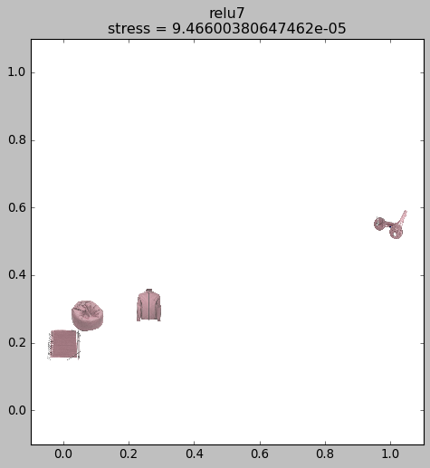
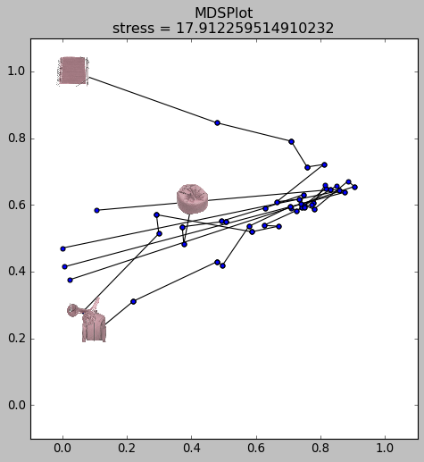

User’s Guide
------------

This library contains a collection of functions for easily conducting
representational similarity analysis (RSA) on convolutional neural
networks (CNNs), serving as a wrapper for various PyTorch functions. The
imagined use-case is one where you want to perform representational
similarity analysis over many different datasets, and perhaps perform
higher-order RSA analyses (e.g., generate a set of representational
dissimilarity matrices (RDMs), and then correlate THOSE matrices with
one another to make a higher-order RDM). Thus, the library stores the
resulting matrices as Pandas dataframes, with the matrix itself being
stored in one column, and all accompanying metadata being stored in the
other columns. This structure makes it very easy to perform higher-order
RSA analyses, to visualize the results using multidimensional scaling,
and so on, requiring very few lines of code on the user’s end.

The library additionally contains functions for running ANOVAs within
CNN units (without the clunky solution of storing intermediate
activations), and also running SVM analyses on CNN activations. Finally,
it contains a number of quality-of-life functions for dealing with
dataframes and RDMs. Here, I provide some examples to get you started
using the package; all functions are documented with further
instructions.

.. code:: ipython3

    import pytorch_feature_analysis as pfa
    import numpy as np
    from os.path import join as opj
    import os
    import itertools as it
    
    project_dir = opj('/ncf/vcn/jtaylor/mri-space/studies/binding_cnn')

Loading in CNN models and dealing with them
~~~~~~~~~~~~~~~~~~~~~~~~~~~~~~~~~~~~~~~~~~~

First, you need to specify which models you want to use for the RSA
analysis. Currently, Alexnet, GoogLeNet, ResNet-50, VGG19, and CORNet-S
are supported. The core functions take in a model_dict, where each key
is your internal name for the model, and each value is a tuple
specifying 1) the “base” model (e.g., AlexNet) and 2) the setting for
the weights: either ‘trained’, ‘random’, or a link to the state_dict for
custom weight settings from online. This dict is run through the
prepare_models function; this loads the models and modifies them so they
save the intermediate layer activations.

.. code:: ipython3

    model_dict = {'alexnet':('alexnet','trained'),
                  'alexnet_random':('alexnet','random'),
                  'vgg19':('vgg19','trained'),
                  'resnet50_stylized':('resnet50',
                                       'https://bitbucket.org/robert_geirhos/texture-vs-shape-pretrained-models/raw/6f41d2e86fc60566f78de64ecff35cc61eb6436f/resnet50_train_60_epochs-c8e5653e.pth.tar')}
    
    models_prepped = pfa.prepare_models(model_dict)

CNN models can be a bit unwieldy in PyTorch: they have complex
structures that can vary greatly across models, making it hard to index
the layers you want, since sometimes things are indexed numerically,
sometimes as classes, and so on. For example, AlexNet looks like this:

.. code:: ipython3

    print(models_prepped['alexnet'])

.. parsed-literal::

    AlexNet(
      (features): Sequential(
        (0): Conv2d(3, 64, kernel_size=(11, 11), stride=(4, 4), padding=(2, 2))
        (1): ReLU(inplace=True)
        (2): MaxPool2d(kernel_size=3, stride=2, padding=0, dilation=1, ceil_mode=False)
        (3): Conv2d(64, 192, kernel_size=(5, 5), stride=(1, 1), padding=(2, 2))
        (4): ReLU(inplace=True)
        (5): MaxPool2d(kernel_size=3, stride=2, padding=0, dilation=1, ceil_mode=False)
        (6): Conv2d(192, 384, kernel_size=(3, 3), stride=(1, 1), padding=(1, 1))
        (7): ReLU(inplace=True)
        (8): Conv2d(384, 256, kernel_size=(3, 3), stride=(1, 1), padding=(1, 1))
        (9): ReLU(inplace=True)
        (10): Conv2d(256, 256, kernel_size=(3, 3), stride=(1, 1), padding=(1, 1))
        (11): ReLU(inplace=True)
        (12): MaxPool2d(kernel_size=3, stride=2, padding=0, dilation=1, ceil_mode=False)
      )
      (avgpool): AdaptiveAvgPool2d(output_size=(6, 6))
      (classifier): Sequential(
        (0): Dropout(p=0.5, inplace=False)
        (1): Linear(in_features=9216, out_features=4096, bias=True)
        (2): ReLU(inplace=True)
        (3): Dropout(p=0.5, inplace=False)
        (4): Linear(in_features=4096, out_features=4096, bias=True)
        (5): ReLU(inplace=True)
        (6): Linear(in_features=4096, out_features=1000, bias=True)
      )
    )

And indexing CNN layers can look like this:

.. code:: ipython3

    alexnet = models_prepped['alexnet']
    resnet = models_prepped['resnet50_stylized']
    
    print(alexnet.features[0])
    print(alexnet.classifier[0])
    print(resnet.layer4[2].bn1)

.. parsed-literal::

    Conv2d(3, 64, kernel_size=(11, 11), stride=(4, 4), padding=(2, 2))
    Dropout(p=0.5, inplace=False)
    BatchNorm2d(512, eps=1e-05, momentum=0.1, affine=True, track_running_stats=True)

To help deal with this, the fetch_layers function recursively crawls
through a network and pulls out an “address book” specifying the
indexing for each layer, like this:

.. code:: ipython3

    alexnet_layers = pfa.fetch_layers(alexnet)
    print(alexnet_layers)

.. parsed-literal::

    OrderedDict([(('conv1', 1), ['features', 0]), (('relu1', 2), ['features', 1]), (('maxpool1', 3), ['features', 2]), (('conv2', 4), ['features', 3]), (('relu2', 5), ['features', 4]), (('maxpool2', 6), ['features', 5]), (('conv3', 7), ['features', 6]), (('relu3', 8), ['features', 7]), (('conv4', 9), ['features', 8]), (('relu4', 10), ['features', 9]), (('conv5', 11), ['features', 10]), (('relu5', 12), ['features', 11]), (('maxpool3', 13), ['features', 12]), (('avgpool1', 14), ['avgpool']), (('dropout1', 15), ['classifier', 0]), (('fc1', 16), ['classifier', 1]), (('relu6', 17), ['classifier', 2]), (('dropout2', 18), ['classifier', 3]), (('fc2', 19), ['classifier', 4]), (('relu7', 20), ['classifier', 5]), (('fc3', 21), ['classifier', 6])])

Each key in this dictionary is a layer; (‘conv1’,1) means the first
convolutional layer and the first layer overall. This convention is used
throughout this package, though many functions also let you simply put
‘conv1’.

With these addresses in hand can easily find the layer with the desired
“address” to modify it, refer to it, etc.; the index_nested does this
for you.

.. code:: ipython3

    layer_address = alexnet_layers[('fc2',19)]
    pfa.index_nested(alexnet._modules,layer_address)

.. parsed-literal::

    Linear(in_features=4096, out_features=4096, bias=True)

Core functions: making RDMs and meta-RDMs, MDS plots of the results.
~~~~~~~~~~~~~~~~~~~~~~~~~~~~~~~~~~~~~~~~~~~~~~~~~~~~~~~~~~~~~~~~~~~~

Making RDMs: the assumed use case for this package is that you want to
make many RDMs, then maybe make “meta-RDMs” out of those RDMs (where the
original RDMs are in turn correlated with one another to make
higher-order RDMs, etc.) So, the initial step is to make not just one
RDM, but a stack of them: one for each set of images.

As an example, let’s say we have 4 different objects in 4 different
colors. We want to compute the similarity structure of the different
colors of each object, then ask the higher-order question of how similar
the color similarity spaces of different objects are. So we want to make
an RDM of the four different colors for each of our four objects. This
requires specifying four image sets: one for each object, each
specifying the stimuli for the four colors of that object, along with
descriptors for that image set, and for each of the images in that set.
This is the ONLY labor-intensive part–everything after this is
one-liners!

This next cell simply sets up the image sets, you can do this however
you want.

.. code:: ipython3

    color_list = ['000','090','180','270']
    obj_list = ['obj001','obj003','obj004','obj005']
    stim_dir = opj(project_dir,'stimuli')
    
    image_sets = []
    for obj in obj_list:
        image_set_labels = {'obj':obj}
        image_set_stim = {}
        for color in color_list:
            image_set_stim[tuple([color])] = opj(stim_dir,f"color_rot_processed_tsao_method_luv",obj,f"{obj}_{color}deg.jpg")
        entry_types = tuple(['color'])
        new_image_set = (image_set_labels,image_set_stim,entry_types,[])
        image_sets.append(new_image_set)
    
    for i in image_sets[0]:print(i,end='\n\n')

.. parsed-literal::

    {'obj': 'obj001'}
    
    {('000',): '/ncf/vcn/jtaylor/mri-space/studies/binding_cnn/stimuli/color_rot_processed_tsao_method_luv/obj001/obj001_000deg.jpg', ('090',): '/ncf/vcn/jtaylor/mri-space/studies/binding_cnn/stimuli/color_rot_processed_tsao_method_luv/obj001/obj001_090deg.jpg', ('180',): '/ncf/vcn/jtaylor/mri-space/studies/binding_cnn/stimuli/color_rot_processed_tsao_method_luv/obj001/obj001_180deg.jpg', ('270',): '/ncf/vcn/jtaylor/mri-space/studies/binding_cnn/stimuli/color_rot_processed_tsao_method_luv/obj001/obj001_270deg.jpg'}
    
    ('color',)
    
    []
    

We now have a list of image_sets, each of which will be used to make one
RDM. Each image set is a tuple with four parts. I’ve printed one of
these image sets above.

The first part of the tuple is a dictionary containing meta-data about
that image set: each key is the name of a variable describing that image
set, and each value is the value of that variable in the image set.
These are completely up to you. Here, I’m saying that this image set is
for obj001; the first object we want to look at.

The second part of the tuple is a dictionary for the different images in
the image set. Each key is the “entry key” for that image: it’s your
internal label for that image, and will be a tuple consisting of the
values of variables that vary within each RDM. Here, the thing that’s
varying is color (which I have in degrees of the color wheel).

The third part is a tuple saying the names of the variables in the entry
keys. Here, this is color.

The fourth part is simply a blank list; you would fill it out if you
want to analyze combinations of stimuli (e.g., the average pattern of
two images in a given CNN layer), but this is a rare use case.

That was the only hard part! Now that we have our four image sets, each
with four images, we can create an RDM for each image set with a single
function call. We pass in the list of image sets, the models we prepared
earlier, where we want the Pandas dataframe containing the RDMs to go,
any internal name we wish to give the dataframe, which dissimilarity
metrics to use (1-correlation and Euclidean distance are provided as
defaults, but you can also specify your own), and the number of cores to
use if you want to use parallel processing.

.. code:: ipython3

    rdm_df = pfa.get_rdms(image_sets, # the stack of image sets
                          models_prepped, # the desired models
                          opj(project_dir,'analysis','demo_rdm.p'), # where to save the output
                          'one_object_color_rdms', # the name of the output RDM
                          dissim_metrics = ['corr','euclidean_distance'], # the dissimilarity metrics you want to try
                          )

.. parsed-literal::

    *****Computing RDMs*****
    obj001
    	Model alexnet
    		Computing image activations...
    Making RDMs...
    
    	('original_rgb', 0),corr
    		Kernel set all, activation unit_level, perm orig_data
    		Kernel set all, activation feature_means, perm orig_data
    
    	('original_rgb', 0),euclidean_distance
    		Kernel set all, activation unit_level, perm orig_data
    		Kernel set all, activation feature_means, perm orig_data
    
    	('conv1', 1),corr
    		Kernel set all, activation unit_level, perm orig_data
    		Kernel set all, activation feature_means, perm orig_data
    
    	('conv1', 1),euclidean_distance
    		Kernel set all, activation unit_level, perm orig_data
    		Kernel set all, activation feature_means, perm orig_data
    
    	('relu1', 2),corr
    		Kernel set all, activation unit_level, perm orig_data
    		Kernel set all, activation feature_means, perm orig_data
    
    	('relu1', 2),euclidean_distance
    		Kernel set all, activation unit_level, perm orig_data
    		Kernel set all, activation feature_means, perm orig_data
    
    	('maxpool1', 3),corr
    		Kernel set all, activation unit_level, perm orig_data
    		Kernel set all, activation feature_means, perm orig_data
    
    	('maxpool1', 3),euclidean_distance
    		Kernel set all, activation unit_level, perm orig_data
    		Kernel set all, activation feature_means, perm orig_data
    
    	('conv2', 4),corr
    		Kernel set all, activation unit_level, perm orig_data
    		Kernel set all, activation feature_means, perm orig_data
    
    	('conv2', 4),euclidean_distance
    		Kernel set all, activation unit_level, perm orig_data
    		Kernel set all, activation feature_means, perm orig_data
    
    	('relu2', 5),corr
    		Kernel set all, activation unit_level, perm orig_data
    		Kernel set all, activation feature_means, perm orig_data
    
    	('relu2', 5),euclidean_distance
    		Kernel set all, activation unit_level, perm orig_data
    		Kernel set all, activation feature_means, perm orig_data
    
    	('maxpool2', 6),corr
    		Kernel set all, activation unit_level, perm orig_data
    		Kernel set all, activation feature_means, perm orig_data
    
    	('maxpool2', 6),euclidean_distance
    		Kernel set all, activation unit_level, perm orig_data
    		Kernel set all, activation feature_means, perm orig_data
    
    	('conv3', 7),corr
    		Kernel set all, activation unit_level, perm orig_data
    		Kernel set all, activation feature_means, perm orig_data
    
    	('conv3', 7),euclidean_distance
    		Kernel set all, activation unit_level, perm orig_data
    		Kernel set all, activation feature_means, perm orig_data
    
    	('relu3', 8),corr
    		Kernel set all, activation unit_level, perm orig_data
    		Kernel set all, activation feature_means, perm orig_data
    
    	('relu3', 8),euclidean_distance
    		Kernel set all, activation unit_level, perm orig_data
    		Kernel set all, activation feature_means, perm orig_data
    
    	('conv4', 9),corr
    		Kernel set all, activation unit_level, perm orig_data
    		Kernel set all, activation feature_means, perm orig_data
    
    	('conv4', 9),euclidean_distance
    		Kernel set all, activation unit_level, perm orig_data
    		Kernel set all, activation feature_means, perm orig_data
    
    	('relu4', 10),corr
    		Kernel set all, activation unit_level, perm orig_data
    		Kernel set all, activation feature_means, perm orig_data
    
    	('relu4', 10),euclidean_distance
    		Kernel set all, activation unit_level, perm orig_data
    		Kernel set all, activation feature_means, perm orig_data
    
    	('conv5', 11),corr
    		Kernel set all, activation unit_level, perm orig_data
    		Kernel set all, activation feature_means, perm orig_data
    
    	('conv5', 11),euclidean_distance
    		Kernel set all, activation unit_level, perm orig_data
    		Kernel set all, activation feature_means, perm orig_data
    
    	('relu5', 12),corr
    		Kernel set all, activation unit_level, perm orig_data
    		Kernel set all, activation feature_means, perm orig_data
    
    	('relu5', 12),euclidean_distance
    		Kernel set all, activation unit_level, perm orig_data
    		Kernel set all, activation feature_means, perm orig_data
    
    	('maxpool3', 13),corr
    		Kernel set all, activation unit_level, perm orig_data
    		Kernel set all, activation feature_means, perm orig_data
    
    	('maxpool3', 13),euclidean_distance
    		Kernel set all, activation unit_level, perm orig_data
    		Kernel set all, activation feature_means, perm orig_data
    
    	('avgpool1', 14),corr
    		Kernel set all, activation unit_level, perm orig_data
    		Kernel set all, activation feature_means, perm orig_data
    
    	('avgpool1', 14),euclidean_distance
    		Kernel set all, activation unit_level, perm orig_data
    		Kernel set all, activation feature_means, perm orig_data
    
    	('dropout1', 15),corr
    		Kernel set all, activation unit_level, perm orig_data
    		Kernel set all, activation feature_means, perm orig_data
    
    	('dropout1', 15),euclidean_distance
    		Kernel set all, activation unit_level, perm orig_data
    		Kernel set all, activation feature_means, perm orig_data
    
    	('fc1', 16),corr
    		Kernel set all, activation unit_level, perm orig_data
    		Kernel set all, activation feature_means, perm orig_data
    
    	('fc1', 16),euclidean_distance
    		Kernel set all, activation unit_level, perm orig_data
    		Kernel set all, activation feature_means, perm orig_data
    
    	('relu6', 17),corr
    		Kernel set all, activation unit_level, perm orig_data
    		Kernel set all, activation feature_means, perm orig_data
    
    	('relu6', 17),euclidean_distance
    		Kernel set all, activation unit_level, perm orig_data
    		Kernel set all, activation feature_means, perm orig_data
    
    	('dropout2', 18),corr
    		Kernel set all, activation unit_level, perm orig_data
    		Kernel set all, activation feature_means, perm orig_data
    
    	('dropout2', 18),euclidean_distance
    		Kernel set all, activation unit_level, perm orig_data
    		Kernel set all, activation feature_means, perm orig_data
    
    	('fc2', 19),corr
    		Kernel set all, activation unit_level, perm orig_data
    		Kernel set all, activation feature_means, perm orig_data
    
    	('fc2', 19),euclidean_distance
    		Kernel set all, activation unit_level, perm orig_data
    		Kernel set all, activation feature_means, perm orig_data
    
    	('relu7', 20),corr
    		Kernel set all, activation unit_level, perm orig_data
    		Kernel set all, activation feature_means, perm orig_data
    
    	('relu7', 20),euclidean_distance
    		Kernel set all, activation unit_level, perm orig_data
    		Kernel set all, activation feature_means, perm orig_data
    
    	('fc3', 21),corr
    		Kernel set all, activation unit_level, perm orig_data
    		Kernel set all, activation feature_means, perm orig_data
    
    	('fc3', 21),euclidean_distance
    		Kernel set all, activation unit_level, perm orig_data
    		Kernel set all, activation feature_means, perm orig_data
    obj001
    	Model alexnet_random
    		Computing image activations...
    Making RDMs...
    
    	('original_rgb', 0),corr
    		Kernel set all, activation unit_level, perm orig_data
    		Kernel set all, activation feature_means, perm orig_data
    
    	('original_rgb', 0),euclidean_distance
    		Kernel set all, activation unit_level, perm orig_data
    		Kernel set all, activation feature_means, perm orig_data
    
    	('conv1', 1),corr
    		Kernel set all, activation unit_level, perm orig_data
    		Kernel set all, activation feature_means, perm orig_data
    
    	('conv1', 1),euclidean_distance
    		Kernel set all, activation unit_level, perm orig_data
    		Kernel set all, activation feature_means, perm orig_data
    
    	('relu1', 2),corr
    		Kernel set all, activation unit_level, perm orig_data
    		Kernel set all, activation feature_means, perm orig_data
    
    	('relu1', 2),euclidean_distance
    		Kernel set all, activation unit_level, perm orig_data
    		Kernel set all, activation feature_means, perm orig_data
    
    	('maxpool1', 3),corr
    		Kernel set all, activation unit_level, perm orig_data
    		Kernel set all, activation feature_means, perm orig_data
    
    	('maxpool1', 3),euclidean_distance
    		Kernel set all, activation unit_level, perm orig_data
    		Kernel set all, activation feature_means, perm orig_data
    
    	('conv2', 4),corr
    		Kernel set all, activation unit_level, perm orig_data
    		Kernel set all, activation feature_means, perm orig_data
    
    	('conv2', 4),euclidean_distance
    		Kernel set all, activation unit_level, perm orig_data
    		Kernel set all, activation feature_means, perm orig_data
    
    	('relu2', 5),corr
    		Kernel set all, activation unit_level, perm orig_data
    		Kernel set all, activation feature_means, perm orig_data
    
    	('relu2', 5),euclidean_distance
    		Kernel set all, activation unit_level, perm orig_data
    		Kernel set all, activation feature_means, perm orig_data
    
    	('maxpool2', 6),corr
    		Kernel set all, activation unit_level, perm orig_data
    		Kernel set all, activation feature_means, perm orig_data
    
    	('maxpool2', 6),euclidean_distance
    		Kernel set all, activation unit_level, perm orig_data
    		Kernel set all, activation feature_means, perm orig_data
    
    	('conv3', 7),corr
    		Kernel set all, activation unit_level, perm orig_data
    		Kernel set all, activation feature_means, perm orig_data
    
    	('conv3', 7),euclidean_distance
    		Kernel set all, activation unit_level, perm orig_data
    		Kernel set all, activation feature_means, perm orig_data
    
    	('relu3', 8),corr
    		Kernel set all, activation unit_level, perm orig_data
    		Kernel set all, activation feature_means, perm orig_data
    
    	('relu3', 8),euclidean_distance
    		Kernel set all, activation unit_level, perm orig_data
    		Kernel set all, activation feature_means, perm orig_data
    
    	('conv4', 9),corr
    		Kernel set all, activation unit_level, perm orig_data
    		Kernel set all, activation feature_means, perm orig_data
    
    	('conv4', 9),euclidean_distance
    		Kernel set all, activation unit_level, perm orig_data
    		Kernel set all, activation feature_means, perm orig_data
    
    	('relu4', 10),corr
    		Kernel set all, activation unit_level, perm orig_data
    		Kernel set all, activation feature_means, perm orig_data
    
    	('relu4', 10),euclidean_distance
    		Kernel set all, activation unit_level, perm orig_data
    		Kernel set all, activation feature_means, perm orig_data
    
    	('conv5', 11),corr
    		Kernel set all, activation unit_level, perm orig_data
    		Kernel set all, activation feature_means, perm orig_data
    
    	('conv5', 11),euclidean_distance
    		Kernel set all, activation unit_level, perm orig_data
    		Kernel set all, activation feature_means, perm orig_data
    
    	('relu5', 12),corr
    		Kernel set all, activation unit_level, perm orig_data
    		Kernel set all, activation feature_means, perm orig_data
    
    	('relu5', 12),euclidean_distance
    		Kernel set all, activation unit_level, perm orig_data
    		Kernel set all, activation feature_means, perm orig_data
    
    	('maxpool3', 13),corr
    		Kernel set all, activation unit_level, perm orig_data
    		Kernel set all, activation feature_means, perm orig_data
    
    	('maxpool3', 13),euclidean_distance
    		Kernel set all, activation unit_level, perm orig_data
    		Kernel set all, activation feature_means, perm orig_data
    
    	('avgpool1', 14),corr
    		Kernel set all, activation unit_level, perm orig_data
    		Kernel set all, activation feature_means, perm orig_data
    
    	('avgpool1', 14),euclidean_distance
    		Kernel set all, activation unit_level, perm orig_data
    		Kernel set all, activation feature_means, perm orig_data
    
    	('dropout1', 15),corr
    		Kernel set all, activation unit_level, perm orig_data
    		Kernel set all, activation feature_means, perm orig_data
    
    	('dropout1', 15),euclidean_distance
    		Kernel set all, activation unit_level, perm orig_data
    		Kernel set all, activation feature_means, perm orig_data
    
    	('fc1', 16),corr
    		Kernel set all, activation unit_level, perm orig_data
    		Kernel set all, activation feature_means, perm orig_data
    
    	('fc1', 16),euclidean_distance
    		Kernel set all, activation unit_level, perm orig_data
    		Kernel set all, activation feature_means, perm orig_data
    
    	('relu6', 17),corr
    		Kernel set all, activation unit_level, perm orig_data
    		Kernel set all, activation feature_means, perm orig_data
    
    	('relu6', 17),euclidean_distance
    		Kernel set all, activation unit_level, perm orig_data
    		Kernel set all, activation feature_means, perm orig_data
    
    	('dropout2', 18),corr
    		Kernel set all, activation unit_level, perm orig_data
    		Kernel set all, activation feature_means, perm orig_data
    
    	('dropout2', 18),euclidean_distance
    		Kernel set all, activation unit_level, perm orig_data
    		Kernel set all, activation feature_means, perm orig_data
    
    	('fc2', 19),corr
    		Kernel set all, activation unit_level, perm orig_data
    		Kernel set all, activation feature_means, perm orig_data
    
    	('fc2', 19),euclidean_distance
    		Kernel set all, activation unit_level, perm orig_data
    		Kernel set all, activation feature_means, perm orig_data
    
    	('relu7', 20),corr
    		Kernel set all, activation unit_level, perm orig_data
    		Kernel set all, activation feature_means, perm orig_data
    
    	('relu7', 20),euclidean_distance
    		Kernel set all, activation unit_level, perm orig_data
    		Kernel set all, activation feature_means, perm orig_data
    
    	('fc3', 21),corr
    		Kernel set all, activation unit_level, perm orig_data
    		Kernel set all, activation feature_means, perm orig_data
    
    	('fc3', 21),euclidean_distance
    		Kernel set all, activation unit_level, perm orig_data
    		Kernel set all, activation feature_means, perm orig_data
    obj001
    	Model vgg19
    		Computing image activations...
    Making RDMs...
    
    	('original_rgb', 0),corr
    		Kernel set all, activation unit_level, perm orig_data
    		Kernel set all, activation feature_means, perm orig_data
    
    	('original_rgb', 0),euclidean_distance
    		Kernel set all, activation unit_level, perm orig_data
    		Kernel set all, activation feature_means, perm orig_data
    
    	('conv1', 1),corr
    		Kernel set all, activation unit_level, perm orig_data
    		Kernel set all, activation feature_means, perm orig_data
    
    	('conv1', 1),euclidean_distance
    		Kernel set all, activation unit_level, perm orig_data
    		Kernel set all, activation feature_means, perm orig_data
    
    	('relu1', 2),corr
    		Kernel set all, activation unit_level, perm orig_data
    		Kernel set all, activation feature_means, perm orig_data
    
    	('relu1', 2),euclidean_distance
    		Kernel set all, activation unit_level, perm orig_data
    		Kernel set all, activation feature_means, perm orig_data
    
    	('conv2', 3),corr
    		Kernel set all, activation unit_level, perm orig_data
    		Kernel set all, activation feature_means, perm orig_data
    
    	('conv2', 3),euclidean_distance
    		Kernel set all, activation unit_level, perm orig_data
    		Kernel set all, activation feature_means, perm orig_data
    
    	('relu2', 4),corr
    		Kernel set all, activation unit_level, perm orig_data
    		Kernel set all, activation feature_means, perm orig_data
    
    	('relu2', 4),euclidean_distance
    		Kernel set all, activation unit_level, perm orig_data
    		Kernel set all, activation feature_means, perm orig_data
    
    	('maxpool1', 5),corr
    		Kernel set all, activation unit_level, perm orig_data
    		Kernel set all, activation feature_means, perm orig_data
    
    	('maxpool1', 5),euclidean_distance
    		Kernel set all, activation unit_level, perm orig_data
    		Kernel set all, activation feature_means, perm orig_data
    
    	('conv3', 6),corr
    		Kernel set all, activation unit_level, perm orig_data
    		Kernel set all, activation feature_means, perm orig_data
    
    	('conv3', 6),euclidean_distance
    		Kernel set all, activation unit_level, perm orig_data
    		Kernel set all, activation feature_means, perm orig_data
    
    	('relu3', 7),corr
    		Kernel set all, activation unit_level, perm orig_data
    		Kernel set all, activation feature_means, perm orig_data
    
    	('relu3', 7),euclidean_distance
    		Kernel set all, activation unit_level, perm orig_data
    		Kernel set all, activation feature_means, perm orig_data
    
    	('conv4', 8),corr
    		Kernel set all, activation unit_level, perm orig_data
    		Kernel set all, activation feature_means, perm orig_data
    
    	('conv4', 8),euclidean_distance
    		Kernel set all, activation unit_level, perm orig_data
    		Kernel set all, activation feature_means, perm orig_data
    
    	('relu4', 9),corr
    		Kernel set all, activation unit_level, perm orig_data
    		Kernel set all, activation feature_means, perm orig_data
    
    	('relu4', 9),euclidean_distance
    		Kernel set all, activation unit_level, perm orig_data
    		Kernel set all, activation feature_means, perm orig_data
    
    	('maxpool2', 10),corr
    		Kernel set all, activation unit_level, perm orig_data
    		Kernel set all, activation feature_means, perm orig_data
    
    	('maxpool2', 10),euclidean_distance
    		Kernel set all, activation unit_level, perm orig_data
    		Kernel set all, activation feature_means, perm orig_data
    
    	('conv5', 11),corr
    		Kernel set all, activation unit_level, perm orig_data
    		Kernel set all, activation feature_means, perm orig_data
    
    	('conv5', 11),euclidean_distance
    		Kernel set all, activation unit_level, perm orig_data
    		Kernel set all, activation feature_means, perm orig_data
    
    	('relu5', 12),corr
    		Kernel set all, activation unit_level, perm orig_data
    		Kernel set all, activation feature_means, perm orig_data
    
    	('relu5', 12),euclidean_distance
    		Kernel set all, activation unit_level, perm orig_data
    		Kernel set all, activation feature_means, perm orig_data
    
    	('conv6', 13),corr
    		Kernel set all, activation unit_level, perm orig_data
    		Kernel set all, activation feature_means, perm orig_data
    
    	('conv6', 13),euclidean_distance
    		Kernel set all, activation unit_level, perm orig_data
    		Kernel set all, activation feature_means, perm orig_data
    
    	('relu6', 14),corr
    		Kernel set all, activation unit_level, perm orig_data
    		Kernel set all, activation feature_means, perm orig_data
    
    	('relu6', 14),euclidean_distance
    		Kernel set all, activation unit_level, perm orig_data
    		Kernel set all, activation feature_means, perm orig_data
    
    	('conv7', 15),corr
    		Kernel set all, activation unit_level, perm orig_data
    		Kernel set all, activation feature_means, perm orig_data
    
    	('conv7', 15),euclidean_distance
    		Kernel set all, activation unit_level, perm orig_data
    		Kernel set all, activation feature_means, perm orig_data
    
    	('relu7', 16),corr
    		Kernel set all, activation unit_level, perm orig_data
    		Kernel set all, activation feature_means, perm orig_data
    
    	('relu7', 16),euclidean_distance
    		Kernel set all, activation unit_level, perm orig_data
    		Kernel set all, activation feature_means, perm orig_data
    
    	('conv8', 17),corr
    		Kernel set all, activation unit_level, perm orig_data
    		Kernel set all, activation feature_means, perm orig_data
    
    	('conv8', 17),euclidean_distance
    		Kernel set all, activation unit_level, perm orig_data
    		Kernel set all, activation feature_means, perm orig_data
    
    	('relu8', 18),corr
    		Kernel set all, activation unit_level, perm orig_data
    		Kernel set all, activation feature_means, perm orig_data
    
    	('relu8', 18),euclidean_distance
    		Kernel set all, activation unit_level, perm orig_data
    		Kernel set all, activation feature_means, perm orig_data
    
    	('maxpool3', 19),corr
    		Kernel set all, activation unit_level, perm orig_data
    		Kernel set all, activation feature_means, perm orig_data
    
    	('maxpool3', 19),euclidean_distance
    		Kernel set all, activation unit_level, perm orig_data
    		Kernel set all, activation feature_means, perm orig_data
    
    	('conv9', 20),corr
    		Kernel set all, activation unit_level, perm orig_data
    		Kernel set all, activation feature_means, perm orig_data
    
    	('conv9', 20),euclidean_distance
    		Kernel set all, activation unit_level, perm orig_data
    		Kernel set all, activation feature_means, perm orig_data
    
    	('relu9', 21),corr
    		Kernel set all, activation unit_level, perm orig_data
    		Kernel set all, activation feature_means, perm orig_data
    
    	('relu9', 21),euclidean_distance
    		Kernel set all, activation unit_level, perm orig_data
    		Kernel set all, activation feature_means, perm orig_data
    
    	('conv10', 22),corr
    		Kernel set all, activation unit_level, perm orig_data
    		Kernel set all, activation feature_means, perm orig_data
    
    	('conv10', 22),euclidean_distance
    		Kernel set all, activation unit_level, perm orig_data
    		Kernel set all, activation feature_means, perm orig_data
    
    	('relu10', 23),corr
    		Kernel set all, activation unit_level, perm orig_data
    		Kernel set all, activation feature_means, perm orig_data
    
    	('relu10', 23),euclidean_distance
    		Kernel set all, activation unit_level, perm orig_data
    		Kernel set all, activation feature_means, perm orig_data
    
    	('conv11', 24),corr
    		Kernel set all, activation unit_level, perm orig_data
    		Kernel set all, activation feature_means, perm orig_data
    
    	('conv11', 24),euclidean_distance
    		Kernel set all, activation unit_level, perm orig_data
    		Kernel set all, activation feature_means, perm orig_data
    
    	('relu11', 25),corr
    		Kernel set all, activation unit_level, perm orig_data
    		Kernel set all, activation feature_means, perm orig_data
    
    	('relu11', 25),euclidean_distance
    		Kernel set all, activation unit_level, perm orig_data
    		Kernel set all, activation feature_means, perm orig_data
    
    	('conv12', 26),corr
    		Kernel set all, activation unit_level, perm orig_data
    		Kernel set all, activation feature_means, perm orig_data
    
    	('conv12', 26),euclidean_distance
    		Kernel set all, activation unit_level, perm orig_data
    		Kernel set all, activation feature_means, perm orig_data
    
    	('relu12', 27),corr
    		Kernel set all, activation unit_level, perm orig_data
    		Kernel set all, activation feature_means, perm orig_data
    
    	('relu12', 27),euclidean_distance
    		Kernel set all, activation unit_level, perm orig_data
    		Kernel set all, activation feature_means, perm orig_data
    
    	('maxpool4', 28),corr
    		Kernel set all, activation unit_level, perm orig_data
    		Kernel set all, activation feature_means, perm orig_data
    
    	('maxpool4', 28),euclidean_distance
    		Kernel set all, activation unit_level, perm orig_data
    		Kernel set all, activation feature_means, perm orig_data
    
    	('conv13', 29),corr
    		Kernel set all, activation unit_level, perm orig_data
    		Kernel set all, activation feature_means, perm orig_data
    
    	('conv13', 29),euclidean_distance
    		Kernel set all, activation unit_level, perm orig_data
    		Kernel set all, activation feature_means, perm orig_data
    
    	('relu13', 30),corr
    		Kernel set all, activation unit_level, perm orig_data
    		Kernel set all, activation feature_means, perm orig_data
    
    	('relu13', 30),euclidean_distance
    		Kernel set all, activation unit_level, perm orig_data
    		Kernel set all, activation feature_means, perm orig_data
    
    	('conv14', 31),corr
    		Kernel set all, activation unit_level, perm orig_data
    		Kernel set all, activation feature_means, perm orig_data
    
    	('conv14', 31),euclidean_distance
    		Kernel set all, activation unit_level, perm orig_data
    		Kernel set all, activation feature_means, perm orig_data
    
    	('relu14', 32),corr
    		Kernel set all, activation unit_level, perm orig_data
    		Kernel set all, activation feature_means, perm orig_data
    
    	('relu14', 32),euclidean_distance
    		Kernel set all, activation unit_level, perm orig_data
    		Kernel set all, activation feature_means, perm orig_data
    
    	('conv15', 33),corr
    		Kernel set all, activation unit_level, perm orig_data
    		Kernel set all, activation feature_means, perm orig_data
    
    	('conv15', 33),euclidean_distance
    		Kernel set all, activation unit_level, perm orig_data
    		Kernel set all, activation feature_means, perm orig_data
    
    	('relu15', 34),corr
    		Kernel set all, activation unit_level, perm orig_data
    		Kernel set all, activation feature_means, perm orig_data
    
    	('relu15', 34),euclidean_distance
    		Kernel set all, activation unit_level, perm orig_data
    		Kernel set all, activation feature_means, perm orig_data
    
    	('conv16', 35),corr
    		Kernel set all, activation unit_level, perm orig_data
    		Kernel set all, activation feature_means, perm orig_data
    
    	('conv16', 35),euclidean_distance
    		Kernel set all, activation unit_level, perm orig_data
    		Kernel set all, activation feature_means, perm orig_data
    
    	('relu16', 36),corr
    		Kernel set all, activation unit_level, perm orig_data
    		Kernel set all, activation feature_means, perm orig_data
    
    	('relu16', 36),euclidean_distance
    		Kernel set all, activation unit_level, perm orig_data
    		Kernel set all, activation feature_means, perm orig_data
    
    	('maxpool5', 37),corr
    		Kernel set all, activation unit_level, perm orig_data
    		Kernel set all, activation feature_means, perm orig_data
    
    	('maxpool5', 37),euclidean_distance
    		Kernel set all, activation unit_level, perm orig_data
    		Kernel set all, activation feature_means, perm orig_data
    
    	('avgpool1', 38),corr
    		Kernel set all, activation unit_level, perm orig_data
    		Kernel set all, activation feature_means, perm orig_data
    
    	('avgpool1', 38),euclidean_distance
    		Kernel set all, activation unit_level, perm orig_data
    		Kernel set all, activation feature_means, perm orig_data
    
    	('fc1', 39),corr
    		Kernel set all, activation unit_level, perm orig_data
    		Kernel set all, activation feature_means, perm orig_data
    
    	('fc1', 39),euclidean_distance
    		Kernel set all, activation unit_level, perm orig_data
    		Kernel set all, activation feature_means, perm orig_data
    
    	('relu17', 40),corr
    		Kernel set all, activation unit_level, perm orig_data
    		Kernel set all, activation feature_means, perm orig_data
    
    	('relu17', 40),euclidean_distance
    		Kernel set all, activation unit_level, perm orig_data
    		Kernel set all, activation feature_means, perm orig_data
    
    	('dropout1', 41),corr
    		Kernel set all, activation unit_level, perm orig_data
    		Kernel set all, activation feature_means, perm orig_data
    
    	('dropout1', 41),euclidean_distance
    		Kernel set all, activation unit_level, perm orig_data
    		Kernel set all, activation feature_means, perm orig_data
    
    	('fc2', 42),corr
    		Kernel set all, activation unit_level, perm orig_data
    		Kernel set all, activation feature_means, perm orig_data
    
    	('fc2', 42),euclidean_distance
    		Kernel set all, activation unit_level, perm orig_data
    		Kernel set all, activation feature_means, perm orig_data
    
    	('relu18', 43),corr
    		Kernel set all, activation unit_level, perm orig_data
    		Kernel set all, activation feature_means, perm orig_data
    
    	('relu18', 43),euclidean_distance
    		Kernel set all, activation unit_level, perm orig_data
    		Kernel set all, activation feature_means, perm orig_data
    
    	('dropout2', 44),corr
    		Kernel set all, activation unit_level, perm orig_data
    		Kernel set all, activation feature_means, perm orig_data
    
    	('dropout2', 44),euclidean_distance
    		Kernel set all, activation unit_level, perm orig_data
    		Kernel set all, activation feature_means, perm orig_data
    
    	('fc3', 45),corr
    		Kernel set all, activation unit_level, perm orig_data
    		Kernel set all, activation feature_means, perm orig_data
    
    	('fc3', 45),euclidean_distance
    		Kernel set all, activation unit_level, perm orig_data
    		Kernel set all, activation feature_means, perm orig_data
    obj001
    	Model resnet50_stylized
    		Computing image activations...
    Making RDMs...
    
    	('original_rgb', 0),corr
    		Kernel set all, activation unit_level, perm orig_data
    		Kernel set all, activation feature_means, perm orig_data
    
    	('original_rgb', 0),euclidean_distance
    		Kernel set all, activation unit_level, perm orig_data
    		Kernel set all, activation feature_means, perm orig_data
    
    	('conv1', 1),corr
    		Kernel set all, activation unit_level, perm orig_data
    		Kernel set all, activation feature_means, perm orig_data
    
    	('conv1', 1),euclidean_distance
    		Kernel set all, activation unit_level, perm orig_data
    		Kernel set all, activation feature_means, perm orig_data
    
    	('batchnorm1', 2),corr
    		Kernel set all, activation unit_level, perm orig_data
    		Kernel set all, activation feature_means, perm orig_data
    
    	('batchnorm1', 2),euclidean_distance
    		Kernel set all, activation unit_level, perm orig_data
    		Kernel set all, activation feature_means, perm orig_data
    
    	('relu1', 3),corr
    		Kernel set all, activation unit_level, perm orig_data
    		Kernel set all, activation feature_means, perm orig_data
    
    	('relu1', 3),euclidean_distance
    		Kernel set all, activation unit_level, perm orig_data
    		Kernel set all, activation feature_means, perm orig_data
    
    	('maxpool1', 4),corr
    		Kernel set all, activation unit_level, perm orig_data
    		Kernel set all, activation feature_means, perm orig_data
    
    	('maxpool1', 4),euclidean_distance
    		Kernel set all, activation unit_level, perm orig_data
    		Kernel set all, activation feature_means, perm orig_data
    
    	('conv2', 5),corr
    		Kernel set all, activation unit_level, perm orig_data
    		Kernel set all, activation feature_means, perm orig_data
    
    	('conv2', 5),euclidean_distance
    		Kernel set all, activation unit_level, perm orig_data
    		Kernel set all, activation feature_means, perm orig_data
    
    	('batchnorm2', 6),corr
    		Kernel set all, activation unit_level, perm orig_data
    		Kernel set all, activation feature_means, perm orig_data
    
    	('batchnorm2', 6),euclidean_distance
    		Kernel set all, activation unit_level, perm orig_data
    		Kernel set all, activation feature_means, perm orig_data
    
    	('relu2', 11),corr
    		Kernel set all, activation unit_level, perm orig_data
    		Kernel set all, activation feature_means, perm orig_data
    
    	('relu2', 11),euclidean_distance
    		Kernel set all, activation unit_level, perm orig_data
    		Kernel set all, activation feature_means, perm orig_data
    
    	('conv3', 7),corr
    		Kernel set all, activation unit_level, perm orig_data
    		Kernel set all, activation feature_means, perm orig_data
    
    	('conv3', 7),euclidean_distance
    		Kernel set all, activation unit_level, perm orig_data
    		Kernel set all, activation feature_means, perm orig_data
    
    	('batchnorm3', 8),corr
    		Kernel set all, activation unit_level, perm orig_data
    		Kernel set all, activation feature_means, perm orig_data
    
    	('batchnorm3', 8),euclidean_distance
    		Kernel set all, activation unit_level, perm orig_data
    		Kernel set all, activation feature_means, perm orig_data
    
    	('conv4', 9),corr
    		Kernel set all, activation unit_level, perm orig_data
    		Kernel set all, activation feature_means, perm orig_data
    
    	('conv4', 9),euclidean_distance
    		Kernel set all, activation unit_level, perm orig_data
    		Kernel set all, activation feature_means, perm orig_data
    
    	('batchnorm4', 10),corr
    		Kernel set all, activation unit_level, perm orig_data
    		Kernel set all, activation feature_means, perm orig_data
    
    	('batchnorm4', 10),euclidean_distance
    		Kernel set all, activation unit_level, perm orig_data
    		Kernel set all, activation feature_means, perm orig_data
    
    	('conv5', 12),corr
    		Kernel set all, activation unit_level, perm orig_data
    		Kernel set all, activation feature_means, perm orig_data
    
    	('conv5', 12),euclidean_distance
    		Kernel set all, activation unit_level, perm orig_data
    		Kernel set all, activation feature_means, perm orig_data
    
    	('batchnorm5', 13),corr
    		Kernel set all, activation unit_level, perm orig_data
    		Kernel set all, activation feature_means, perm orig_data
    
    	('batchnorm5', 13),euclidean_distance
    		Kernel set all, activation unit_level, perm orig_data
    		Kernel set all, activation feature_means, perm orig_data
    
    	('conv6', 14),corr
    		Kernel set all, activation unit_level, perm orig_data
    		Kernel set all, activation feature_means, perm orig_data
    
    	('conv6', 14),euclidean_distance
    		Kernel set all, activation unit_level, perm orig_data
    		Kernel set all, activation feature_means, perm orig_data
    
    	('batchnorm6', 15),corr
    		Kernel set all, activation unit_level, perm orig_data
    		Kernel set all, activation feature_means, perm orig_data
    
    	('batchnorm6', 15),euclidean_distance
    		Kernel set all, activation unit_level, perm orig_data
    		Kernel set all, activation feature_means, perm orig_data
    
    	('relu3', 20),corr
    		Kernel set all, activation unit_level, perm orig_data
    		Kernel set all, activation feature_means, perm orig_data
    
    	('relu3', 20),euclidean_distance
    		Kernel set all, activation unit_level, perm orig_data
    		Kernel set all, activation feature_means, perm orig_data
    
    	('conv7', 16),corr
    		Kernel set all, activation unit_level, perm orig_data
    		Kernel set all, activation feature_means, perm orig_data
    
    	('conv7', 16),euclidean_distance
    		Kernel set all, activation unit_level, perm orig_data
    		Kernel set all, activation feature_means, perm orig_data
    
    	('batchnorm7', 17),corr
    		Kernel set all, activation unit_level, perm orig_data
    		Kernel set all, activation feature_means, perm orig_data
    
    	('batchnorm7', 17),euclidean_distance
    		Kernel set all, activation unit_level, perm orig_data
    		Kernel set all, activation feature_means, perm orig_data
    
    	('conv8', 18),corr
    		Kernel set all, activation unit_level, perm orig_data
    		Kernel set all, activation feature_means, perm orig_data
    
    	('conv8', 18),euclidean_distance
    		Kernel set all, activation unit_level, perm orig_data
    		Kernel set all, activation feature_means, perm orig_data
    
    	('batchnorm8', 19),corr
    		Kernel set all, activation unit_level, perm orig_data
    		Kernel set all, activation feature_means, perm orig_data
    
    	('batchnorm8', 19),euclidean_distance
    		Kernel set all, activation unit_level, perm orig_data
    		Kernel set all, activation feature_means, perm orig_data
    
    	('conv9', 21),corr
    		Kernel set all, activation unit_level, perm orig_data
    		Kernel set all, activation feature_means, perm orig_data
    
    	('conv9', 21),euclidean_distance
    		Kernel set all, activation unit_level, perm orig_data
    		Kernel set all, activation feature_means, perm orig_data
    
    	('batchnorm9', 22),corr
    		Kernel set all, activation unit_level, perm orig_data
    		Kernel set all, activation feature_means, perm orig_data
    
    	('batchnorm9', 22),euclidean_distance
    		Kernel set all, activation unit_level, perm orig_data
    		Kernel set all, activation feature_means, perm orig_data
    
    	('relu4', 27),corr
    		Kernel set all, activation unit_level, perm orig_data
    		Kernel set all, activation feature_means, perm orig_data
    
    	('relu4', 27),euclidean_distance
    		Kernel set all, activation unit_level, perm orig_data
    		Kernel set all, activation feature_means, perm orig_data
    
    	('conv10', 23),corr
    		Kernel set all, activation unit_level, perm orig_data
    		Kernel set all, activation feature_means, perm orig_data
    
    	('conv10', 23),euclidean_distance
    		Kernel set all, activation unit_level, perm orig_data
    		Kernel set all, activation feature_means, perm orig_data
    
    	('batchnorm10', 24),corr
    		Kernel set all, activation unit_level, perm orig_data
    		Kernel set all, activation feature_means, perm orig_data
    
    	('batchnorm10', 24),euclidean_distance
    		Kernel set all, activation unit_level, perm orig_data
    		Kernel set all, activation feature_means, perm orig_data
    
    	('conv11', 25),corr
    		Kernel set all, activation unit_level, perm orig_data
    		Kernel set all, activation feature_means, perm orig_data
    
    	('conv11', 25),euclidean_distance
    		Kernel set all, activation unit_level, perm orig_data
    		Kernel set all, activation feature_means, perm orig_data
    
    	('batchnorm11', 26),corr
    		Kernel set all, activation unit_level, perm orig_data
    		Kernel set all, activation feature_means, perm orig_data
    
    	('batchnorm11', 26),euclidean_distance
    		Kernel set all, activation unit_level, perm orig_data
    		Kernel set all, activation feature_means, perm orig_data
    
    	('conv12', 28),corr
    		Kernel set all, activation unit_level, perm orig_data
    		Kernel set all, activation feature_means, perm orig_data
    
    	('conv12', 28),euclidean_distance
    		Kernel set all, activation unit_level, perm orig_data
    		Kernel set all, activation feature_means, perm orig_data
    
    	('batchnorm12', 29),corr
    		Kernel set all, activation unit_level, perm orig_data
    		Kernel set all, activation feature_means, perm orig_data
    
    	('batchnorm12', 29),euclidean_distance
    		Kernel set all, activation unit_level, perm orig_data
    		Kernel set all, activation feature_means, perm orig_data
    
    	('relu5', 34),corr
    		Kernel set all, activation unit_level, perm orig_data
    		Kernel set all, activation feature_means, perm orig_data
    
    	('relu5', 34),euclidean_distance
    		Kernel set all, activation unit_level, perm orig_data
    		Kernel set all, activation feature_means, perm orig_data
    
    	('conv13', 30),corr
    		Kernel set all, activation unit_level, perm orig_data
    		Kernel set all, activation feature_means, perm orig_data
    
    	('conv13', 30),euclidean_distance
    		Kernel set all, activation unit_level, perm orig_data
    		Kernel set all, activation feature_means, perm orig_data
    
    	('batchnorm13', 31),corr
    		Kernel set all, activation unit_level, perm orig_data
    		Kernel set all, activation feature_means, perm orig_data
    
    	('batchnorm13', 31),euclidean_distance
    		Kernel set all, activation unit_level, perm orig_data
    		Kernel set all, activation feature_means, perm orig_data
    
    	('conv14', 32),corr
    		Kernel set all, activation unit_level, perm orig_data
    		Kernel set all, activation feature_means, perm orig_data
    
    	('conv14', 32),euclidean_distance
    		Kernel set all, activation unit_level, perm orig_data
    		Kernel set all, activation feature_means, perm orig_data
    
    	('batchnorm14', 33),corr
    		Kernel set all, activation unit_level, perm orig_data
    		Kernel set all, activation feature_means, perm orig_data
    
    	('batchnorm14', 33),euclidean_distance
    		Kernel set all, activation unit_level, perm orig_data
    		Kernel set all, activation feature_means, perm orig_data
    
    	('conv15', 35),corr
    		Kernel set all, activation unit_level, perm orig_data
    		Kernel set all, activation feature_means, perm orig_data
    
    	('conv15', 35),euclidean_distance
    		Kernel set all, activation unit_level, perm orig_data
    		Kernel set all, activation feature_means, perm orig_data
    
    	('batchnorm15', 36),corr
    		Kernel set all, activation unit_level, perm orig_data
    		Kernel set all, activation feature_means, perm orig_data
    
    	('batchnorm15', 36),euclidean_distance
    		Kernel set all, activation unit_level, perm orig_data
    		Kernel set all, activation feature_means, perm orig_data
    
    	('conv16', 37),corr
    		Kernel set all, activation unit_level, perm orig_data
    		Kernel set all, activation feature_means, perm orig_data
    
    	('conv16', 37),euclidean_distance
    		Kernel set all, activation unit_level, perm orig_data
    		Kernel set all, activation feature_means, perm orig_data
    
    	('batchnorm16', 38),corr
    		Kernel set all, activation unit_level, perm orig_data
    		Kernel set all, activation feature_means, perm orig_data
    
    	('batchnorm16', 38),euclidean_distance
    		Kernel set all, activation unit_level, perm orig_data
    		Kernel set all, activation feature_means, perm orig_data
    
    	('relu6', 43),corr
    		Kernel set all, activation unit_level, perm orig_data
    		Kernel set all, activation feature_means, perm orig_data
    
    	('relu6', 43),euclidean_distance
    		Kernel set all, activation unit_level, perm orig_data
    		Kernel set all, activation feature_means, perm orig_data
    
    	('conv17', 39),corr
    		Kernel set all, activation unit_level, perm orig_data
    		Kernel set all, activation feature_means, perm orig_data
    
    	('conv17', 39),euclidean_distance
    		Kernel set all, activation unit_level, perm orig_data
    		Kernel set all, activation feature_means, perm orig_data
    
    	('batchnorm17', 40),corr
    		Kernel set all, activation unit_level, perm orig_data
    		Kernel set all, activation feature_means, perm orig_data
    
    	('batchnorm17', 40),euclidean_distance
    		Kernel set all, activation unit_level, perm orig_data
    		Kernel set all, activation feature_means, perm orig_data
    
    	('conv18', 41),corr
    		Kernel set all, activation unit_level, perm orig_data
    		Kernel set all, activation feature_means, perm orig_data
    
    	('conv18', 41),euclidean_distance
    		Kernel set all, activation unit_level, perm orig_data
    		Kernel set all, activation feature_means, perm orig_data
    
    	('batchnorm18', 42),corr
    		Kernel set all, activation unit_level, perm orig_data
    		Kernel set all, activation feature_means, perm orig_data
    
    	('batchnorm18', 42),euclidean_distance
    		Kernel set all, activation unit_level, perm orig_data
    		Kernel set all, activation feature_means, perm orig_data
    
    	('conv19', 44),corr
    		Kernel set all, activation unit_level, perm orig_data
    		Kernel set all, activation feature_means, perm orig_data
    
    	('conv19', 44),euclidean_distance
    		Kernel set all, activation unit_level, perm orig_data
    		Kernel set all, activation feature_means, perm orig_data
    
    	('batchnorm19', 45),corr
    		Kernel set all, activation unit_level, perm orig_data
    		Kernel set all, activation feature_means, perm orig_data
    
    	('batchnorm19', 45),euclidean_distance
    		Kernel set all, activation unit_level, perm orig_data
    		Kernel set all, activation feature_means, perm orig_data
    
    	('relu7', 50),corr
    		Kernel set all, activation unit_level, perm orig_data
    		Kernel set all, activation feature_means, perm orig_data
    
    	('relu7', 50),euclidean_distance
    		Kernel set all, activation unit_level, perm orig_data
    		Kernel set all, activation feature_means, perm orig_data
    
    	('conv20', 46),corr
    		Kernel set all, activation unit_level, perm orig_data
    		Kernel set all, activation feature_means, perm orig_data
    
    	('conv20', 46),euclidean_distance
    		Kernel set all, activation unit_level, perm orig_data
    		Kernel set all, activation feature_means, perm orig_data
    
    	('batchnorm20', 47),corr
    		Kernel set all, activation unit_level, perm orig_data
    		Kernel set all, activation feature_means, perm orig_data
    
    	('batchnorm20', 47),euclidean_distance
    		Kernel set all, activation unit_level, perm orig_data
    		Kernel set all, activation feature_means, perm orig_data
    
    	('conv21', 48),corr
    		Kernel set all, activation unit_level, perm orig_data
    		Kernel set all, activation feature_means, perm orig_data
    
    	('conv21', 48),euclidean_distance
    		Kernel set all, activation unit_level, perm orig_data
    		Kernel set all, activation feature_means, perm orig_data
    
    	('batchnorm21', 49),corr
    		Kernel set all, activation unit_level, perm orig_data
    		Kernel set all, activation feature_means, perm orig_data
    
    	('batchnorm21', 49),euclidean_distance
    		Kernel set all, activation unit_level, perm orig_data
    		Kernel set all, activation feature_means, perm orig_data
    
    	('conv22', 51),corr
    		Kernel set all, activation unit_level, perm orig_data
    		Kernel set all, activation feature_means, perm orig_data
    
    	('conv22', 51),euclidean_distance
    		Kernel set all, activation unit_level, perm orig_data
    		Kernel set all, activation feature_means, perm orig_data
    
    	('batchnorm22', 52),corr
    		Kernel set all, activation unit_level, perm orig_data
    		Kernel set all, activation feature_means, perm orig_data
    
    	('batchnorm22', 52),euclidean_distance
    		Kernel set all, activation unit_level, perm orig_data
    		Kernel set all, activation feature_means, perm orig_data
    
    	('relu8', 57),corr
    		Kernel set all, activation unit_level, perm orig_data
    		Kernel set all, activation feature_means, perm orig_data
    
    	('relu8', 57),euclidean_distance
    		Kernel set all, activation unit_level, perm orig_data
    		Kernel set all, activation feature_means, perm orig_data
    
    	('conv23', 53),corr
    		Kernel set all, activation unit_level, perm orig_data
    		Kernel set all, activation feature_means, perm orig_data
    
    	('conv23', 53),euclidean_distance
    		Kernel set all, activation unit_level, perm orig_data
    		Kernel set all, activation feature_means, perm orig_data
    
    	('batchnorm23', 54),corr
    		Kernel set all, activation unit_level, perm orig_data
    		Kernel set all, activation feature_means, perm orig_data
    
    	('batchnorm23', 54),euclidean_distance
    		Kernel set all, activation unit_level, perm orig_data
    		Kernel set all, activation feature_means, perm orig_data
    
    	('conv24', 55),corr
    		Kernel set all, activation unit_level, perm orig_data
    		Kernel set all, activation feature_means, perm orig_data
    
    	('conv24', 55),euclidean_distance
    		Kernel set all, activation unit_level, perm orig_data
    		Kernel set all, activation feature_means, perm orig_data
    
    	('batchnorm24', 56),corr
    		Kernel set all, activation unit_level, perm orig_data
    		Kernel set all, activation feature_means, perm orig_data
    
    	('batchnorm24', 56),euclidean_distance
    		Kernel set all, activation unit_level, perm orig_data
    		Kernel set all, activation feature_means, perm orig_data
    
    	('conv25', 58),corr
    		Kernel set all, activation unit_level, perm orig_data
    		Kernel set all, activation feature_means, perm orig_data
    
    	('conv25', 58),euclidean_distance
    		Kernel set all, activation unit_level, perm orig_data
    		Kernel set all, activation feature_means, perm orig_data
    
    	('batchnorm25', 59),corr
    		Kernel set all, activation unit_level, perm orig_data
    		Kernel set all, activation feature_means, perm orig_data
    
    	('batchnorm25', 59),euclidean_distance
    		Kernel set all, activation unit_level, perm orig_data
    		Kernel set all, activation feature_means, perm orig_data
    
    	('relu9', 64),corr
    		Kernel set all, activation unit_level, perm orig_data
    		Kernel set all, activation feature_means, perm orig_data
    
    	('relu9', 64),euclidean_distance
    		Kernel set all, activation unit_level, perm orig_data
    		Kernel set all, activation feature_means, perm orig_data
    
    	('conv26', 60),corr
    		Kernel set all, activation unit_level, perm orig_data
    		Kernel set all, activation feature_means, perm orig_data
    
    	('conv26', 60),euclidean_distance
    		Kernel set all, activation unit_level, perm orig_data
    		Kernel set all, activation feature_means, perm orig_data
    
    	('batchnorm26', 61),corr
    		Kernel set all, activation unit_level, perm orig_data
    		Kernel set all, activation feature_means, perm orig_data
    
    	('batchnorm26', 61),euclidean_distance
    		Kernel set all, activation unit_level, perm orig_data
    		Kernel set all, activation feature_means, perm orig_data
    
    	('conv27', 62),corr
    		Kernel set all, activation unit_level, perm orig_data
    		Kernel set all, activation feature_means, perm orig_data
    
    	('conv27', 62),euclidean_distance
    		Kernel set all, activation unit_level, perm orig_data
    		Kernel set all, activation feature_means, perm orig_data
    
    	('batchnorm27', 63),corr
    		Kernel set all, activation unit_level, perm orig_data
    		Kernel set all, activation feature_means, perm orig_data
    
    	('batchnorm27', 63),euclidean_distance
    		Kernel set all, activation unit_level, perm orig_data
    		Kernel set all, activation feature_means, perm orig_data
    
    	('conv28', 65),corr
    		Kernel set all, activation unit_level, perm orig_data
    		Kernel set all, activation feature_means, perm orig_data
    
    	('conv28', 65),euclidean_distance
    		Kernel set all, activation unit_level, perm orig_data
    		Kernel set all, activation feature_means, perm orig_data
    
    	('batchnorm28', 66),corr
    		Kernel set all, activation unit_level, perm orig_data
    		Kernel set all, activation feature_means, perm orig_data
    
    	('batchnorm28', 66),euclidean_distance
    		Kernel set all, activation unit_level, perm orig_data
    		Kernel set all, activation feature_means, perm orig_data
    
    	('conv29', 67),corr
    		Kernel set all, activation unit_level, perm orig_data
    		Kernel set all, activation feature_means, perm orig_data
    
    	('conv29', 67),euclidean_distance
    		Kernel set all, activation unit_level, perm orig_data
    		Kernel set all, activation feature_means, perm orig_data
    
    	('batchnorm29', 68),corr
    		Kernel set all, activation unit_level, perm orig_data
    		Kernel set all, activation feature_means, perm orig_data
    
    	('batchnorm29', 68),euclidean_distance
    		Kernel set all, activation unit_level, perm orig_data
    		Kernel set all, activation feature_means, perm orig_data
    
    	('relu10', 73),corr
    		Kernel set all, activation unit_level, perm orig_data
    		Kernel set all, activation feature_means, perm orig_data
    
    	('relu10', 73),euclidean_distance
    		Kernel set all, activation unit_level, perm orig_data
    		Kernel set all, activation feature_means, perm orig_data
    
    	('conv30', 69),corr
    		Kernel set all, activation unit_level, perm orig_data
    		Kernel set all, activation feature_means, perm orig_data
    
    	('conv30', 69),euclidean_distance
    		Kernel set all, activation unit_level, perm orig_data
    		Kernel set all, activation feature_means, perm orig_data
    
    	('batchnorm30', 70),corr
    		Kernel set all, activation unit_level, perm orig_data
    		Kernel set all, activation feature_means, perm orig_data
    
    	('batchnorm30', 70),euclidean_distance
    		Kernel set all, activation unit_level, perm orig_data
    		Kernel set all, activation feature_means, perm orig_data
    
    	('conv31', 71),corr
    		Kernel set all, activation unit_level, perm orig_data
    		Kernel set all, activation feature_means, perm orig_data
    
    	('conv31', 71),euclidean_distance
    		Kernel set all, activation unit_level, perm orig_data
    		Kernel set all, activation feature_means, perm orig_data
    
    	('batchnorm31', 72),corr
    		Kernel set all, activation unit_level, perm orig_data
    		Kernel set all, activation feature_means, perm orig_data
    
    	('batchnorm31', 72),euclidean_distance
    		Kernel set all, activation unit_level, perm orig_data
    		Kernel set all, activation feature_means, perm orig_data
    
    	('conv32', 74),corr
    		Kernel set all, activation unit_level, perm orig_data
    		Kernel set all, activation feature_means, perm orig_data
    
    	('conv32', 74),euclidean_distance
    		Kernel set all, activation unit_level, perm orig_data
    		Kernel set all, activation feature_means, perm orig_data
    
    	('batchnorm32', 75),corr
    		Kernel set all, activation unit_level, perm orig_data
    		Kernel set all, activation feature_means, perm orig_data
    
    	('batchnorm32', 75),euclidean_distance
    		Kernel set all, activation unit_level, perm orig_data
    		Kernel set all, activation feature_means, perm orig_data
    
    	('relu11', 80),corr
    		Kernel set all, activation unit_level, perm orig_data
    		Kernel set all, activation feature_means, perm orig_data
    
    	('relu11', 80),euclidean_distance
    		Kernel set all, activation unit_level, perm orig_data
    		Kernel set all, activation feature_means, perm orig_data
    
    	('conv33', 76),corr
    		Kernel set all, activation unit_level, perm orig_data
    		Kernel set all, activation feature_means, perm orig_data
    
    	('conv33', 76),euclidean_distance
    		Kernel set all, activation unit_level, perm orig_data
    		Kernel set all, activation feature_means, perm orig_data
    
    	('batchnorm33', 77),corr
    		Kernel set all, activation unit_level, perm orig_data
    		Kernel set all, activation feature_means, perm orig_data
    
    	('batchnorm33', 77),euclidean_distance
    		Kernel set all, activation unit_level, perm orig_data
    		Kernel set all, activation feature_means, perm orig_data
    
    	('conv34', 78),corr
    		Kernel set all, activation unit_level, perm orig_data
    		Kernel set all, activation feature_means, perm orig_data
    
    	('conv34', 78),euclidean_distance
    		Kernel set all, activation unit_level, perm orig_data
    		Kernel set all, activation feature_means, perm orig_data
    
    	('batchnorm34', 79),corr
    		Kernel set all, activation unit_level, perm orig_data
    		Kernel set all, activation feature_means, perm orig_data
    
    	('batchnorm34', 79),euclidean_distance
    		Kernel set all, activation unit_level, perm orig_data
    		Kernel set all, activation feature_means, perm orig_data
    
    	('conv35', 81),corr
    		Kernel set all, activation unit_level, perm orig_data
    		Kernel set all, activation feature_means, perm orig_data
    
    	('conv35', 81),euclidean_distance
    		Kernel set all, activation unit_level, perm orig_data
    		Kernel set all, activation feature_means, perm orig_data
    
    	('batchnorm35', 82),corr
    		Kernel set all, activation unit_level, perm orig_data
    		Kernel set all, activation feature_means, perm orig_data
    
    	('batchnorm35', 82),euclidean_distance
    		Kernel set all, activation unit_level, perm orig_data
    		Kernel set all, activation feature_means, perm orig_data
    
    	('relu12', 87),corr
    		Kernel set all, activation unit_level, perm orig_data
    		Kernel set all, activation feature_means, perm orig_data
    
    	('relu12', 87),euclidean_distance
    		Kernel set all, activation unit_level, perm orig_data
    		Kernel set all, activation feature_means, perm orig_data
    
    	('conv36', 83),corr
    		Kernel set all, activation unit_level, perm orig_data
    		Kernel set all, activation feature_means, perm orig_data
    
    	('conv36', 83),euclidean_distance
    		Kernel set all, activation unit_level, perm orig_data
    		Kernel set all, activation feature_means, perm orig_data
    
    	('batchnorm36', 84),corr
    		Kernel set all, activation unit_level, perm orig_data
    		Kernel set all, activation feature_means, perm orig_data
    
    	('batchnorm36', 84),euclidean_distance
    		Kernel set all, activation unit_level, perm orig_data
    		Kernel set all, activation feature_means, perm orig_data
    
    	('conv37', 85),corr
    		Kernel set all, activation unit_level, perm orig_data
    		Kernel set all, activation feature_means, perm orig_data
    
    	('conv37', 85),euclidean_distance
    		Kernel set all, activation unit_level, perm orig_data
    		Kernel set all, activation feature_means, perm orig_data
    
    	('batchnorm37', 86),corr
    		Kernel set all, activation unit_level, perm orig_data
    		Kernel set all, activation feature_means, perm orig_data
    
    	('batchnorm37', 86),euclidean_distance
    		Kernel set all, activation unit_level, perm orig_data
    		Kernel set all, activation feature_means, perm orig_data
    
    	('conv38', 88),corr
    		Kernel set all, activation unit_level, perm orig_data
    		Kernel set all, activation feature_means, perm orig_data
    
    	('conv38', 88),euclidean_distance
    		Kernel set all, activation unit_level, perm orig_data
    		Kernel set all, activation feature_means, perm orig_data
    
    	('batchnorm38', 89),corr
    		Kernel set all, activation unit_level, perm orig_data
    		Kernel set all, activation feature_means, perm orig_data
    
    	('batchnorm38', 89),euclidean_distance
    		Kernel set all, activation unit_level, perm orig_data
    		Kernel set all, activation feature_means, perm orig_data
    
    	('relu13', 94),corr
    		Kernel set all, activation unit_level, perm orig_data
    		Kernel set all, activation feature_means, perm orig_data
    
    	('relu13', 94),euclidean_distance
    		Kernel set all, activation unit_level, perm orig_data
    		Kernel set all, activation feature_means, perm orig_data
    
    	('conv39', 90),corr
    		Kernel set all, activation unit_level, perm orig_data
    		Kernel set all, activation feature_means, perm orig_data
    
    	('conv39', 90),euclidean_distance
    		Kernel set all, activation unit_level, perm orig_data
    		Kernel set all, activation feature_means, perm orig_data
    
    	('batchnorm39', 91),corr
    		Kernel set all, activation unit_level, perm orig_data
    		Kernel set all, activation feature_means, perm orig_data
    
    	('batchnorm39', 91),euclidean_distance
    		Kernel set all, activation unit_level, perm orig_data
    		Kernel set all, activation feature_means, perm orig_data
    
    	('conv40', 92),corr
    		Kernel set all, activation unit_level, perm orig_data
    		Kernel set all, activation feature_means, perm orig_data
    
    	('conv40', 92),euclidean_distance
    		Kernel set all, activation unit_level, perm orig_data
    		Kernel set all, activation feature_means, perm orig_data
    
    	('batchnorm40', 93),corr
    		Kernel set all, activation unit_level, perm orig_data
    		Kernel set all, activation feature_means, perm orig_data
    
    	('batchnorm40', 93),euclidean_distance
    		Kernel set all, activation unit_level, perm orig_data
    		Kernel set all, activation feature_means, perm orig_data
    
    	('conv41', 95),corr
    		Kernel set all, activation unit_level, perm orig_data
    		Kernel set all, activation feature_means, perm orig_data
    
    	('conv41', 95),euclidean_distance
    		Kernel set all, activation unit_level, perm orig_data
    		Kernel set all, activation feature_means, perm orig_data
    
    	('batchnorm41', 96),corr
    		Kernel set all, activation unit_level, perm orig_data
    		Kernel set all, activation feature_means, perm orig_data
    
    	('batchnorm41', 96),euclidean_distance
    		Kernel set all, activation unit_level, perm orig_data
    		Kernel set all, activation feature_means, perm orig_data
    
    	('relu14', 101),corr
    		Kernel set all, activation unit_level, perm orig_data
    		Kernel set all, activation feature_means, perm orig_data
    
    	('relu14', 101),euclidean_distance
    		Kernel set all, activation unit_level, perm orig_data
    		Kernel set all, activation feature_means, perm orig_data
    
    	('conv42', 97),corr
    		Kernel set all, activation unit_level, perm orig_data
    		Kernel set all, activation feature_means, perm orig_data
    
    	('conv42', 97),euclidean_distance
    		Kernel set all, activation unit_level, perm orig_data
    		Kernel set all, activation feature_means, perm orig_data
    
    	('batchnorm42', 98),corr
    		Kernel set all, activation unit_level, perm orig_data
    		Kernel set all, activation feature_means, perm orig_data
    
    	('batchnorm42', 98),euclidean_distance
    		Kernel set all, activation unit_level, perm orig_data
    		Kernel set all, activation feature_means, perm orig_data
    
    	('conv43', 99),corr
    		Kernel set all, activation unit_level, perm orig_data
    		Kernel set all, activation feature_means, perm orig_data
    
    	('conv43', 99),euclidean_distance
    		Kernel set all, activation unit_level, perm orig_data
    		Kernel set all, activation feature_means, perm orig_data
    
    	('batchnorm43', 100),corr
    		Kernel set all, activation unit_level, perm orig_data
    		Kernel set all, activation feature_means, perm orig_data
    
    	('batchnorm43', 100),euclidean_distance
    		Kernel set all, activation unit_level, perm orig_data
    		Kernel set all, activation feature_means, perm orig_data
    
    	('conv44', 102),corr
    		Kernel set all, activation unit_level, perm orig_data
    		Kernel set all, activation feature_means, perm orig_data
    
    	('conv44', 102),euclidean_distance
    		Kernel set all, activation unit_level, perm orig_data
    		Kernel set all, activation feature_means, perm orig_data
    
    	('batchnorm44', 103),corr
    		Kernel set all, activation unit_level, perm orig_data
    		Kernel set all, activation feature_means, perm orig_data
    
    	('batchnorm44', 103),euclidean_distance
    		Kernel set all, activation unit_level, perm orig_data
    		Kernel set all, activation feature_means, perm orig_data
    
    	('relu15', 108),corr
    		Kernel set all, activation unit_level, perm orig_data
    		Kernel set all, activation feature_means, perm orig_data
    
    	('relu15', 108),euclidean_distance
    		Kernel set all, activation unit_level, perm orig_data
    		Kernel set all, activation feature_means, perm orig_data
    
    	('conv45', 104),corr
    		Kernel set all, activation unit_level, perm orig_data
    		Kernel set all, activation feature_means, perm orig_data
    
    	('conv45', 104),euclidean_distance
    		Kernel set all, activation unit_level, perm orig_data
    		Kernel set all, activation feature_means, perm orig_data
    
    	('batchnorm45', 105),corr
    		Kernel set all, activation unit_level, perm orig_data
    		Kernel set all, activation feature_means, perm orig_data
    
    	('batchnorm45', 105),euclidean_distance
    		Kernel set all, activation unit_level, perm orig_data
    		Kernel set all, activation feature_means, perm orig_data
    
    	('conv46', 106),corr
    		Kernel set all, activation unit_level, perm orig_data
    		Kernel set all, activation feature_means, perm orig_data
    
    	('conv46', 106),euclidean_distance
    		Kernel set all, activation unit_level, perm orig_data
    		Kernel set all, activation feature_means, perm orig_data
    
    	('batchnorm46', 107),corr
    		Kernel set all, activation unit_level, perm orig_data
    		Kernel set all, activation feature_means, perm orig_data
    
    	('batchnorm46', 107),euclidean_distance
    		Kernel set all, activation unit_level, perm orig_data
    		Kernel set all, activation feature_means, perm orig_data
    
    	('conv47', 109),corr
    		Kernel set all, activation unit_level, perm orig_data
    		Kernel set all, activation feature_means, perm orig_data
    
    	('conv47', 109),euclidean_distance
    		Kernel set all, activation unit_level, perm orig_data
    		Kernel set all, activation feature_means, perm orig_data
    
    	('batchnorm47', 110),corr
    		Kernel set all, activation unit_level, perm orig_data
    		Kernel set all, activation feature_means, perm orig_data
    
    	('batchnorm47', 110),euclidean_distance
    		Kernel set all, activation unit_level, perm orig_data
    		Kernel set all, activation feature_means, perm orig_data
    
    	('conv48', 111),corr
    		Kernel set all, activation unit_level, perm orig_data
    		Kernel set all, activation feature_means, perm orig_data
    
    	('conv48', 111),euclidean_distance
    		Kernel set all, activation unit_level, perm orig_data
    		Kernel set all, activation feature_means, perm orig_data
    
    	('batchnorm48', 112),corr
    		Kernel set all, activation unit_level, perm orig_data
    		Kernel set all, activation feature_means, perm orig_data
    
    	('batchnorm48', 112),euclidean_distance
    		Kernel set all, activation unit_level, perm orig_data
    		Kernel set all, activation feature_means, perm orig_data
    
    	('relu16', 117),corr
    		Kernel set all, activation unit_level, perm orig_data
    		Kernel set all, activation feature_means, perm orig_data
    
    	('relu16', 117),euclidean_distance
    		Kernel set all, activation unit_level, perm orig_data
    		Kernel set all, activation feature_means, perm orig_data
    
    	('conv49', 113),corr
    		Kernel set all, activation unit_level, perm orig_data
    		Kernel set all, activation feature_means, perm orig_data
    
    	('conv49', 113),euclidean_distance
    		Kernel set all, activation unit_level, perm orig_data
    		Kernel set all, activation feature_means, perm orig_data
    
    	('batchnorm49', 114),corr
    		Kernel set all, activation unit_level, perm orig_data
    		Kernel set all, activation feature_means, perm orig_data
    
    	('batchnorm49', 114),euclidean_distance
    		Kernel set all, activation unit_level, perm orig_data
    		Kernel set all, activation feature_means, perm orig_data
    
    	('conv50', 115),corr
    		Kernel set all, activation unit_level, perm orig_data
    		Kernel set all, activation feature_means, perm orig_data
    
    	('conv50', 115),euclidean_distance
    		Kernel set all, activation unit_level, perm orig_data
    		Kernel set all, activation feature_means, perm orig_data
    
    	('batchnorm50', 116),corr
    		Kernel set all, activation unit_level, perm orig_data
    		Kernel set all, activation feature_means, perm orig_data
    
    	('batchnorm50', 116),euclidean_distance
    		Kernel set all, activation unit_level, perm orig_data
    		Kernel set all, activation feature_means, perm orig_data
    
    	('conv51', 118),corr
    		Kernel set all, activation unit_level, perm orig_data
    		Kernel set all, activation feature_means, perm orig_data
    
    	('conv51', 118),euclidean_distance
    		Kernel set all, activation unit_level, perm orig_data
    		Kernel set all, activation feature_means, perm orig_data
    
    	('batchnorm51', 119),corr
    		Kernel set all, activation unit_level, perm orig_data
    		Kernel set all, activation feature_means, perm orig_data
    
    	('batchnorm51', 119),euclidean_distance
    		Kernel set all, activation unit_level, perm orig_data
    		Kernel set all, activation feature_means, perm orig_data
    
    	('relu17', 124),corr
    		Kernel set all, activation unit_level, perm orig_data
    		Kernel set all, activation feature_means, perm orig_data
    
    	('relu17', 124),euclidean_distance
    		Kernel set all, activation unit_level, perm orig_data
    		Kernel set all, activation feature_means, perm orig_data
    
    	('conv52', 120),corr
    		Kernel set all, activation unit_level, perm orig_data
    		Kernel set all, activation feature_means, perm orig_data
    
    	('conv52', 120),euclidean_distance
    		Kernel set all, activation unit_level, perm orig_data
    		Kernel set all, activation feature_means, perm orig_data
    
    	('batchnorm52', 121),corr
    		Kernel set all, activation unit_level, perm orig_data
    		Kernel set all, activation feature_means, perm orig_data
    
    	('batchnorm52', 121),euclidean_distance
    		Kernel set all, activation unit_level, perm orig_data
    		Kernel set all, activation feature_means, perm orig_data
    
    	('conv53', 122),corr
    		Kernel set all, activation unit_level, perm orig_data
    		Kernel set all, activation feature_means, perm orig_data
    
    	('conv53', 122),euclidean_distance
    		Kernel set all, activation unit_level, perm orig_data
    		Kernel set all, activation feature_means, perm orig_data
    
    	('batchnorm53', 123),corr
    		Kernel set all, activation unit_level, perm orig_data
    		Kernel set all, activation feature_means, perm orig_data
    
    	('batchnorm53', 123),euclidean_distance
    		Kernel set all, activation unit_level, perm orig_data
    		Kernel set all, activation feature_means, perm orig_data
    
    	('avgpool1', 125),corr
    		Kernel set all, activation unit_level, perm orig_data
    		Kernel set all, activation feature_means, perm orig_data
    
    	('avgpool1', 125),euclidean_distance
    		Kernel set all, activation unit_level, perm orig_data
    		Kernel set all, activation feature_means, perm orig_data
    
    	('fc1', 126),corr
    		Kernel set all, activation unit_level, perm orig_data
    		Kernel set all, activation feature_means, perm orig_data
    
    	('fc1', 126),euclidean_distance
    		Kernel set all, activation unit_level, perm orig_data
    		Kernel set all, activation feature_means, perm orig_data
    obj003
    	Model alexnet
    		Computing image activations...
    Making RDMs...
    
    	('original_rgb', 0),corr
    		Kernel set all, activation unit_level, perm orig_data
    		Kernel set all, activation feature_means, perm orig_data
    
    	('original_rgb', 0),euclidean_distance
    		Kernel set all, activation unit_level, perm orig_data
    		Kernel set all, activation feature_means, perm orig_data
    
    	('conv1', 1),corr
    		Kernel set all, activation unit_level, perm orig_data
    		Kernel set all, activation feature_means, perm orig_data
    
    	('conv1', 1),euclidean_distance
    		Kernel set all, activation unit_level, perm orig_data
    		Kernel set all, activation feature_means, perm orig_data
    
    	('relu1', 2),corr
    		Kernel set all, activation unit_level, perm orig_data
    		Kernel set all, activation feature_means, perm orig_data
    
    	('relu1', 2),euclidean_distance
    		Kernel set all, activation unit_level, perm orig_data
    		Kernel set all, activation feature_means, perm orig_data
    
    	('maxpool1', 3),corr
    		Kernel set all, activation unit_level, perm orig_data
    		Kernel set all, activation feature_means, perm orig_data
    
    	('maxpool1', 3),euclidean_distance
    		Kernel set all, activation unit_level, perm orig_data
    		Kernel set all, activation feature_means, perm orig_data
    
    	('conv2', 4),corr
    		Kernel set all, activation unit_level, perm orig_data
    		Kernel set all, activation feature_means, perm orig_data
    
    	('conv2', 4),euclidean_distance
    		Kernel set all, activation unit_level, perm orig_data
    		Kernel set all, activation feature_means, perm orig_data
    
    	('relu2', 5),corr
    		Kernel set all, activation unit_level, perm orig_data
    		Kernel set all, activation feature_means, perm orig_data
    
    	('relu2', 5),euclidean_distance
    		Kernel set all, activation unit_level, perm orig_data
    		Kernel set all, activation feature_means, perm orig_data
    
    	('maxpool2', 6),corr
    		Kernel set all, activation unit_level, perm orig_data
    		Kernel set all, activation feature_means, perm orig_data
    
    	('maxpool2', 6),euclidean_distance
    		Kernel set all, activation unit_level, perm orig_data
    		Kernel set all, activation feature_means, perm orig_data
    
    	('conv3', 7),corr
    		Kernel set all, activation unit_level, perm orig_data
    		Kernel set all, activation feature_means, perm orig_data
    
    	('conv3', 7),euclidean_distance
    		Kernel set all, activation unit_level, perm orig_data
    		Kernel set all, activation feature_means, perm orig_data
    
    	('relu3', 8),corr
    		Kernel set all, activation unit_level, perm orig_data
    		Kernel set all, activation feature_means, perm orig_data
    
    	('relu3', 8),euclidean_distance
    		Kernel set all, activation unit_level, perm orig_data
    		Kernel set all, activation feature_means, perm orig_data
    
    	('conv4', 9),corr
    		Kernel set all, activation unit_level, perm orig_data
    		Kernel set all, activation feature_means, perm orig_data
    
    	('conv4', 9),euclidean_distance
    		Kernel set all, activation unit_level, perm orig_data
    		Kernel set all, activation feature_means, perm orig_data
    
    	('relu4', 10),corr
    		Kernel set all, activation unit_level, perm orig_data
    		Kernel set all, activation feature_means, perm orig_data
    
    	('relu4', 10),euclidean_distance
    		Kernel set all, activation unit_level, perm orig_data
    		Kernel set all, activation feature_means, perm orig_data
    
    	('conv5', 11),corr
    		Kernel set all, activation unit_level, perm orig_data
    		Kernel set all, activation feature_means, perm orig_data
    
    	('conv5', 11),euclidean_distance
    		Kernel set all, activation unit_level, perm orig_data
    		Kernel set all, activation feature_means, perm orig_data
    
    	('relu5', 12),corr
    		Kernel set all, activation unit_level, perm orig_data
    		Kernel set all, activation feature_means, perm orig_data
    
    	('relu5', 12),euclidean_distance
    		Kernel set all, activation unit_level, perm orig_data
    		Kernel set all, activation feature_means, perm orig_data
    
    	('maxpool3', 13),corr
    		Kernel set all, activation unit_level, perm orig_data
    		Kernel set all, activation feature_means, perm orig_data
    
    	('maxpool3', 13),euclidean_distance
    		Kernel set all, activation unit_level, perm orig_data
    		Kernel set all, activation feature_means, perm orig_data
    
    	('avgpool1', 14),corr
    		Kernel set all, activation unit_level, perm orig_data
    		Kernel set all, activation feature_means, perm orig_data
    
    	('avgpool1', 14),euclidean_distance
    		Kernel set all, activation unit_level, perm orig_data
    		Kernel set all, activation feature_means, perm orig_data
    
    	('dropout1', 15),corr
    		Kernel set all, activation unit_level, perm orig_data
    		Kernel set all, activation feature_means, perm orig_data
    
    	('dropout1', 15),euclidean_distance
    		Kernel set all, activation unit_level, perm orig_data
    		Kernel set all, activation feature_means, perm orig_data
    
    	('fc1', 16),corr
    		Kernel set all, activation unit_level, perm orig_data
    		Kernel set all, activation feature_means, perm orig_data
    
    	('fc1', 16),euclidean_distance
    		Kernel set all, activation unit_level, perm orig_data
    		Kernel set all, activation feature_means, perm orig_data
    
    	('relu6', 17),corr
    		Kernel set all, activation unit_level, perm orig_data
    		Kernel set all, activation feature_means, perm orig_data
    
    	('relu6', 17),euclidean_distance
    		Kernel set all, activation unit_level, perm orig_data
    		Kernel set all, activation feature_means, perm orig_data
    
    	('dropout2', 18),corr
    		Kernel set all, activation unit_level, perm orig_data
    		Kernel set all, activation feature_means, perm orig_data
    
    	('dropout2', 18),euclidean_distance
    		Kernel set all, activation unit_level, perm orig_data
    		Kernel set all, activation feature_means, perm orig_data
    
    	('fc2', 19),corr
    		Kernel set all, activation unit_level, perm orig_data
    		Kernel set all, activation feature_means, perm orig_data
    
    	('fc2', 19),euclidean_distance
    		Kernel set all, activation unit_level, perm orig_data
    		Kernel set all, activation feature_means, perm orig_data
    
    	('relu7', 20),corr
    		Kernel set all, activation unit_level, perm orig_data
    		Kernel set all, activation feature_means, perm orig_data
    
    	('relu7', 20),euclidean_distance
    		Kernel set all, activation unit_level, perm orig_data
    		Kernel set all, activation feature_means, perm orig_data
    
    	('fc3', 21),corr
    		Kernel set all, activation unit_level, perm orig_data
    		Kernel set all, activation feature_means, perm orig_data
    
    	('fc3', 21),euclidean_distance
    		Kernel set all, activation unit_level, perm orig_data
    		Kernel set all, activation feature_means, perm orig_data
    obj003
    	Model alexnet_random
    		Computing image activations...
    Making RDMs...
    
    	('original_rgb', 0),corr
    		Kernel set all, activation unit_level, perm orig_data
    		Kernel set all, activation feature_means, perm orig_data
    
    	('original_rgb', 0),euclidean_distance
    		Kernel set all, activation unit_level, perm orig_data
    		Kernel set all, activation feature_means, perm orig_data
    
    	('conv1', 1),corr
    		Kernel set all, activation unit_level, perm orig_data
    		Kernel set all, activation feature_means, perm orig_data
    
    	('conv1', 1),euclidean_distance
    		Kernel set all, activation unit_level, perm orig_data
    		Kernel set all, activation feature_means, perm orig_data
    
    	('relu1', 2),corr
    		Kernel set all, activation unit_level, perm orig_data
    		Kernel set all, activation feature_means, perm orig_data
    
    	('relu1', 2),euclidean_distance
    		Kernel set all, activation unit_level, perm orig_data
    		Kernel set all, activation feature_means, perm orig_data
    
    	('maxpool1', 3),corr
    		Kernel set all, activation unit_level, perm orig_data
    		Kernel set all, activation feature_means, perm orig_data
    
    	('maxpool1', 3),euclidean_distance
    		Kernel set all, activation unit_level, perm orig_data
    		Kernel set all, activation feature_means, perm orig_data
    
    	('conv2', 4),corr
    		Kernel set all, activation unit_level, perm orig_data
    		Kernel set all, activation feature_means, perm orig_data
    
    	('conv2', 4),euclidean_distance
    		Kernel set all, activation unit_level, perm orig_data
    		Kernel set all, activation feature_means, perm orig_data
    
    	('relu2', 5),corr
    		Kernel set all, activation unit_level, perm orig_data
    		Kernel set all, activation feature_means, perm orig_data
    
    	('relu2', 5),euclidean_distance
    		Kernel set all, activation unit_level, perm orig_data
    		Kernel set all, activation feature_means, perm orig_data
    
    	('maxpool2', 6),corr
    		Kernel set all, activation unit_level, perm orig_data
    		Kernel set all, activation feature_means, perm orig_data
    
    	('maxpool2', 6),euclidean_distance
    		Kernel set all, activation unit_level, perm orig_data
    		Kernel set all, activation feature_means, perm orig_data
    
    	('conv3', 7),corr
    		Kernel set all, activation unit_level, perm orig_data
    		Kernel set all, activation feature_means, perm orig_data
    
    	('conv3', 7),euclidean_distance
    		Kernel set all, activation unit_level, perm orig_data
    		Kernel set all, activation feature_means, perm orig_data
    
    	('relu3', 8),corr
    		Kernel set all, activation unit_level, perm orig_data
    		Kernel set all, activation feature_means, perm orig_data
    
    	('relu3', 8),euclidean_distance
    		Kernel set all, activation unit_level, perm orig_data
    		Kernel set all, activation feature_means, perm orig_data
    
    	('conv4', 9),corr
    		Kernel set all, activation unit_level, perm orig_data
    		Kernel set all, activation feature_means, perm orig_data
    
    	('conv4', 9),euclidean_distance
    		Kernel set all, activation unit_level, perm orig_data
    		Kernel set all, activation feature_means, perm orig_data
    
    	('relu4', 10),corr
    		Kernel set all, activation unit_level, perm orig_data
    		Kernel set all, activation feature_means, perm orig_data
    
    	('relu4', 10),euclidean_distance
    		Kernel set all, activation unit_level, perm orig_data
    		Kernel set all, activation feature_means, perm orig_data
    
    	('conv5', 11),corr
    		Kernel set all, activation unit_level, perm orig_data
    		Kernel set all, activation feature_means, perm orig_data
    
    	('conv5', 11),euclidean_distance
    		Kernel set all, activation unit_level, perm orig_data
    		Kernel set all, activation feature_means, perm orig_data
    
    	('relu5', 12),corr
    		Kernel set all, activation unit_level, perm orig_data
    		Kernel set all, activation feature_means, perm orig_data
    
    	('relu5', 12),euclidean_distance
    		Kernel set all, activation unit_level, perm orig_data
    		Kernel set all, activation feature_means, perm orig_data
    
    	('maxpool3', 13),corr
    		Kernel set all, activation unit_level, perm orig_data
    		Kernel set all, activation feature_means, perm orig_data
    
    	('maxpool3', 13),euclidean_distance
    		Kernel set all, activation unit_level, perm orig_data
    		Kernel set all, activation feature_means, perm orig_data
    
    	('avgpool1', 14),corr
    		Kernel set all, activation unit_level, perm orig_data
    		Kernel set all, activation feature_means, perm orig_data
    
    	('avgpool1', 14),euclidean_distance
    		Kernel set all, activation unit_level, perm orig_data
    		Kernel set all, activation feature_means, perm orig_data
    
    	('dropout1', 15),corr
    		Kernel set all, activation unit_level, perm orig_data
    		Kernel set all, activation feature_means, perm orig_data
    
    	('dropout1', 15),euclidean_distance
    		Kernel set all, activation unit_level, perm orig_data
    		Kernel set all, activation feature_means, perm orig_data
    
    	('fc1', 16),corr
    		Kernel set all, activation unit_level, perm orig_data
    		Kernel set all, activation feature_means, perm orig_data
    
    	('fc1', 16),euclidean_distance
    		Kernel set all, activation unit_level, perm orig_data
    		Kernel set all, activation feature_means, perm orig_data
    
    	('relu6', 17),corr
    		Kernel set all, activation unit_level, perm orig_data
    		Kernel set all, activation feature_means, perm orig_data
    
    	('relu6', 17),euclidean_distance
    		Kernel set all, activation unit_level, perm orig_data
    		Kernel set all, activation feature_means, perm orig_data
    
    	('dropout2', 18),corr
    		Kernel set all, activation unit_level, perm orig_data
    		Kernel set all, activation feature_means, perm orig_data
    
    	('dropout2', 18),euclidean_distance
    		Kernel set all, activation unit_level, perm orig_data
    		Kernel set all, activation feature_means, perm orig_data
    
    	('fc2', 19),corr
    		Kernel set all, activation unit_level, perm orig_data
    		Kernel set all, activation feature_means, perm orig_data
    
    	('fc2', 19),euclidean_distance
    		Kernel set all, activation unit_level, perm orig_data
    		Kernel set all, activation feature_means, perm orig_data
    
    	('relu7', 20),corr
    		Kernel set all, activation unit_level, perm orig_data
    		Kernel set all, activation feature_means, perm orig_data
    
    	('relu7', 20),euclidean_distance
    		Kernel set all, activation unit_level, perm orig_data
    		Kernel set all, activation feature_means, perm orig_data
    
    	('fc3', 21),corr
    		Kernel set all, activation unit_level, perm orig_data
    		Kernel set all, activation feature_means, perm orig_data
    
    	('fc3', 21),euclidean_distance
    		Kernel set all, activation unit_level, perm orig_data
    		Kernel set all, activation feature_means, perm orig_data
    obj003
    	Model vgg19
    		Computing image activations...
    Making RDMs...
    
    	('original_rgb', 0),corr
    		Kernel set all, activation unit_level, perm orig_data
    		Kernel set all, activation feature_means, perm orig_data
    
    	('original_rgb', 0),euclidean_distance
    		Kernel set all, activation unit_level, perm orig_data
    		Kernel set all, activation feature_means, perm orig_data
    
    	('conv1', 1),corr
    		Kernel set all, activation unit_level, perm orig_data
    		Kernel set all, activation feature_means, perm orig_data
    
    	('conv1', 1),euclidean_distance
    		Kernel set all, activation unit_level, perm orig_data
    		Kernel set all, activation feature_means, perm orig_data
    
    	('relu1', 2),corr
    		Kernel set all, activation unit_level, perm orig_data
    		Kernel set all, activation feature_means, perm orig_data
    
    	('relu1', 2),euclidean_distance
    		Kernel set all, activation unit_level, perm orig_data
    		Kernel set all, activation feature_means, perm orig_data
    
    	('conv2', 3),corr
    		Kernel set all, activation unit_level, perm orig_data
    		Kernel set all, activation feature_means, perm orig_data
    
    	('conv2', 3),euclidean_distance
    		Kernel set all, activation unit_level, perm orig_data
    		Kernel set all, activation feature_means, perm orig_data
    
    	('relu2', 4),corr
    		Kernel set all, activation unit_level, perm orig_data
    		Kernel set all, activation feature_means, perm orig_data
    
    	('relu2', 4),euclidean_distance
    		Kernel set all, activation unit_level, perm orig_data
    		Kernel set all, activation feature_means, perm orig_data
    
    	('maxpool1', 5),corr
    		Kernel set all, activation unit_level, perm orig_data
    		Kernel set all, activation feature_means, perm orig_data
    
    	('maxpool1', 5),euclidean_distance
    		Kernel set all, activation unit_level, perm orig_data
    		Kernel set all, activation feature_means, perm orig_data
    
    	('conv3', 6),corr
    		Kernel set all, activation unit_level, perm orig_data
    		Kernel set all, activation feature_means, perm orig_data
    
    	('conv3', 6),euclidean_distance
    		Kernel set all, activation unit_level, perm orig_data
    		Kernel set all, activation feature_means, perm orig_data
    
    	('relu3', 7),corr
    		Kernel set all, activation unit_level, perm orig_data
    		Kernel set all, activation feature_means, perm orig_data
    
    	('relu3', 7),euclidean_distance
    		Kernel set all, activation unit_level, perm orig_data
    		Kernel set all, activation feature_means, perm orig_data
    
    	('conv4', 8),corr
    		Kernel set all, activation unit_level, perm orig_data
    		Kernel set all, activation feature_means, perm orig_data
    
    	('conv4', 8),euclidean_distance
    		Kernel set all, activation unit_level, perm orig_data
    		Kernel set all, activation feature_means, perm orig_data
    
    	('relu4', 9),corr
    		Kernel set all, activation unit_level, perm orig_data
    		Kernel set all, activation feature_means, perm orig_data
    
    	('relu4', 9),euclidean_distance
    		Kernel set all, activation unit_level, perm orig_data
    		Kernel set all, activation feature_means, perm orig_data
    
    	('maxpool2', 10),corr
    		Kernel set all, activation unit_level, perm orig_data
    		Kernel set all, activation feature_means, perm orig_data
    
    	('maxpool2', 10),euclidean_distance
    		Kernel set all, activation unit_level, perm orig_data
    		Kernel set all, activation feature_means, perm orig_data
    
    	('conv5', 11),corr
    		Kernel set all, activation unit_level, perm orig_data
    		Kernel set all, activation feature_means, perm orig_data
    
    	('conv5', 11),euclidean_distance
    		Kernel set all, activation unit_level, perm orig_data
    		Kernel set all, activation feature_means, perm orig_data
    
    	('relu5', 12),corr
    		Kernel set all, activation unit_level, perm orig_data
    		Kernel set all, activation feature_means, perm orig_data
    
    	('relu5', 12),euclidean_distance
    		Kernel set all, activation unit_level, perm orig_data
    		Kernel set all, activation feature_means, perm orig_data
    
    	('conv6', 13),corr
    		Kernel set all, activation unit_level, perm orig_data
    		Kernel set all, activation feature_means, perm orig_data
    
    	('conv6', 13),euclidean_distance
    		Kernel set all, activation unit_level, perm orig_data
    		Kernel set all, activation feature_means, perm orig_data
    
    	('relu6', 14),corr
    		Kernel set all, activation unit_level, perm orig_data
    		Kernel set all, activation feature_means, perm orig_data
    
    	('relu6', 14),euclidean_distance
    		Kernel set all, activation unit_level, perm orig_data
    		Kernel set all, activation feature_means, perm orig_data
    
    	('conv7', 15),corr
    		Kernel set all, activation unit_level, perm orig_data
    		Kernel set all, activation feature_means, perm orig_data
    
    	('conv7', 15),euclidean_distance
    		Kernel set all, activation unit_level, perm orig_data
    		Kernel set all, activation feature_means, perm orig_data
    
    	('relu7', 16),corr
    		Kernel set all, activation unit_level, perm orig_data
    		Kernel set all, activation feature_means, perm orig_data
    
    	('relu7', 16),euclidean_distance
    		Kernel set all, activation unit_level, perm orig_data
    		Kernel set all, activation feature_means, perm orig_data
    
    	('conv8', 17),corr
    		Kernel set all, activation unit_level, perm orig_data
    		Kernel set all, activation feature_means, perm orig_data
    
    	('conv8', 17),euclidean_distance
    		Kernel set all, activation unit_level, perm orig_data
    		Kernel set all, activation feature_means, perm orig_data
    
    	('relu8', 18),corr
    		Kernel set all, activation unit_level, perm orig_data
    		Kernel set all, activation feature_means, perm orig_data
    
    	('relu8', 18),euclidean_distance
    		Kernel set all, activation unit_level, perm orig_data
    		Kernel set all, activation feature_means, perm orig_data
    
    	('maxpool3', 19),corr
    		Kernel set all, activation unit_level, perm orig_data
    		Kernel set all, activation feature_means, perm orig_data
    
    	('maxpool3', 19),euclidean_distance
    		Kernel set all, activation unit_level, perm orig_data
    		Kernel set all, activation feature_means, perm orig_data
    
    	('conv9', 20),corr
    		Kernel set all, activation unit_level, perm orig_data
    		Kernel set all, activation feature_means, perm orig_data
    
    	('conv9', 20),euclidean_distance
    		Kernel set all, activation unit_level, perm orig_data
    		Kernel set all, activation feature_means, perm orig_data
    
    	('relu9', 21),corr
    		Kernel set all, activation unit_level, perm orig_data
    		Kernel set all, activation feature_means, perm orig_data
    
    	('relu9', 21),euclidean_distance
    		Kernel set all, activation unit_level, perm orig_data
    		Kernel set all, activation feature_means, perm orig_data
    
    	('conv10', 22),corr
    		Kernel set all, activation unit_level, perm orig_data
    		Kernel set all, activation feature_means, perm orig_data
    
    	('conv10', 22),euclidean_distance
    		Kernel set all, activation unit_level, perm orig_data
    		Kernel set all, activation feature_means, perm orig_data
    
    	('relu10', 23),corr
    		Kernel set all, activation unit_level, perm orig_data
    		Kernel set all, activation feature_means, perm orig_data
    
    	('relu10', 23),euclidean_distance
    		Kernel set all, activation unit_level, perm orig_data
    		Kernel set all, activation feature_means, perm orig_data
    
    	('conv11', 24),corr
    		Kernel set all, activation unit_level, perm orig_data
    		Kernel set all, activation feature_means, perm orig_data
    
    	('conv11', 24),euclidean_distance
    		Kernel set all, activation unit_level, perm orig_data
    		Kernel set all, activation feature_means, perm orig_data
    
    	('relu11', 25),corr
    		Kernel set all, activation unit_level, perm orig_data
    		Kernel set all, activation feature_means, perm orig_data
    
    	('relu11', 25),euclidean_distance
    		Kernel set all, activation unit_level, perm orig_data
    		Kernel set all, activation feature_means, perm orig_data
    
    	('conv12', 26),corr
    		Kernel set all, activation unit_level, perm orig_data
    		Kernel set all, activation feature_means, perm orig_data
    
    	('conv12', 26),euclidean_distance
    		Kernel set all, activation unit_level, perm orig_data
    		Kernel set all, activation feature_means, perm orig_data
    
    	('relu12', 27),corr
    		Kernel set all, activation unit_level, perm orig_data
    		Kernel set all, activation feature_means, perm orig_data
    
    	('relu12', 27),euclidean_distance
    		Kernel set all, activation unit_level, perm orig_data
    		Kernel set all, activation feature_means, perm orig_data
    
    	('maxpool4', 28),corr
    		Kernel set all, activation unit_level, perm orig_data
    		Kernel set all, activation feature_means, perm orig_data
    
    	('maxpool4', 28),euclidean_distance
    		Kernel set all, activation unit_level, perm orig_data
    		Kernel set all, activation feature_means, perm orig_data
    
    	('conv13', 29),corr
    		Kernel set all, activation unit_level, perm orig_data
    		Kernel set all, activation feature_means, perm orig_data
    
    	('conv13', 29),euclidean_distance
    		Kernel set all, activation unit_level, perm orig_data
    		Kernel set all, activation feature_means, perm orig_data
    
    	('relu13', 30),corr
    		Kernel set all, activation unit_level, perm orig_data
    		Kernel set all, activation feature_means, perm orig_data
    
    	('relu13', 30),euclidean_distance
    		Kernel set all, activation unit_level, perm orig_data
    		Kernel set all, activation feature_means, perm orig_data
    
    	('conv14', 31),corr
    		Kernel set all, activation unit_level, perm orig_data
    		Kernel set all, activation feature_means, perm orig_data
    
    	('conv14', 31),euclidean_distance
    		Kernel set all, activation unit_level, perm orig_data
    		Kernel set all, activation feature_means, perm orig_data
    
    	('relu14', 32),corr
    		Kernel set all, activation unit_level, perm orig_data
    		Kernel set all, activation feature_means, perm orig_data
    
    	('relu14', 32),euclidean_distance
    		Kernel set all, activation unit_level, perm orig_data
    		Kernel set all, activation feature_means, perm orig_data
    
    	('conv15', 33),corr
    		Kernel set all, activation unit_level, perm orig_data
    		Kernel set all, activation feature_means, perm orig_data
    
    	('conv15', 33),euclidean_distance
    		Kernel set all, activation unit_level, perm orig_data
    		Kernel set all, activation feature_means, perm orig_data
    
    	('relu15', 34),corr
    		Kernel set all, activation unit_level, perm orig_data
    		Kernel set all, activation feature_means, perm orig_data
    
    	('relu15', 34),euclidean_distance
    		Kernel set all, activation unit_level, perm orig_data
    		Kernel set all, activation feature_means, perm orig_data
    
    	('conv16', 35),corr
    		Kernel set all, activation unit_level, perm orig_data
    		Kernel set all, activation feature_means, perm orig_data
    
    	('conv16', 35),euclidean_distance
    		Kernel set all, activation unit_level, perm orig_data
    		Kernel set all, activation feature_means, perm orig_data
    
    	('relu16', 36),corr
    		Kernel set all, activation unit_level, perm orig_data
    		Kernel set all, activation feature_means, perm orig_data
    
    	('relu16', 36),euclidean_distance
    		Kernel set all, activation unit_level, perm orig_data
    		Kernel set all, activation feature_means, perm orig_data
    
    	('maxpool5', 37),corr
    		Kernel set all, activation unit_level, perm orig_data
    		Kernel set all, activation feature_means, perm orig_data
    
    	('maxpool5', 37),euclidean_distance
    		Kernel set all, activation unit_level, perm orig_data
    		Kernel set all, activation feature_means, perm orig_data
    
    	('avgpool1', 38),corr
    		Kernel set all, activation unit_level, perm orig_data
    		Kernel set all, activation feature_means, perm orig_data
    
    	('avgpool1', 38),euclidean_distance
    		Kernel set all, activation unit_level, perm orig_data
    		Kernel set all, activation feature_means, perm orig_data
    
    	('fc1', 39),corr
    		Kernel set all, activation unit_level, perm orig_data
    		Kernel set all, activation feature_means, perm orig_data
    
    	('fc1', 39),euclidean_distance
    		Kernel set all, activation unit_level, perm orig_data
    		Kernel set all, activation feature_means, perm orig_data
    
    	('relu17', 40),corr
    		Kernel set all, activation unit_level, perm orig_data
    		Kernel set all, activation feature_means, perm orig_data
    
    	('relu17', 40),euclidean_distance
    		Kernel set all, activation unit_level, perm orig_data
    		Kernel set all, activation feature_means, perm orig_data
    
    	('dropout1', 41),corr
    		Kernel set all, activation unit_level, perm orig_data
    		Kernel set all, activation feature_means, perm orig_data
    
    	('dropout1', 41),euclidean_distance
    		Kernel set all, activation unit_level, perm orig_data
    		Kernel set all, activation feature_means, perm orig_data
    
    	('fc2', 42),corr
    		Kernel set all, activation unit_level, perm orig_data
    		Kernel set all, activation feature_means, perm orig_data
    
    	('fc2', 42),euclidean_distance
    		Kernel set all, activation unit_level, perm orig_data
    		Kernel set all, activation feature_means, perm orig_data
    
    	('relu18', 43),corr
    		Kernel set all, activation unit_level, perm orig_data
    		Kernel set all, activation feature_means, perm orig_data
    
    	('relu18', 43),euclidean_distance
    		Kernel set all, activation unit_level, perm orig_data
    		Kernel set all, activation feature_means, perm orig_data
    
    	('dropout2', 44),corr
    		Kernel set all, activation unit_level, perm orig_data
    		Kernel set all, activation feature_means, perm orig_data
    
    	('dropout2', 44),euclidean_distance
    		Kernel set all, activation unit_level, perm orig_data
    		Kernel set all, activation feature_means, perm orig_data
    
    	('fc3', 45),corr
    		Kernel set all, activation unit_level, perm orig_data
    		Kernel set all, activation feature_means, perm orig_data
    
    	('fc3', 45),euclidean_distance
    		Kernel set all, activation unit_level, perm orig_data
    		Kernel set all, activation feature_means, perm orig_data
    obj003
    	Model resnet50_stylized
    		Computing image activations...
    Making RDMs...
    
    	('original_rgb', 0),corr
    		Kernel set all, activation unit_level, perm orig_data
    		Kernel set all, activation feature_means, perm orig_data
    
    	('original_rgb', 0),euclidean_distance
    		Kernel set all, activation unit_level, perm orig_data
    		Kernel set all, activation feature_means, perm orig_data
    
    	('conv1', 1),corr
    		Kernel set all, activation unit_level, perm orig_data
    		Kernel set all, activation feature_means, perm orig_data
    
    	('conv1', 1),euclidean_distance
    		Kernel set all, activation unit_level, perm orig_data
    		Kernel set all, activation feature_means, perm orig_data
    
    	('batchnorm1', 2),corr
    		Kernel set all, activation unit_level, perm orig_data
    		Kernel set all, activation feature_means, perm orig_data
    
    	('batchnorm1', 2),euclidean_distance
    		Kernel set all, activation unit_level, perm orig_data
    		Kernel set all, activation feature_means, perm orig_data
    
    	('relu1', 3),corr
    		Kernel set all, activation unit_level, perm orig_data
    		Kernel set all, activation feature_means, perm orig_data
    
    	('relu1', 3),euclidean_distance
    		Kernel set all, activation unit_level, perm orig_data
    		Kernel set all, activation feature_means, perm orig_data
    
    	('maxpool1', 4),corr
    		Kernel set all, activation unit_level, perm orig_data
    		Kernel set all, activation feature_means, perm orig_data
    
    	('maxpool1', 4),euclidean_distance
    		Kernel set all, activation unit_level, perm orig_data
    		Kernel set all, activation feature_means, perm orig_data
    
    	('conv2', 5),corr
    		Kernel set all, activation unit_level, perm orig_data
    		Kernel set all, activation feature_means, perm orig_data
    
    	('conv2', 5),euclidean_distance
    		Kernel set all, activation unit_level, perm orig_data
    		Kernel set all, activation feature_means, perm orig_data
    
    	('batchnorm2', 6),corr
    		Kernel set all, activation unit_level, perm orig_data
    		Kernel set all, activation feature_means, perm orig_data
    
    	('batchnorm2', 6),euclidean_distance
    		Kernel set all, activation unit_level, perm orig_data
    		Kernel set all, activation feature_means, perm orig_data
    
    	('relu2', 11),corr
    		Kernel set all, activation unit_level, perm orig_data
    		Kernel set all, activation feature_means, perm orig_data
    
    	('relu2', 11),euclidean_distance
    		Kernel set all, activation unit_level, perm orig_data
    		Kernel set all, activation feature_means, perm orig_data
    
    	('conv3', 7),corr
    		Kernel set all, activation unit_level, perm orig_data
    		Kernel set all, activation feature_means, perm orig_data
    
    	('conv3', 7),euclidean_distance
    		Kernel set all, activation unit_level, perm orig_data
    		Kernel set all, activation feature_means, perm orig_data
    
    	('batchnorm3', 8),corr
    		Kernel set all, activation unit_level, perm orig_data
    		Kernel set all, activation feature_means, perm orig_data
    
    	('batchnorm3', 8),euclidean_distance
    		Kernel set all, activation unit_level, perm orig_data
    		Kernel set all, activation feature_means, perm orig_data
    
    	('conv4', 9),corr
    		Kernel set all, activation unit_level, perm orig_data
    		Kernel set all, activation feature_means, perm orig_data
    
    	('conv4', 9),euclidean_distance
    		Kernel set all, activation unit_level, perm orig_data
    		Kernel set all, activation feature_means, perm orig_data
    
    	('batchnorm4', 10),corr
    		Kernel set all, activation unit_level, perm orig_data
    		Kernel set all, activation feature_means, perm orig_data
    
    	('batchnorm4', 10),euclidean_distance
    		Kernel set all, activation unit_level, perm orig_data
    		Kernel set all, activation feature_means, perm orig_data
    
    	('conv5', 12),corr
    		Kernel set all, activation unit_level, perm orig_data
    		Kernel set all, activation feature_means, perm orig_data
    
    	('conv5', 12),euclidean_distance
    		Kernel set all, activation unit_level, perm orig_data
    		Kernel set all, activation feature_means, perm orig_data
    
    	('batchnorm5', 13),corr
    		Kernel set all, activation unit_level, perm orig_data
    		Kernel set all, activation feature_means, perm orig_data
    
    	('batchnorm5', 13),euclidean_distance
    		Kernel set all, activation unit_level, perm orig_data
    		Kernel set all, activation feature_means, perm orig_data
    
    	('conv6', 14),corr
    		Kernel set all, activation unit_level, perm orig_data
    		Kernel set all, activation feature_means, perm orig_data
    
    	('conv6', 14),euclidean_distance
    		Kernel set all, activation unit_level, perm orig_data
    		Kernel set all, activation feature_means, perm orig_data
    
    	('batchnorm6', 15),corr
    		Kernel set all, activation unit_level, perm orig_data
    		Kernel set all, activation feature_means, perm orig_data
    
    	('batchnorm6', 15),euclidean_distance
    		Kernel set all, activation unit_level, perm orig_data
    		Kernel set all, activation feature_means, perm orig_data
    
    	('relu3', 20),corr
    		Kernel set all, activation unit_level, perm orig_data
    		Kernel set all, activation feature_means, perm orig_data
    
    	('relu3', 20),euclidean_distance
    		Kernel set all, activation unit_level, perm orig_data
    		Kernel set all, activation feature_means, perm orig_data
    
    	('conv7', 16),corr
    		Kernel set all, activation unit_level, perm orig_data
    		Kernel set all, activation feature_means, perm orig_data
    
    	('conv7', 16),euclidean_distance
    		Kernel set all, activation unit_level, perm orig_data
    		Kernel set all, activation feature_means, perm orig_data
    
    	('batchnorm7', 17),corr
    		Kernel set all, activation unit_level, perm orig_data
    		Kernel set all, activation feature_means, perm orig_data
    
    	('batchnorm7', 17),euclidean_distance
    		Kernel set all, activation unit_level, perm orig_data
    		Kernel set all, activation feature_means, perm orig_data
    
    	('conv8', 18),corr
    		Kernel set all, activation unit_level, perm orig_data
    		Kernel set all, activation feature_means, perm orig_data
    
    	('conv8', 18),euclidean_distance
    		Kernel set all, activation unit_level, perm orig_data
    		Kernel set all, activation feature_means, perm orig_data
    
    	('batchnorm8', 19),corr
    		Kernel set all, activation unit_level, perm orig_data
    		Kernel set all, activation feature_means, perm orig_data
    
    	('batchnorm8', 19),euclidean_distance
    		Kernel set all, activation unit_level, perm orig_data
    		Kernel set all, activation feature_means, perm orig_data
    
    	('conv9', 21),corr
    		Kernel set all, activation unit_level, perm orig_data
    		Kernel set all, activation feature_means, perm orig_data
    
    	('conv9', 21),euclidean_distance
    		Kernel set all, activation unit_level, perm orig_data
    		Kernel set all, activation feature_means, perm orig_data
    
    	('batchnorm9', 22),corr
    		Kernel set all, activation unit_level, perm orig_data
    		Kernel set all, activation feature_means, perm orig_data
    
    	('batchnorm9', 22),euclidean_distance
    		Kernel set all, activation unit_level, perm orig_data
    		Kernel set all, activation feature_means, perm orig_data
    
    	('relu4', 27),corr
    		Kernel set all, activation unit_level, perm orig_data
    		Kernel set all, activation feature_means, perm orig_data
    
    	('relu4', 27),euclidean_distance
    		Kernel set all, activation unit_level, perm orig_data
    		Kernel set all, activation feature_means, perm orig_data
    
    	('conv10', 23),corr
    		Kernel set all, activation unit_level, perm orig_data
    		Kernel set all, activation feature_means, perm orig_data
    
    	('conv10', 23),euclidean_distance
    		Kernel set all, activation unit_level, perm orig_data
    		Kernel set all, activation feature_means, perm orig_data
    
    	('batchnorm10', 24),corr
    		Kernel set all, activation unit_level, perm orig_data
    		Kernel set all, activation feature_means, perm orig_data
    
    	('batchnorm10', 24),euclidean_distance
    		Kernel set all, activation unit_level, perm orig_data
    		Kernel set all, activation feature_means, perm orig_data
    
    	('conv11', 25),corr
    		Kernel set all, activation unit_level, perm orig_data
    		Kernel set all, activation feature_means, perm orig_data
    
    	('conv11', 25),euclidean_distance
    		Kernel set all, activation unit_level, perm orig_data
    		Kernel set all, activation feature_means, perm orig_data
    
    	('batchnorm11', 26),corr
    		Kernel set all, activation unit_level, perm orig_data
    		Kernel set all, activation feature_means, perm orig_data
    
    	('batchnorm11', 26),euclidean_distance
    		Kernel set all, activation unit_level, perm orig_data
    		Kernel set all, activation feature_means, perm orig_data
    
    	('conv12', 28),corr
    		Kernel set all, activation unit_level, perm orig_data
    		Kernel set all, activation feature_means, perm orig_data
    
    	('conv12', 28),euclidean_distance
    		Kernel set all, activation unit_level, perm orig_data
    		Kernel set all, activation feature_means, perm orig_data
    
    	('batchnorm12', 29),corr
    		Kernel set all, activation unit_level, perm orig_data
    		Kernel set all, activation feature_means, perm orig_data
    
    	('batchnorm12', 29),euclidean_distance
    		Kernel set all, activation unit_level, perm orig_data
    		Kernel set all, activation feature_means, perm orig_data
    
    	('relu5', 34),corr
    		Kernel set all, activation unit_level, perm orig_data
    		Kernel set all, activation feature_means, perm orig_data
    
    	('relu5', 34),euclidean_distance
    		Kernel set all, activation unit_level, perm orig_data
    		Kernel set all, activation feature_means, perm orig_data
    
    	('conv13', 30),corr
    		Kernel set all, activation unit_level, perm orig_data
    		Kernel set all, activation feature_means, perm orig_data
    
    	('conv13', 30),euclidean_distance
    		Kernel set all, activation unit_level, perm orig_data
    		Kernel set all, activation feature_means, perm orig_data
    
    	('batchnorm13', 31),corr
    		Kernel set all, activation unit_level, perm orig_data
    		Kernel set all, activation feature_means, perm orig_data
    
    	('batchnorm13', 31),euclidean_distance
    		Kernel set all, activation unit_level, perm orig_data
    		Kernel set all, activation feature_means, perm orig_data
    
    	('conv14', 32),corr
    		Kernel set all, activation unit_level, perm orig_data
    		Kernel set all, activation feature_means, perm orig_data
    
    	('conv14', 32),euclidean_distance
    		Kernel set all, activation unit_level, perm orig_data
    		Kernel set all, activation feature_means, perm orig_data
    
    	('batchnorm14', 33),corr
    		Kernel set all, activation unit_level, perm orig_data
    		Kernel set all, activation feature_means, perm orig_data
    
    	('batchnorm14', 33),euclidean_distance
    		Kernel set all, activation unit_level, perm orig_data
    		Kernel set all, activation feature_means, perm orig_data
    
    	('conv15', 35),corr
    		Kernel set all, activation unit_level, perm orig_data
    		Kernel set all, activation feature_means, perm orig_data
    
    	('conv15', 35),euclidean_distance
    		Kernel set all, activation unit_level, perm orig_data
    		Kernel set all, activation feature_means, perm orig_data
    
    	('batchnorm15', 36),corr
    		Kernel set all, activation unit_level, perm orig_data
    		Kernel set all, activation feature_means, perm orig_data
    
    	('batchnorm15', 36),euclidean_distance
    		Kernel set all, activation unit_level, perm orig_data
    		Kernel set all, activation feature_means, perm orig_data
    
    	('conv16', 37),corr
    		Kernel set all, activation unit_level, perm orig_data
    		Kernel set all, activation feature_means, perm orig_data
    
    	('conv16', 37),euclidean_distance
    		Kernel set all, activation unit_level, perm orig_data
    		Kernel set all, activation feature_means, perm orig_data
    
    	('batchnorm16', 38),corr
    		Kernel set all, activation unit_level, perm orig_data
    		Kernel set all, activation feature_means, perm orig_data
    
    	('batchnorm16', 38),euclidean_distance
    		Kernel set all, activation unit_level, perm orig_data
    		Kernel set all, activation feature_means, perm orig_data
    
    	('relu6', 43),corr
    		Kernel set all, activation unit_level, perm orig_data
    		Kernel set all, activation feature_means, perm orig_data
    
    	('relu6', 43),euclidean_distance
    		Kernel set all, activation unit_level, perm orig_data
    		Kernel set all, activation feature_means, perm orig_data
    
    	('conv17', 39),corr
    		Kernel set all, activation unit_level, perm orig_data
    		Kernel set all, activation feature_means, perm orig_data
    
    	('conv17', 39),euclidean_distance
    		Kernel set all, activation unit_level, perm orig_data
    		Kernel set all, activation feature_means, perm orig_data
    
    	('batchnorm17', 40),corr
    		Kernel set all, activation unit_level, perm orig_data
    		Kernel set all, activation feature_means, perm orig_data
    
    	('batchnorm17', 40),euclidean_distance
    		Kernel set all, activation unit_level, perm orig_data
    		Kernel set all, activation feature_means, perm orig_data
    
    	('conv18', 41),corr
    		Kernel set all, activation unit_level, perm orig_data
    		Kernel set all, activation feature_means, perm orig_data
    
    	('conv18', 41),euclidean_distance
    		Kernel set all, activation unit_level, perm orig_data
    		Kernel set all, activation feature_means, perm orig_data
    
    	('batchnorm18', 42),corr
    		Kernel set all, activation unit_level, perm orig_data
    		Kernel set all, activation feature_means, perm orig_data
    
    	('batchnorm18', 42),euclidean_distance
    		Kernel set all, activation unit_level, perm orig_data
    		Kernel set all, activation feature_means, perm orig_data
    
    	('conv19', 44),corr
    		Kernel set all, activation unit_level, perm orig_data
    		Kernel set all, activation feature_means, perm orig_data
    
    	('conv19', 44),euclidean_distance
    		Kernel set all, activation unit_level, perm orig_data
    		Kernel set all, activation feature_means, perm orig_data
    
    	('batchnorm19', 45),corr
    		Kernel set all, activation unit_level, perm orig_data
    		Kernel set all, activation feature_means, perm orig_data
    
    	('batchnorm19', 45),euclidean_distance
    		Kernel set all, activation unit_level, perm orig_data
    		Kernel set all, activation feature_means, perm orig_data
    
    	('relu7', 50),corr
    		Kernel set all, activation unit_level, perm orig_data
    		Kernel set all, activation feature_means, perm orig_data
    
    	('relu7', 50),euclidean_distance
    		Kernel set all, activation unit_level, perm orig_data
    		Kernel set all, activation feature_means, perm orig_data
    
    	('conv20', 46),corr
    		Kernel set all, activation unit_level, perm orig_data
    		Kernel set all, activation feature_means, perm orig_data
    
    	('conv20', 46),euclidean_distance
    		Kernel set all, activation unit_level, perm orig_data
    		Kernel set all, activation feature_means, perm orig_data
    
    	('batchnorm20', 47),corr
    		Kernel set all, activation unit_level, perm orig_data
    		Kernel set all, activation feature_means, perm orig_data
    
    	('batchnorm20', 47),euclidean_distance
    		Kernel set all, activation unit_level, perm orig_data
    		Kernel set all, activation feature_means, perm orig_data
    
    	('conv21', 48),corr
    		Kernel set all, activation unit_level, perm orig_data
    		Kernel set all, activation feature_means, perm orig_data
    
    	('conv21', 48),euclidean_distance
    		Kernel set all, activation unit_level, perm orig_data
    		Kernel set all, activation feature_means, perm orig_data
    
    	('batchnorm21', 49),corr
    		Kernel set all, activation unit_level, perm orig_data
    		Kernel set all, activation feature_means, perm orig_data
    
    	('batchnorm21', 49),euclidean_distance
    		Kernel set all, activation unit_level, perm orig_data
    		Kernel set all, activation feature_means, perm orig_data
    
    	('conv22', 51),corr
    		Kernel set all, activation unit_level, perm orig_data
    		Kernel set all, activation feature_means, perm orig_data
    
    	('conv22', 51),euclidean_distance
    		Kernel set all, activation unit_level, perm orig_data
    		Kernel set all, activation feature_means, perm orig_data
    
    	('batchnorm22', 52),corr
    		Kernel set all, activation unit_level, perm orig_data
    		Kernel set all, activation feature_means, perm orig_data
    
    	('batchnorm22', 52),euclidean_distance
    		Kernel set all, activation unit_level, perm orig_data
    		Kernel set all, activation feature_means, perm orig_data
    
    	('relu8', 57),corr
    		Kernel set all, activation unit_level, perm orig_data
    		Kernel set all, activation feature_means, perm orig_data
    
    	('relu8', 57),euclidean_distance
    		Kernel set all, activation unit_level, perm orig_data
    		Kernel set all, activation feature_means, perm orig_data
    
    	('conv23', 53),corr
    		Kernel set all, activation unit_level, perm orig_data
    		Kernel set all, activation feature_means, perm orig_data
    
    	('conv23', 53),euclidean_distance
    		Kernel set all, activation unit_level, perm orig_data
    		Kernel set all, activation feature_means, perm orig_data
    
    	('batchnorm23', 54),corr
    		Kernel set all, activation unit_level, perm orig_data
    		Kernel set all, activation feature_means, perm orig_data
    
    	('batchnorm23', 54),euclidean_distance
    		Kernel set all, activation unit_level, perm orig_data
    		Kernel set all, activation feature_means, perm orig_data
    
    	('conv24', 55),corr
    		Kernel set all, activation unit_level, perm orig_data
    		Kernel set all, activation feature_means, perm orig_data
    
    	('conv24', 55),euclidean_distance
    		Kernel set all, activation unit_level, perm orig_data
    		Kernel set all, activation feature_means, perm orig_data
    
    	('batchnorm24', 56),corr
    		Kernel set all, activation unit_level, perm orig_data
    		Kernel set all, activation feature_means, perm orig_data
    
    	('batchnorm24', 56),euclidean_distance
    		Kernel set all, activation unit_level, perm orig_data
    		Kernel set all, activation feature_means, perm orig_data
    
    	('conv25', 58),corr
    		Kernel set all, activation unit_level, perm orig_data
    		Kernel set all, activation feature_means, perm orig_data
    
    	('conv25', 58),euclidean_distance
    		Kernel set all, activation unit_level, perm orig_data
    		Kernel set all, activation feature_means, perm orig_data
    
    	('batchnorm25', 59),corr
    		Kernel set all, activation unit_level, perm orig_data
    		Kernel set all, activation feature_means, perm orig_data
    
    	('batchnorm25', 59),euclidean_distance
    		Kernel set all, activation unit_level, perm orig_data
    		Kernel set all, activation feature_means, perm orig_data
    
    	('relu9', 64),corr
    		Kernel set all, activation unit_level, perm orig_data
    		Kernel set all, activation feature_means, perm orig_data
    
    	('relu9', 64),euclidean_distance
    		Kernel set all, activation unit_level, perm orig_data
    		Kernel set all, activation feature_means, perm orig_data
    
    	('conv26', 60),corr
    		Kernel set all, activation unit_level, perm orig_data
    		Kernel set all, activation feature_means, perm orig_data
    
    	('conv26', 60),euclidean_distance
    		Kernel set all, activation unit_level, perm orig_data
    		Kernel set all, activation feature_means, perm orig_data
    
    	('batchnorm26', 61),corr
    		Kernel set all, activation unit_level, perm orig_data
    		Kernel set all, activation feature_means, perm orig_data
    
    	('batchnorm26', 61),euclidean_distance
    		Kernel set all, activation unit_level, perm orig_data
    		Kernel set all, activation feature_means, perm orig_data
    
    	('conv27', 62),corr
    		Kernel set all, activation unit_level, perm orig_data
    		Kernel set all, activation feature_means, perm orig_data
    
    	('conv27', 62),euclidean_distance
    		Kernel set all, activation unit_level, perm orig_data
    		Kernel set all, activation feature_means, perm orig_data
    
    	('batchnorm27', 63),corr
    		Kernel set all, activation unit_level, perm orig_data
    		Kernel set all, activation feature_means, perm orig_data
    
    	('batchnorm27', 63),euclidean_distance
    		Kernel set all, activation unit_level, perm orig_data
    		Kernel set all, activation feature_means, perm orig_data
    
    	('conv28', 65),corr
    		Kernel set all, activation unit_level, perm orig_data
    		Kernel set all, activation feature_means, perm orig_data
    
    	('conv28', 65),euclidean_distance
    		Kernel set all, activation unit_level, perm orig_data
    		Kernel set all, activation feature_means, perm orig_data
    
    	('batchnorm28', 66),corr
    		Kernel set all, activation unit_level, perm orig_data
    		Kernel set all, activation feature_means, perm orig_data
    
    	('batchnorm28', 66),euclidean_distance
    		Kernel set all, activation unit_level, perm orig_data
    		Kernel set all, activation feature_means, perm orig_data
    
    	('conv29', 67),corr
    		Kernel set all, activation unit_level, perm orig_data
    		Kernel set all, activation feature_means, perm orig_data
    
    	('conv29', 67),euclidean_distance
    		Kernel set all, activation unit_level, perm orig_data
    		Kernel set all, activation feature_means, perm orig_data
    
    	('batchnorm29', 68),corr
    		Kernel set all, activation unit_level, perm orig_data
    		Kernel set all, activation feature_means, perm orig_data
    
    	('batchnorm29', 68),euclidean_distance
    		Kernel set all, activation unit_level, perm orig_data
    		Kernel set all, activation feature_means, perm orig_data
    
    	('relu10', 73),corr
    		Kernel set all, activation unit_level, perm orig_data
    		Kernel set all, activation feature_means, perm orig_data
    
    	('relu10', 73),euclidean_distance
    		Kernel set all, activation unit_level, perm orig_data
    		Kernel set all, activation feature_means, perm orig_data
    
    	('conv30', 69),corr
    		Kernel set all, activation unit_level, perm orig_data
    		Kernel set all, activation feature_means, perm orig_data
    
    	('conv30', 69),euclidean_distance
    		Kernel set all, activation unit_level, perm orig_data
    		Kernel set all, activation feature_means, perm orig_data
    
    	('batchnorm30', 70),corr
    		Kernel set all, activation unit_level, perm orig_data
    		Kernel set all, activation feature_means, perm orig_data
    
    	('batchnorm30', 70),euclidean_distance
    		Kernel set all, activation unit_level, perm orig_data
    		Kernel set all, activation feature_means, perm orig_data
    
    	('conv31', 71),corr
    		Kernel set all, activation unit_level, perm orig_data
    		Kernel set all, activation feature_means, perm orig_data
    
    	('conv31', 71),euclidean_distance
    		Kernel set all, activation unit_level, perm orig_data
    		Kernel set all, activation feature_means, perm orig_data
    
    	('batchnorm31', 72),corr
    		Kernel set all, activation unit_level, perm orig_data
    		Kernel set all, activation feature_means, perm orig_data
    
    	('batchnorm31', 72),euclidean_distance
    		Kernel set all, activation unit_level, perm orig_data
    		Kernel set all, activation feature_means, perm orig_data
    
    	('conv32', 74),corr
    		Kernel set all, activation unit_level, perm orig_data
    		Kernel set all, activation feature_means, perm orig_data
    
    	('conv32', 74),euclidean_distance
    		Kernel set all, activation unit_level, perm orig_data
    		Kernel set all, activation feature_means, perm orig_data
    
    	('batchnorm32', 75),corr
    		Kernel set all, activation unit_level, perm orig_data
    		Kernel set all, activation feature_means, perm orig_data
    
    	('batchnorm32', 75),euclidean_distance
    		Kernel set all, activation unit_level, perm orig_data
    		Kernel set all, activation feature_means, perm orig_data
    
    	('relu11', 80),corr
    		Kernel set all, activation unit_level, perm orig_data
    		Kernel set all, activation feature_means, perm orig_data
    
    	('relu11', 80),euclidean_distance
    		Kernel set all, activation unit_level, perm orig_data
    		Kernel set all, activation feature_means, perm orig_data
    
    	('conv33', 76),corr
    		Kernel set all, activation unit_level, perm orig_data
    		Kernel set all, activation feature_means, perm orig_data
    
    	('conv33', 76),euclidean_distance
    		Kernel set all, activation unit_level, perm orig_data
    		Kernel set all, activation feature_means, perm orig_data
    
    	('batchnorm33', 77),corr
    		Kernel set all, activation unit_level, perm orig_data
    		Kernel set all, activation feature_means, perm orig_data
    
    	('batchnorm33', 77),euclidean_distance
    		Kernel set all, activation unit_level, perm orig_data
    		Kernel set all, activation feature_means, perm orig_data
    
    	('conv34', 78),corr
    		Kernel set all, activation unit_level, perm orig_data
    		Kernel set all, activation feature_means, perm orig_data
    
    	('conv34', 78),euclidean_distance
    		Kernel set all, activation unit_level, perm orig_data
    		Kernel set all, activation feature_means, perm orig_data
    
    	('batchnorm34', 79),corr
    		Kernel set all, activation unit_level, perm orig_data
    		Kernel set all, activation feature_means, perm orig_data
    
    	('batchnorm34', 79),euclidean_distance
    		Kernel set all, activation unit_level, perm orig_data
    		Kernel set all, activation feature_means, perm orig_data
    
    	('conv35', 81),corr
    		Kernel set all, activation unit_level, perm orig_data
    		Kernel set all, activation feature_means, perm orig_data
    
    	('conv35', 81),euclidean_distance
    		Kernel set all, activation unit_level, perm orig_data
    		Kernel set all, activation feature_means, perm orig_data
    
    	('batchnorm35', 82),corr
    		Kernel set all, activation unit_level, perm orig_data
    		Kernel set all, activation feature_means, perm orig_data
    
    	('batchnorm35', 82),euclidean_distance
    		Kernel set all, activation unit_level, perm orig_data
    		Kernel set all, activation feature_means, perm orig_data
    
    	('relu12', 87),corr
    		Kernel set all, activation unit_level, perm orig_data
    		Kernel set all, activation feature_means, perm orig_data
    
    	('relu12', 87),euclidean_distance
    		Kernel set all, activation unit_level, perm orig_data
    		Kernel set all, activation feature_means, perm orig_data
    
    	('conv36', 83),corr
    		Kernel set all, activation unit_level, perm orig_data
    		Kernel set all, activation feature_means, perm orig_data
    
    	('conv36', 83),euclidean_distance
    		Kernel set all, activation unit_level, perm orig_data
    		Kernel set all, activation feature_means, perm orig_data
    
    	('batchnorm36', 84),corr
    		Kernel set all, activation unit_level, perm orig_data
    		Kernel set all, activation feature_means, perm orig_data
    
    	('batchnorm36', 84),euclidean_distance
    		Kernel set all, activation unit_level, perm orig_data
    		Kernel set all, activation feature_means, perm orig_data
    
    	('conv37', 85),corr
    		Kernel set all, activation unit_level, perm orig_data
    		Kernel set all, activation feature_means, perm orig_data
    
    	('conv37', 85),euclidean_distance
    		Kernel set all, activation unit_level, perm orig_data
    		Kernel set all, activation feature_means, perm orig_data
    
    	('batchnorm37', 86),corr
    		Kernel set all, activation unit_level, perm orig_data
    		Kernel set all, activation feature_means, perm orig_data
    
    	('batchnorm37', 86),euclidean_distance
    		Kernel set all, activation unit_level, perm orig_data
    		Kernel set all, activation feature_means, perm orig_data
    
    	('conv38', 88),corr
    		Kernel set all, activation unit_level, perm orig_data
    		Kernel set all, activation feature_means, perm orig_data
    
    	('conv38', 88),euclidean_distance
    		Kernel set all, activation unit_level, perm orig_data
    		Kernel set all, activation feature_means, perm orig_data
    
    	('batchnorm38', 89),corr
    		Kernel set all, activation unit_level, perm orig_data
    		Kernel set all, activation feature_means, perm orig_data
    
    	('batchnorm38', 89),euclidean_distance
    		Kernel set all, activation unit_level, perm orig_data
    		Kernel set all, activation feature_means, perm orig_data
    
    	('relu13', 94),corr
    		Kernel set all, activation unit_level, perm orig_data
    		Kernel set all, activation feature_means, perm orig_data
    
    	('relu13', 94),euclidean_distance
    		Kernel set all, activation unit_level, perm orig_data
    		Kernel set all, activation feature_means, perm orig_data
    
    	('conv39', 90),corr
    		Kernel set all, activation unit_level, perm orig_data
    		Kernel set all, activation feature_means, perm orig_data
    
    	('conv39', 90),euclidean_distance
    		Kernel set all, activation unit_level, perm orig_data
    		Kernel set all, activation feature_means, perm orig_data
    
    	('batchnorm39', 91),corr
    		Kernel set all, activation unit_level, perm orig_data
    		Kernel set all, activation feature_means, perm orig_data
    
    	('batchnorm39', 91),euclidean_distance
    		Kernel set all, activation unit_level, perm orig_data
    		Kernel set all, activation feature_means, perm orig_data
    
    	('conv40', 92),corr
    		Kernel set all, activation unit_level, perm orig_data
    		Kernel set all, activation feature_means, perm orig_data
    
    	('conv40', 92),euclidean_distance
    		Kernel set all, activation unit_level, perm orig_data
    		Kernel set all, activation feature_means, perm orig_data
    
    	('batchnorm40', 93),corr
    		Kernel set all, activation unit_level, perm orig_data
    		Kernel set all, activation feature_means, perm orig_data
    
    	('batchnorm40', 93),euclidean_distance
    		Kernel set all, activation unit_level, perm orig_data
    		Kernel set all, activation feature_means, perm orig_data
    
    	('conv41', 95),corr
    		Kernel set all, activation unit_level, perm orig_data
    		Kernel set all, activation feature_means, perm orig_data
    
    	('conv41', 95),euclidean_distance
    		Kernel set all, activation unit_level, perm orig_data
    		Kernel set all, activation feature_means, perm orig_data
    
    	('batchnorm41', 96),corr
    		Kernel set all, activation unit_level, perm orig_data
    		Kernel set all, activation feature_means, perm orig_data
    
    	('batchnorm41', 96),euclidean_distance
    		Kernel set all, activation unit_level, perm orig_data
    		Kernel set all, activation feature_means, perm orig_data
    
    	('relu14', 101),corr
    		Kernel set all, activation unit_level, perm orig_data
    		Kernel set all, activation feature_means, perm orig_data
    
    	('relu14', 101),euclidean_distance
    		Kernel set all, activation unit_level, perm orig_data
    		Kernel set all, activation feature_means, perm orig_data
    
    	('conv42', 97),corr
    		Kernel set all, activation unit_level, perm orig_data
    		Kernel set all, activation feature_means, perm orig_data
    
    	('conv42', 97),euclidean_distance
    		Kernel set all, activation unit_level, perm orig_data
    		Kernel set all, activation feature_means, perm orig_data
    
    	('batchnorm42', 98),corr
    		Kernel set all, activation unit_level, perm orig_data
    		Kernel set all, activation feature_means, perm orig_data
    
    	('batchnorm42', 98),euclidean_distance
    		Kernel set all, activation unit_level, perm orig_data
    		Kernel set all, activation feature_means, perm orig_data
    
    	('conv43', 99),corr
    		Kernel set all, activation unit_level, perm orig_data
    		Kernel set all, activation feature_means, perm orig_data
    
    	('conv43', 99),euclidean_distance
    		Kernel set all, activation unit_level, perm orig_data
    		Kernel set all, activation feature_means, perm orig_data
    
    	('batchnorm43', 100),corr
    		Kernel set all, activation unit_level, perm orig_data
    		Kernel set all, activation feature_means, perm orig_data
    
    	('batchnorm43', 100),euclidean_distance
    		Kernel set all, activation unit_level, perm orig_data
    		Kernel set all, activation feature_means, perm orig_data
    
    	('conv44', 102),corr
    		Kernel set all, activation unit_level, perm orig_data
    		Kernel set all, activation feature_means, perm orig_data
    
    	('conv44', 102),euclidean_distance
    		Kernel set all, activation unit_level, perm orig_data
    		Kernel set all, activation feature_means, perm orig_data
    
    	('batchnorm44', 103),corr
    		Kernel set all, activation unit_level, perm orig_data
    		Kernel set all, activation feature_means, perm orig_data
    
    	('batchnorm44', 103),euclidean_distance
    		Kernel set all, activation unit_level, perm orig_data
    		Kernel set all, activation feature_means, perm orig_data
    
    	('relu15', 108),corr
    		Kernel set all, activation unit_level, perm orig_data
    		Kernel set all, activation feature_means, perm orig_data
    
    	('relu15', 108),euclidean_distance
    		Kernel set all, activation unit_level, perm orig_data
    		Kernel set all, activation feature_means, perm orig_data
    
    	('conv45', 104),corr
    		Kernel set all, activation unit_level, perm orig_data
    		Kernel set all, activation feature_means, perm orig_data
    
    	('conv45', 104),euclidean_distance
    		Kernel set all, activation unit_level, perm orig_data
    		Kernel set all, activation feature_means, perm orig_data
    
    	('batchnorm45', 105),corr
    		Kernel set all, activation unit_level, perm orig_data
    		Kernel set all, activation feature_means, perm orig_data
    
    	('batchnorm45', 105),euclidean_distance
    		Kernel set all, activation unit_level, perm orig_data
    		Kernel set all, activation feature_means, perm orig_data
    
    	('conv46', 106),corr
    		Kernel set all, activation unit_level, perm orig_data
    		Kernel set all, activation feature_means, perm orig_data
    
    	('conv46', 106),euclidean_distance
    		Kernel set all, activation unit_level, perm orig_data
    		Kernel set all, activation feature_means, perm orig_data
    
    	('batchnorm46', 107),corr
    		Kernel set all, activation unit_level, perm orig_data
    		Kernel set all, activation feature_means, perm orig_data
    
    	('batchnorm46', 107),euclidean_distance
    		Kernel set all, activation unit_level, perm orig_data
    		Kernel set all, activation feature_means, perm orig_data
    
    	('conv47', 109),corr
    		Kernel set all, activation unit_level, perm orig_data
    		Kernel set all, activation feature_means, perm orig_data
    
    	('conv47', 109),euclidean_distance
    		Kernel set all, activation unit_level, perm orig_data
    		Kernel set all, activation feature_means, perm orig_data
    
    	('batchnorm47', 110),corr
    		Kernel set all, activation unit_level, perm orig_data
    		Kernel set all, activation feature_means, perm orig_data
    
    	('batchnorm47', 110),euclidean_distance
    		Kernel set all, activation unit_level, perm orig_data
    		Kernel set all, activation feature_means, perm orig_data
    
    	('conv48', 111),corr
    		Kernel set all, activation unit_level, perm orig_data
    		Kernel set all, activation feature_means, perm orig_data
    
    	('conv48', 111),euclidean_distance
    		Kernel set all, activation unit_level, perm orig_data
    		Kernel set all, activation feature_means, perm orig_data
    
    	('batchnorm48', 112),corr
    		Kernel set all, activation unit_level, perm orig_data
    		Kernel set all, activation feature_means, perm orig_data
    
    	('batchnorm48', 112),euclidean_distance
    		Kernel set all, activation unit_level, perm orig_data
    		Kernel set all, activation feature_means, perm orig_data
    
    	('relu16', 117),corr
    		Kernel set all, activation unit_level, perm orig_data
    		Kernel set all, activation feature_means, perm orig_data
    
    	('relu16', 117),euclidean_distance
    		Kernel set all, activation unit_level, perm orig_data
    		Kernel set all, activation feature_means, perm orig_data
    
    	('conv49', 113),corr
    		Kernel set all, activation unit_level, perm orig_data
    		Kernel set all, activation feature_means, perm orig_data
    
    	('conv49', 113),euclidean_distance
    		Kernel set all, activation unit_level, perm orig_data
    		Kernel set all, activation feature_means, perm orig_data
    
    	('batchnorm49', 114),corr
    		Kernel set all, activation unit_level, perm orig_data
    		Kernel set all, activation feature_means, perm orig_data
    
    	('batchnorm49', 114),euclidean_distance
    		Kernel set all, activation unit_level, perm orig_data
    		Kernel set all, activation feature_means, perm orig_data
    
    	('conv50', 115),corr
    		Kernel set all, activation unit_level, perm orig_data
    		Kernel set all, activation feature_means, perm orig_data
    
    	('conv50', 115),euclidean_distance
    		Kernel set all, activation unit_level, perm orig_data
    		Kernel set all, activation feature_means, perm orig_data
    
    	('batchnorm50', 116),corr
    		Kernel set all, activation unit_level, perm orig_data
    		Kernel set all, activation feature_means, perm orig_data
    
    	('batchnorm50', 116),euclidean_distance
    		Kernel set all, activation unit_level, perm orig_data
    		Kernel set all, activation feature_means, perm orig_data
    
    	('conv51', 118),corr
    		Kernel set all, activation unit_level, perm orig_data
    		Kernel set all, activation feature_means, perm orig_data
    
    	('conv51', 118),euclidean_distance
    		Kernel set all, activation unit_level, perm orig_data
    		Kernel set all, activation feature_means, perm orig_data
    
    	('batchnorm51', 119),corr
    		Kernel set all, activation unit_level, perm orig_data
    		Kernel set all, activation feature_means, perm orig_data
    
    	('batchnorm51', 119),euclidean_distance
    		Kernel set all, activation unit_level, perm orig_data
    		Kernel set all, activation feature_means, perm orig_data
    
    	('relu17', 124),corr
    		Kernel set all, activation unit_level, perm orig_data
    		Kernel set all, activation feature_means, perm orig_data
    
    	('relu17', 124),euclidean_distance
    		Kernel set all, activation unit_level, perm orig_data
    		Kernel set all, activation feature_means, perm orig_data
    
    	('conv52', 120),corr
    		Kernel set all, activation unit_level, perm orig_data
    		Kernel set all, activation feature_means, perm orig_data
    
    	('conv52', 120),euclidean_distance
    		Kernel set all, activation unit_level, perm orig_data
    		Kernel set all, activation feature_means, perm orig_data
    
    	('batchnorm52', 121),corr
    		Kernel set all, activation unit_level, perm orig_data
    		Kernel set all, activation feature_means, perm orig_data
    
    	('batchnorm52', 121),euclidean_distance
    		Kernel set all, activation unit_level, perm orig_data
    		Kernel set all, activation feature_means, perm orig_data
    
    	('conv53', 122),corr
    		Kernel set all, activation unit_level, perm orig_data
    		Kernel set all, activation feature_means, perm orig_data
    
    	('conv53', 122),euclidean_distance
    		Kernel set all, activation unit_level, perm orig_data
    		Kernel set all, activation feature_means, perm orig_data
    
    	('batchnorm53', 123),corr
    		Kernel set all, activation unit_level, perm orig_data
    		Kernel set all, activation feature_means, perm orig_data
    
    	('batchnorm53', 123),euclidean_distance
    		Kernel set all, activation unit_level, perm orig_data
    		Kernel set all, activation feature_means, perm orig_data
    
    	('avgpool1', 125),corr
    		Kernel set all, activation unit_level, perm orig_data
    		Kernel set all, activation feature_means, perm orig_data
    
    	('avgpool1', 125),euclidean_distance
    		Kernel set all, activation unit_level, perm orig_data
    		Kernel set all, activation feature_means, perm orig_data
    
    	('fc1', 126),corr
    		Kernel set all, activation unit_level, perm orig_data
    		Kernel set all, activation feature_means, perm orig_data
    
    	('fc1', 126),euclidean_distance
    		Kernel set all, activation unit_level, perm orig_data
    		Kernel set all, activation feature_means, perm orig_data
    obj004
    	Model alexnet
    		Computing image activations...
    Making RDMs...
    
    	('original_rgb', 0),corr
    		Kernel set all, activation unit_level, perm orig_data
    		Kernel set all, activation feature_means, perm orig_data
    
    	('original_rgb', 0),euclidean_distance
    		Kernel set all, activation unit_level, perm orig_data
    		Kernel set all, activation feature_means, perm orig_data
    
    	('conv1', 1),corr
    		Kernel set all, activation unit_level, perm orig_data
    		Kernel set all, activation feature_means, perm orig_data
    
    	('conv1', 1),euclidean_distance
    		Kernel set all, activation unit_level, perm orig_data
    		Kernel set all, activation feature_means, perm orig_data
    
    	('relu1', 2),corr
    		Kernel set all, activation unit_level, perm orig_data
    		Kernel set all, activation feature_means, perm orig_data
    
    	('relu1', 2),euclidean_distance
    		Kernel set all, activation unit_level, perm orig_data
    		Kernel set all, activation feature_means, perm orig_data
    
    	('maxpool1', 3),corr
    		Kernel set all, activation unit_level, perm orig_data
    		Kernel set all, activation feature_means, perm orig_data
    
    	('maxpool1', 3),euclidean_distance
    		Kernel set all, activation unit_level, perm orig_data
    		Kernel set all, activation feature_means, perm orig_data
    
    	('conv2', 4),corr
    		Kernel set all, activation unit_level, perm orig_data
    		Kernel set all, activation feature_means, perm orig_data
    
    	('conv2', 4),euclidean_distance
    		Kernel set all, activation unit_level, perm orig_data
    		Kernel set all, activation feature_means, perm orig_data
    
    	('relu2', 5),corr
    		Kernel set all, activation unit_level, perm orig_data
    		Kernel set all, activation feature_means, perm orig_data
    
    	('relu2', 5),euclidean_distance
    		Kernel set all, activation unit_level, perm orig_data
    		Kernel set all, activation feature_means, perm orig_data
    
    	('maxpool2', 6),corr
    		Kernel set all, activation unit_level, perm orig_data
    		Kernel set all, activation feature_means, perm orig_data
    
    	('maxpool2', 6),euclidean_distance
    		Kernel set all, activation unit_level, perm orig_data
    		Kernel set all, activation feature_means, perm orig_data
    
    	('conv3', 7),corr
    		Kernel set all, activation unit_level, perm orig_data
    		Kernel set all, activation feature_means, perm orig_data
    
    	('conv3', 7),euclidean_distance
    		Kernel set all, activation unit_level, perm orig_data
    		Kernel set all, activation feature_means, perm orig_data
    
    	('relu3', 8),corr
    		Kernel set all, activation unit_level, perm orig_data
    		Kernel set all, activation feature_means, perm orig_data
    
    	('relu3', 8),euclidean_distance
    		Kernel set all, activation unit_level, perm orig_data
    		Kernel set all, activation feature_means, perm orig_data
    
    	('conv4', 9),corr
    		Kernel set all, activation unit_level, perm orig_data
    		Kernel set all, activation feature_means, perm orig_data
    
    	('conv4', 9),euclidean_distance
    		Kernel set all, activation unit_level, perm orig_data
    		Kernel set all, activation feature_means, perm orig_data
    
    	('relu4', 10),corr
    		Kernel set all, activation unit_level, perm orig_data
    		Kernel set all, activation feature_means, perm orig_data
    
    	('relu4', 10),euclidean_distance
    		Kernel set all, activation unit_level, perm orig_data
    		Kernel set all, activation feature_means, perm orig_data
    
    	('conv5', 11),corr
    		Kernel set all, activation unit_level, perm orig_data
    		Kernel set all, activation feature_means, perm orig_data
    
    	('conv5', 11),euclidean_distance
    		Kernel set all, activation unit_level, perm orig_data
    		Kernel set all, activation feature_means, perm orig_data
    
    	('relu5', 12),corr
    		Kernel set all, activation unit_level, perm orig_data
    		Kernel set all, activation feature_means, perm orig_data
    
    	('relu5', 12),euclidean_distance
    		Kernel set all, activation unit_level, perm orig_data
    		Kernel set all, activation feature_means, perm orig_data
    
    	('maxpool3', 13),corr
    		Kernel set all, activation unit_level, perm orig_data
    		Kernel set all, activation feature_means, perm orig_data
    
    	('maxpool3', 13),euclidean_distance
    		Kernel set all, activation unit_level, perm orig_data
    		Kernel set all, activation feature_means, perm orig_data
    
    	('avgpool1', 14),corr
    		Kernel set all, activation unit_level, perm orig_data
    		Kernel set all, activation feature_means, perm orig_data
    
    	('avgpool1', 14),euclidean_distance
    		Kernel set all, activation unit_level, perm orig_data
    		Kernel set all, activation feature_means, perm orig_data
    
    	('dropout1', 15),corr
    		Kernel set all, activation unit_level, perm orig_data
    		Kernel set all, activation feature_means, perm orig_data
    
    	('dropout1', 15),euclidean_distance
    		Kernel set all, activation unit_level, perm orig_data
    		Kernel set all, activation feature_means, perm orig_data
    
    	('fc1', 16),corr
    		Kernel set all, activation unit_level, perm orig_data
    		Kernel set all, activation feature_means, perm orig_data
    
    	('fc1', 16),euclidean_distance
    		Kernel set all, activation unit_level, perm orig_data
    		Kernel set all, activation feature_means, perm orig_data
    
    	('relu6', 17),corr
    		Kernel set all, activation unit_level, perm orig_data
    		Kernel set all, activation feature_means, perm orig_data
    
    	('relu6', 17),euclidean_distance
    		Kernel set all, activation unit_level, perm orig_data
    		Kernel set all, activation feature_means, perm orig_data
    
    	('dropout2', 18),corr
    		Kernel set all, activation unit_level, perm orig_data
    		Kernel set all, activation feature_means, perm orig_data
    
    	('dropout2', 18),euclidean_distance
    		Kernel set all, activation unit_level, perm orig_data
    		Kernel set all, activation feature_means, perm orig_data
    
    	('fc2', 19),corr
    		Kernel set all, activation unit_level, perm orig_data
    		Kernel set all, activation feature_means, perm orig_data
    
    	('fc2', 19),euclidean_distance
    		Kernel set all, activation unit_level, perm orig_data
    		Kernel set all, activation feature_means, perm orig_data
    
    	('relu7', 20),corr
    		Kernel set all, activation unit_level, perm orig_data
    		Kernel set all, activation feature_means, perm orig_data
    
    	('relu7', 20),euclidean_distance
    		Kernel set all, activation unit_level, perm orig_data
    		Kernel set all, activation feature_means, perm orig_data
    
    	('fc3', 21),corr
    		Kernel set all, activation unit_level, perm orig_data
    		Kernel set all, activation feature_means, perm orig_data
    
    	('fc3', 21),euclidean_distance
    		Kernel set all, activation unit_level, perm orig_data
    		Kernel set all, activation feature_means, perm orig_data
    obj004
    	Model alexnet_random
    		Computing image activations...
    Making RDMs...
    
    	('original_rgb', 0),corr
    		Kernel set all, activation unit_level, perm orig_data
    		Kernel set all, activation feature_means, perm orig_data
    
    	('original_rgb', 0),euclidean_distance
    		Kernel set all, activation unit_level, perm orig_data
    		Kernel set all, activation feature_means, perm orig_data
    
    	('conv1', 1),corr
    		Kernel set all, activation unit_level, perm orig_data
    		Kernel set all, activation feature_means, perm orig_data
    
    	('conv1', 1),euclidean_distance
    		Kernel set all, activation unit_level, perm orig_data
    		Kernel set all, activation feature_means, perm orig_data
    
    	('relu1', 2),corr
    		Kernel set all, activation unit_level, perm orig_data
    		Kernel set all, activation feature_means, perm orig_data
    
    	('relu1', 2),euclidean_distance
    		Kernel set all, activation unit_level, perm orig_data
    		Kernel set all, activation feature_means, perm orig_data
    
    	('maxpool1', 3),corr
    		Kernel set all, activation unit_level, perm orig_data
    		Kernel set all, activation feature_means, perm orig_data
    
    	('maxpool1', 3),euclidean_distance
    		Kernel set all, activation unit_level, perm orig_data
    		Kernel set all, activation feature_means, perm orig_data
    
    	('conv2', 4),corr
    		Kernel set all, activation unit_level, perm orig_data
    		Kernel set all, activation feature_means, perm orig_data
    
    	('conv2', 4),euclidean_distance
    		Kernel set all, activation unit_level, perm orig_data
    		Kernel set all, activation feature_means, perm orig_data
    
    	('relu2', 5),corr
    		Kernel set all, activation unit_level, perm orig_data
    		Kernel set all, activation feature_means, perm orig_data
    
    	('relu2', 5),euclidean_distance
    		Kernel set all, activation unit_level, perm orig_data
    		Kernel set all, activation feature_means, perm orig_data
    
    	('maxpool2', 6),corr
    		Kernel set all, activation unit_level, perm orig_data
    		Kernel set all, activation feature_means, perm orig_data
    
    	('maxpool2', 6),euclidean_distance
    		Kernel set all, activation unit_level, perm orig_data
    		Kernel set all, activation feature_means, perm orig_data
    
    	('conv3', 7),corr
    		Kernel set all, activation unit_level, perm orig_data
    		Kernel set all, activation feature_means, perm orig_data
    
    	('conv3', 7),euclidean_distance
    		Kernel set all, activation unit_level, perm orig_data
    		Kernel set all, activation feature_means, perm orig_data
    
    	('relu3', 8),corr
    		Kernel set all, activation unit_level, perm orig_data
    		Kernel set all, activation feature_means, perm orig_data
    
    	('relu3', 8),euclidean_distance
    		Kernel set all, activation unit_level, perm orig_data
    		Kernel set all, activation feature_means, perm orig_data
    
    	('conv4', 9),corr
    		Kernel set all, activation unit_level, perm orig_data
    		Kernel set all, activation feature_means, perm orig_data
    
    	('conv4', 9),euclidean_distance
    		Kernel set all, activation unit_level, perm orig_data
    		Kernel set all, activation feature_means, perm orig_data
    
    	('relu4', 10),corr
    		Kernel set all, activation unit_level, perm orig_data
    		Kernel set all, activation feature_means, perm orig_data
    
    	('relu4', 10),euclidean_distance
    		Kernel set all, activation unit_level, perm orig_data
    		Kernel set all, activation feature_means, perm orig_data
    
    	('conv5', 11),corr
    		Kernel set all, activation unit_level, perm orig_data
    		Kernel set all, activation feature_means, perm orig_data
    
    	('conv5', 11),euclidean_distance
    		Kernel set all, activation unit_level, perm orig_data
    		Kernel set all, activation feature_means, perm orig_data
    
    	('relu5', 12),corr
    		Kernel set all, activation unit_level, perm orig_data
    		Kernel set all, activation feature_means, perm orig_data
    
    	('relu5', 12),euclidean_distance
    		Kernel set all, activation unit_level, perm orig_data
    		Kernel set all, activation feature_means, perm orig_data
    
    	('maxpool3', 13),corr
    		Kernel set all, activation unit_level, perm orig_data
    		Kernel set all, activation feature_means, perm orig_data
    
    	('maxpool3', 13),euclidean_distance
    		Kernel set all, activation unit_level, perm orig_data
    		Kernel set all, activation feature_means, perm orig_data
    
    	('avgpool1', 14),corr
    		Kernel set all, activation unit_level, perm orig_data
    		Kernel set all, activation feature_means, perm orig_data
    
    	('avgpool1', 14),euclidean_distance
    		Kernel set all, activation unit_level, perm orig_data
    		Kernel set all, activation feature_means, perm orig_data
    
    	('dropout1', 15),corr
    		Kernel set all, activation unit_level, perm orig_data
    		Kernel set all, activation feature_means, perm orig_data
    
    	('dropout1', 15),euclidean_distance
    		Kernel set all, activation unit_level, perm orig_data
    		Kernel set all, activation feature_means, perm orig_data
    
    	('fc1', 16),corr
    		Kernel set all, activation unit_level, perm orig_data
    		Kernel set all, activation feature_means, perm orig_data
    
    	('fc1', 16),euclidean_distance
    		Kernel set all, activation unit_level, perm orig_data
    		Kernel set all, activation feature_means, perm orig_data
    
    	('relu6', 17),corr
    		Kernel set all, activation unit_level, perm orig_data
    		Kernel set all, activation feature_means, perm orig_data
    
    	('relu6', 17),euclidean_distance
    		Kernel set all, activation unit_level, perm orig_data
    		Kernel set all, activation feature_means, perm orig_data
    
    	('dropout2', 18),corr
    		Kernel set all, activation unit_level, perm orig_data
    		Kernel set all, activation feature_means, perm orig_data
    
    	('dropout2', 18),euclidean_distance
    		Kernel set all, activation unit_level, perm orig_data
    		Kernel set all, activation feature_means, perm orig_data
    
    	('fc2', 19),corr
    		Kernel set all, activation unit_level, perm orig_data
    		Kernel set all, activation feature_means, perm orig_data
    
    	('fc2', 19),euclidean_distance
    		Kernel set all, activation unit_level, perm orig_data
    		Kernel set all, activation feature_means, perm orig_data
    
    	('relu7', 20),corr
    		Kernel set all, activation unit_level, perm orig_data
    		Kernel set all, activation feature_means, perm orig_data
    
    	('relu7', 20),euclidean_distance
    		Kernel set all, activation unit_level, perm orig_data
    		Kernel set all, activation feature_means, perm orig_data
    
    	('fc3', 21),corr
    		Kernel set all, activation unit_level, perm orig_data
    		Kernel set all, activation feature_means, perm orig_data
    
    	('fc3', 21),euclidean_distance
    		Kernel set all, activation unit_level, perm orig_data
    		Kernel set all, activation feature_means, perm orig_data
    obj004
    	Model vgg19
    		Computing image activations...
    Making RDMs...
    
    	('original_rgb', 0),corr
    		Kernel set all, activation unit_level, perm orig_data
    		Kernel set all, activation feature_means, perm orig_data
    
    	('original_rgb', 0),euclidean_distance
    		Kernel set all, activation unit_level, perm orig_data
    		Kernel set all, activation feature_means, perm orig_data
    
    	('conv1', 1),corr
    		Kernel set all, activation unit_level, perm orig_data
    		Kernel set all, activation feature_means, perm orig_data
    
    	('conv1', 1),euclidean_distance
    		Kernel set all, activation unit_level, perm orig_data
    		Kernel set all, activation feature_means, perm orig_data
    
    	('relu1', 2),corr
    		Kernel set all, activation unit_level, perm orig_data
    		Kernel set all, activation feature_means, perm orig_data
    
    	('relu1', 2),euclidean_distance
    		Kernel set all, activation unit_level, perm orig_data
    		Kernel set all, activation feature_means, perm orig_data
    
    	('conv2', 3),corr
    		Kernel set all, activation unit_level, perm orig_data
    		Kernel set all, activation feature_means, perm orig_data
    
    	('conv2', 3),euclidean_distance
    		Kernel set all, activation unit_level, perm orig_data
    		Kernel set all, activation feature_means, perm orig_data
    
    	('relu2', 4),corr
    		Kernel set all, activation unit_level, perm orig_data
    		Kernel set all, activation feature_means, perm orig_data
    
    	('relu2', 4),euclidean_distance
    		Kernel set all, activation unit_level, perm orig_data
    		Kernel set all, activation feature_means, perm orig_data
    
    	('maxpool1', 5),corr
    		Kernel set all, activation unit_level, perm orig_data
    		Kernel set all, activation feature_means, perm orig_data
    
    	('maxpool1', 5),euclidean_distance
    		Kernel set all, activation unit_level, perm orig_data
    		Kernel set all, activation feature_means, perm orig_data
    
    	('conv3', 6),corr
    		Kernel set all, activation unit_level, perm orig_data
    		Kernel set all, activation feature_means, perm orig_data
    
    	('conv3', 6),euclidean_distance
    		Kernel set all, activation unit_level, perm orig_data
    		Kernel set all, activation feature_means, perm orig_data
    
    	('relu3', 7),corr
    		Kernel set all, activation unit_level, perm orig_data
    		Kernel set all, activation feature_means, perm orig_data
    
    	('relu3', 7),euclidean_distance
    		Kernel set all, activation unit_level, perm orig_data
    		Kernel set all, activation feature_means, perm orig_data
    
    	('conv4', 8),corr
    		Kernel set all, activation unit_level, perm orig_data
    		Kernel set all, activation feature_means, perm orig_data
    
    	('conv4', 8),euclidean_distance
    		Kernel set all, activation unit_level, perm orig_data
    		Kernel set all, activation feature_means, perm orig_data
    
    	('relu4', 9),corr
    		Kernel set all, activation unit_level, perm orig_data
    		Kernel set all, activation feature_means, perm orig_data
    
    	('relu4', 9),euclidean_distance
    		Kernel set all, activation unit_level, perm orig_data
    		Kernel set all, activation feature_means, perm orig_data
    
    	('maxpool2', 10),corr
    		Kernel set all, activation unit_level, perm orig_data
    		Kernel set all, activation feature_means, perm orig_data
    
    	('maxpool2', 10),euclidean_distance
    		Kernel set all, activation unit_level, perm orig_data
    		Kernel set all, activation feature_means, perm orig_data
    
    	('conv5', 11),corr
    		Kernel set all, activation unit_level, perm orig_data
    		Kernel set all, activation feature_means, perm orig_data
    
    	('conv5', 11),euclidean_distance
    		Kernel set all, activation unit_level, perm orig_data
    		Kernel set all, activation feature_means, perm orig_data
    
    	('relu5', 12),corr
    		Kernel set all, activation unit_level, perm orig_data
    		Kernel set all, activation feature_means, perm orig_data
    
    	('relu5', 12),euclidean_distance
    		Kernel set all, activation unit_level, perm orig_data
    		Kernel set all, activation feature_means, perm orig_data
    
    	('conv6', 13),corr
    		Kernel set all, activation unit_level, perm orig_data
    		Kernel set all, activation feature_means, perm orig_data
    
    	('conv6', 13),euclidean_distance
    		Kernel set all, activation unit_level, perm orig_data
    		Kernel set all, activation feature_means, perm orig_data
    
    	('relu6', 14),corr
    		Kernel set all, activation unit_level, perm orig_data
    		Kernel set all, activation feature_means, perm orig_data
    
    	('relu6', 14),euclidean_distance
    		Kernel set all, activation unit_level, perm orig_data
    		Kernel set all, activation feature_means, perm orig_data
    
    	('conv7', 15),corr
    		Kernel set all, activation unit_level, perm orig_data
    		Kernel set all, activation feature_means, perm orig_data
    
    	('conv7', 15),euclidean_distance
    		Kernel set all, activation unit_level, perm orig_data
    		Kernel set all, activation feature_means, perm orig_data
    
    	('relu7', 16),corr
    		Kernel set all, activation unit_level, perm orig_data
    		Kernel set all, activation feature_means, perm orig_data
    
    	('relu7', 16),euclidean_distance
    		Kernel set all, activation unit_level, perm orig_data
    		Kernel set all, activation feature_means, perm orig_data
    
    	('conv8', 17),corr
    		Kernel set all, activation unit_level, perm orig_data
    		Kernel set all, activation feature_means, perm orig_data
    
    	('conv8', 17),euclidean_distance
    		Kernel set all, activation unit_level, perm orig_data
    		Kernel set all, activation feature_means, perm orig_data
    
    	('relu8', 18),corr
    		Kernel set all, activation unit_level, perm orig_data
    		Kernel set all, activation feature_means, perm orig_data
    
    	('relu8', 18),euclidean_distance
    		Kernel set all, activation unit_level, perm orig_data
    		Kernel set all, activation feature_means, perm orig_data
    
    	('maxpool3', 19),corr
    		Kernel set all, activation unit_level, perm orig_data
    		Kernel set all, activation feature_means, perm orig_data
    
    	('maxpool3', 19),euclidean_distance
    		Kernel set all, activation unit_level, perm orig_data
    		Kernel set all, activation feature_means, perm orig_data
    
    	('conv9', 20),corr
    		Kernel set all, activation unit_level, perm orig_data
    		Kernel set all, activation feature_means, perm orig_data
    
    	('conv9', 20),euclidean_distance
    		Kernel set all, activation unit_level, perm orig_data
    		Kernel set all, activation feature_means, perm orig_data
    
    	('relu9', 21),corr
    		Kernel set all, activation unit_level, perm orig_data
    		Kernel set all, activation feature_means, perm orig_data
    
    	('relu9', 21),euclidean_distance
    		Kernel set all, activation unit_level, perm orig_data
    		Kernel set all, activation feature_means, perm orig_data
    
    	('conv10', 22),corr
    		Kernel set all, activation unit_level, perm orig_data
    		Kernel set all, activation feature_means, perm orig_data
    
    	('conv10', 22),euclidean_distance
    		Kernel set all, activation unit_level, perm orig_data
    		Kernel set all, activation feature_means, perm orig_data
    
    	('relu10', 23),corr
    		Kernel set all, activation unit_level, perm orig_data
    		Kernel set all, activation feature_means, perm orig_data
    
    	('relu10', 23),euclidean_distance
    		Kernel set all, activation unit_level, perm orig_data
    		Kernel set all, activation feature_means, perm orig_data
    
    	('conv11', 24),corr
    		Kernel set all, activation unit_level, perm orig_data
    		Kernel set all, activation feature_means, perm orig_data
    
    	('conv11', 24),euclidean_distance
    		Kernel set all, activation unit_level, perm orig_data
    		Kernel set all, activation feature_means, perm orig_data
    
    	('relu11', 25),corr
    		Kernel set all, activation unit_level, perm orig_data
    		Kernel set all, activation feature_means, perm orig_data
    
    	('relu11', 25),euclidean_distance
    		Kernel set all, activation unit_level, perm orig_data
    		Kernel set all, activation feature_means, perm orig_data
    
    	('conv12', 26),corr
    		Kernel set all, activation unit_level, perm orig_data
    		Kernel set all, activation feature_means, perm orig_data
    
    	('conv12', 26),euclidean_distance
    		Kernel set all, activation unit_level, perm orig_data
    		Kernel set all, activation feature_means, perm orig_data
    
    	('relu12', 27),corr
    		Kernel set all, activation unit_level, perm orig_data
    		Kernel set all, activation feature_means, perm orig_data
    
    	('relu12', 27),euclidean_distance
    		Kernel set all, activation unit_level, perm orig_data
    		Kernel set all, activation feature_means, perm orig_data
    
    	('maxpool4', 28),corr
    		Kernel set all, activation unit_level, perm orig_data
    		Kernel set all, activation feature_means, perm orig_data
    
    	('maxpool4', 28),euclidean_distance
    		Kernel set all, activation unit_level, perm orig_data
    		Kernel set all, activation feature_means, perm orig_data
    
    	('conv13', 29),corr
    		Kernel set all, activation unit_level, perm orig_data
    		Kernel set all, activation feature_means, perm orig_data
    
    	('conv13', 29),euclidean_distance
    		Kernel set all, activation unit_level, perm orig_data
    		Kernel set all, activation feature_means, perm orig_data
    
    	('relu13', 30),corr
    		Kernel set all, activation unit_level, perm orig_data
    		Kernel set all, activation feature_means, perm orig_data
    
    	('relu13', 30),euclidean_distance
    		Kernel set all, activation unit_level, perm orig_data
    		Kernel set all, activation feature_means, perm orig_data
    
    	('conv14', 31),corr
    		Kernel set all, activation unit_level, perm orig_data
    		Kernel set all, activation feature_means, perm orig_data
    
    	('conv14', 31),euclidean_distance
    		Kernel set all, activation unit_level, perm orig_data
    		Kernel set all, activation feature_means, perm orig_data
    
    	('relu14', 32),corr
    		Kernel set all, activation unit_level, perm orig_data
    		Kernel set all, activation feature_means, perm orig_data
    
    	('relu14', 32),euclidean_distance
    		Kernel set all, activation unit_level, perm orig_data
    		Kernel set all, activation feature_means, perm orig_data
    
    	('conv15', 33),corr
    		Kernel set all, activation unit_level, perm orig_data
    		Kernel set all, activation feature_means, perm orig_data
    
    	('conv15', 33),euclidean_distance
    		Kernel set all, activation unit_level, perm orig_data
    		Kernel set all, activation feature_means, perm orig_data
    
    	('relu15', 34),corr
    		Kernel set all, activation unit_level, perm orig_data
    		Kernel set all, activation feature_means, perm orig_data
    
    	('relu15', 34),euclidean_distance
    		Kernel set all, activation unit_level, perm orig_data
    		Kernel set all, activation feature_means, perm orig_data
    
    	('conv16', 35),corr
    		Kernel set all, activation unit_level, perm orig_data
    		Kernel set all, activation feature_means, perm orig_data
    
    	('conv16', 35),euclidean_distance
    		Kernel set all, activation unit_level, perm orig_data
    		Kernel set all, activation feature_means, perm orig_data
    
    	('relu16', 36),corr
    		Kernel set all, activation unit_level, perm orig_data
    		Kernel set all, activation feature_means, perm orig_data
    
    	('relu16', 36),euclidean_distance
    		Kernel set all, activation unit_level, perm orig_data
    		Kernel set all, activation feature_means, perm orig_data
    
    	('maxpool5', 37),corr
    		Kernel set all, activation unit_level, perm orig_data
    		Kernel set all, activation feature_means, perm orig_data
    
    	('maxpool5', 37),euclidean_distance
    		Kernel set all, activation unit_level, perm orig_data
    		Kernel set all, activation feature_means, perm orig_data
    
    	('avgpool1', 38),corr
    		Kernel set all, activation unit_level, perm orig_data
    		Kernel set all, activation feature_means, perm orig_data
    
    	('avgpool1', 38),euclidean_distance
    		Kernel set all, activation unit_level, perm orig_data
    		Kernel set all, activation feature_means, perm orig_data
    
    	('fc1', 39),corr
    		Kernel set all, activation unit_level, perm orig_data
    		Kernel set all, activation feature_means, perm orig_data
    
    	('fc1', 39),euclidean_distance
    		Kernel set all, activation unit_level, perm orig_data
    		Kernel set all, activation feature_means, perm orig_data
    
    	('relu17', 40),corr
    		Kernel set all, activation unit_level, perm orig_data
    		Kernel set all, activation feature_means, perm orig_data
    
    	('relu17', 40),euclidean_distance
    		Kernel set all, activation unit_level, perm orig_data
    		Kernel set all, activation feature_means, perm orig_data
    
    	('dropout1', 41),corr
    		Kernel set all, activation unit_level, perm orig_data
    		Kernel set all, activation feature_means, perm orig_data
    
    	('dropout1', 41),euclidean_distance
    		Kernel set all, activation unit_level, perm orig_data
    		Kernel set all, activation feature_means, perm orig_data
    
    	('fc2', 42),corr
    		Kernel set all, activation unit_level, perm orig_data
    		Kernel set all, activation feature_means, perm orig_data
    
    	('fc2', 42),euclidean_distance
    		Kernel set all, activation unit_level, perm orig_data
    		Kernel set all, activation feature_means, perm orig_data
    
    	('relu18', 43),corr
    		Kernel set all, activation unit_level, perm orig_data
    		Kernel set all, activation feature_means, perm orig_data
    
    	('relu18', 43),euclidean_distance
    		Kernel set all, activation unit_level, perm orig_data
    		Kernel set all, activation feature_means, perm orig_data
    
    	('dropout2', 44),corr
    		Kernel set all, activation unit_level, perm orig_data
    		Kernel set all, activation feature_means, perm orig_data
    
    	('dropout2', 44),euclidean_distance
    		Kernel set all, activation unit_level, perm orig_data
    		Kernel set all, activation feature_means, perm orig_data
    
    	('fc3', 45),corr
    		Kernel set all, activation unit_level, perm orig_data
    		Kernel set all, activation feature_means, perm orig_data
    
    	('fc3', 45),euclidean_distance
    		Kernel set all, activation unit_level, perm orig_data
    		Kernel set all, activation feature_means, perm orig_data
    obj004
    	Model resnet50_stylized
    		Computing image activations...
    Making RDMs...
    
    	('original_rgb', 0),corr
    		Kernel set all, activation unit_level, perm orig_data
    		Kernel set all, activation feature_means, perm orig_data
    
    	('original_rgb', 0),euclidean_distance
    		Kernel set all, activation unit_level, perm orig_data
    		Kernel set all, activation feature_means, perm orig_data
    
    	('conv1', 1),corr
    		Kernel set all, activation unit_level, perm orig_data
    		Kernel set all, activation feature_means, perm orig_data
    
    	('conv1', 1),euclidean_distance
    		Kernel set all, activation unit_level, perm orig_data
    		Kernel set all, activation feature_means, perm orig_data
    
    	('batchnorm1', 2),corr
    		Kernel set all, activation unit_level, perm orig_data
    		Kernel set all, activation feature_means, perm orig_data
    
    	('batchnorm1', 2),euclidean_distance
    		Kernel set all, activation unit_level, perm orig_data
    		Kernel set all, activation feature_means, perm orig_data
    
    	('relu1', 3),corr
    		Kernel set all, activation unit_level, perm orig_data
    		Kernel set all, activation feature_means, perm orig_data
    
    	('relu1', 3),euclidean_distance
    		Kernel set all, activation unit_level, perm orig_data
    		Kernel set all, activation feature_means, perm orig_data
    
    	('maxpool1', 4),corr
    		Kernel set all, activation unit_level, perm orig_data
    		Kernel set all, activation feature_means, perm orig_data
    
    	('maxpool1', 4),euclidean_distance
    		Kernel set all, activation unit_level, perm orig_data
    		Kernel set all, activation feature_means, perm orig_data
    
    	('conv2', 5),corr
    		Kernel set all, activation unit_level, perm orig_data
    		Kernel set all, activation feature_means, perm orig_data
    
    	('conv2', 5),euclidean_distance
    		Kernel set all, activation unit_level, perm orig_data
    		Kernel set all, activation feature_means, perm orig_data
    
    	('batchnorm2', 6),corr
    		Kernel set all, activation unit_level, perm orig_data
    		Kernel set all, activation feature_means, perm orig_data
    
    	('batchnorm2', 6),euclidean_distance
    		Kernel set all, activation unit_level, perm orig_data
    		Kernel set all, activation feature_means, perm orig_data
    
    	('relu2', 11),corr
    		Kernel set all, activation unit_level, perm orig_data
    		Kernel set all, activation feature_means, perm orig_data
    
    	('relu2', 11),euclidean_distance
    		Kernel set all, activation unit_level, perm orig_data
    		Kernel set all, activation feature_means, perm orig_data
    
    	('conv3', 7),corr
    		Kernel set all, activation unit_level, perm orig_data
    		Kernel set all, activation feature_means, perm orig_data
    
    	('conv3', 7),euclidean_distance
    		Kernel set all, activation unit_level, perm orig_data
    		Kernel set all, activation feature_means, perm orig_data
    
    	('batchnorm3', 8),corr
    		Kernel set all, activation unit_level, perm orig_data
    		Kernel set all, activation feature_means, perm orig_data
    
    	('batchnorm3', 8),euclidean_distance
    		Kernel set all, activation unit_level, perm orig_data
    		Kernel set all, activation feature_means, perm orig_data
    
    	('conv4', 9),corr
    		Kernel set all, activation unit_level, perm orig_data
    		Kernel set all, activation feature_means, perm orig_data
    
    	('conv4', 9),euclidean_distance
    		Kernel set all, activation unit_level, perm orig_data
    		Kernel set all, activation feature_means, perm orig_data
    
    	('batchnorm4', 10),corr
    		Kernel set all, activation unit_level, perm orig_data
    		Kernel set all, activation feature_means, perm orig_data
    
    	('batchnorm4', 10),euclidean_distance
    		Kernel set all, activation unit_level, perm orig_data
    		Kernel set all, activation feature_means, perm orig_data
    
    	('conv5', 12),corr
    		Kernel set all, activation unit_level, perm orig_data
    		Kernel set all, activation feature_means, perm orig_data
    
    	('conv5', 12),euclidean_distance
    		Kernel set all, activation unit_level, perm orig_data
    		Kernel set all, activation feature_means, perm orig_data
    
    	('batchnorm5', 13),corr
    		Kernel set all, activation unit_level, perm orig_data
    		Kernel set all, activation feature_means, perm orig_data
    
    	('batchnorm5', 13),euclidean_distance
    		Kernel set all, activation unit_level, perm orig_data
    		Kernel set all, activation feature_means, perm orig_data
    
    	('conv6', 14),corr
    		Kernel set all, activation unit_level, perm orig_data
    		Kernel set all, activation feature_means, perm orig_data
    
    	('conv6', 14),euclidean_distance
    		Kernel set all, activation unit_level, perm orig_data
    		Kernel set all, activation feature_means, perm orig_data
    
    	('batchnorm6', 15),corr
    		Kernel set all, activation unit_level, perm orig_data
    		Kernel set all, activation feature_means, perm orig_data
    
    	('batchnorm6', 15),euclidean_distance
    		Kernel set all, activation unit_level, perm orig_data
    		Kernel set all, activation feature_means, perm orig_data
    
    	('relu3', 20),corr
    		Kernel set all, activation unit_level, perm orig_data
    		Kernel set all, activation feature_means, perm orig_data
    
    	('relu3', 20),euclidean_distance
    		Kernel set all, activation unit_level, perm orig_data
    		Kernel set all, activation feature_means, perm orig_data
    
    	('conv7', 16),corr
    		Kernel set all, activation unit_level, perm orig_data
    		Kernel set all, activation feature_means, perm orig_data
    
    	('conv7', 16),euclidean_distance
    		Kernel set all, activation unit_level, perm orig_data
    		Kernel set all, activation feature_means, perm orig_data
    
    	('batchnorm7', 17),corr
    		Kernel set all, activation unit_level, perm orig_data
    		Kernel set all, activation feature_means, perm orig_data
    
    	('batchnorm7', 17),euclidean_distance
    		Kernel set all, activation unit_level, perm orig_data
    		Kernel set all, activation feature_means, perm orig_data
    
    	('conv8', 18),corr
    		Kernel set all, activation unit_level, perm orig_data
    		Kernel set all, activation feature_means, perm orig_data
    
    	('conv8', 18),euclidean_distance
    		Kernel set all, activation unit_level, perm orig_data
    		Kernel set all, activation feature_means, perm orig_data
    
    	('batchnorm8', 19),corr
    		Kernel set all, activation unit_level, perm orig_data
    		Kernel set all, activation feature_means, perm orig_data
    
    	('batchnorm8', 19),euclidean_distance
    		Kernel set all, activation unit_level, perm orig_data
    		Kernel set all, activation feature_means, perm orig_data
    
    	('conv9', 21),corr
    		Kernel set all, activation unit_level, perm orig_data
    		Kernel set all, activation feature_means, perm orig_data
    
    	('conv9', 21),euclidean_distance
    		Kernel set all, activation unit_level, perm orig_data
    		Kernel set all, activation feature_means, perm orig_data
    
    	('batchnorm9', 22),corr
    		Kernel set all, activation unit_level, perm orig_data
    		Kernel set all, activation feature_means, perm orig_data
    
    	('batchnorm9', 22),euclidean_distance
    		Kernel set all, activation unit_level, perm orig_data
    		Kernel set all, activation feature_means, perm orig_data
    
    	('relu4', 27),corr
    		Kernel set all, activation unit_level, perm orig_data
    		Kernel set all, activation feature_means, perm orig_data
    
    	('relu4', 27),euclidean_distance
    		Kernel set all, activation unit_level, perm orig_data
    		Kernel set all, activation feature_means, perm orig_data
    
    	('conv10', 23),corr
    		Kernel set all, activation unit_level, perm orig_data
    		Kernel set all, activation feature_means, perm orig_data
    
    	('conv10', 23),euclidean_distance
    		Kernel set all, activation unit_level, perm orig_data
    		Kernel set all, activation feature_means, perm orig_data
    
    	('batchnorm10', 24),corr
    		Kernel set all, activation unit_level, perm orig_data
    		Kernel set all, activation feature_means, perm orig_data
    
    	('batchnorm10', 24),euclidean_distance
    		Kernel set all, activation unit_level, perm orig_data
    		Kernel set all, activation feature_means, perm orig_data
    
    	('conv11', 25),corr
    		Kernel set all, activation unit_level, perm orig_data
    		Kernel set all, activation feature_means, perm orig_data
    
    	('conv11', 25),euclidean_distance
    		Kernel set all, activation unit_level, perm orig_data
    		Kernel set all, activation feature_means, perm orig_data
    
    	('batchnorm11', 26),corr
    		Kernel set all, activation unit_level, perm orig_data
    		Kernel set all, activation feature_means, perm orig_data
    
    	('batchnorm11', 26),euclidean_distance
    		Kernel set all, activation unit_level, perm orig_data
    		Kernel set all, activation feature_means, perm orig_data
    
    	('conv12', 28),corr
    		Kernel set all, activation unit_level, perm orig_data
    		Kernel set all, activation feature_means, perm orig_data
    
    	('conv12', 28),euclidean_distance
    		Kernel set all, activation unit_level, perm orig_data
    		Kernel set all, activation feature_means, perm orig_data
    
    	('batchnorm12', 29),corr
    		Kernel set all, activation unit_level, perm orig_data
    		Kernel set all, activation feature_means, perm orig_data
    
    	('batchnorm12', 29),euclidean_distance
    		Kernel set all, activation unit_level, perm orig_data
    		Kernel set all, activation feature_means, perm orig_data
    
    	('relu5', 34),corr
    		Kernel set all, activation unit_level, perm orig_data
    		Kernel set all, activation feature_means, perm orig_data
    
    	('relu5', 34),euclidean_distance
    		Kernel set all, activation unit_level, perm orig_data
    		Kernel set all, activation feature_means, perm orig_data
    
    	('conv13', 30),corr
    		Kernel set all, activation unit_level, perm orig_data
    		Kernel set all, activation feature_means, perm orig_data
    
    	('conv13', 30),euclidean_distance
    		Kernel set all, activation unit_level, perm orig_data
    		Kernel set all, activation feature_means, perm orig_data
    
    	('batchnorm13', 31),corr
    		Kernel set all, activation unit_level, perm orig_data
    		Kernel set all, activation feature_means, perm orig_data
    
    	('batchnorm13', 31),euclidean_distance
    		Kernel set all, activation unit_level, perm orig_data
    		Kernel set all, activation feature_means, perm orig_data
    
    	('conv14', 32),corr
    		Kernel set all, activation unit_level, perm orig_data
    		Kernel set all, activation feature_means, perm orig_data
    
    	('conv14', 32),euclidean_distance
    		Kernel set all, activation unit_level, perm orig_data
    		Kernel set all, activation feature_means, perm orig_data
    
    	('batchnorm14', 33),corr
    		Kernel set all, activation unit_level, perm orig_data
    		Kernel set all, activation feature_means, perm orig_data
    
    	('batchnorm14', 33),euclidean_distance
    		Kernel set all, activation unit_level, perm orig_data
    		Kernel set all, activation feature_means, perm orig_data
    
    	('conv15', 35),corr
    		Kernel set all, activation unit_level, perm orig_data
    		Kernel set all, activation feature_means, perm orig_data
    
    	('conv15', 35),euclidean_distance
    		Kernel set all, activation unit_level, perm orig_data
    		Kernel set all, activation feature_means, perm orig_data
    
    	('batchnorm15', 36),corr
    		Kernel set all, activation unit_level, perm orig_data
    		Kernel set all, activation feature_means, perm orig_data
    
    	('batchnorm15', 36),euclidean_distance
    		Kernel set all, activation unit_level, perm orig_data
    		Kernel set all, activation feature_means, perm orig_data
    
    	('conv16', 37),corr
    		Kernel set all, activation unit_level, perm orig_data
    		Kernel set all, activation feature_means, perm orig_data
    
    	('conv16', 37),euclidean_distance
    		Kernel set all, activation unit_level, perm orig_data
    		Kernel set all, activation feature_means, perm orig_data
    
    	('batchnorm16', 38),corr
    		Kernel set all, activation unit_level, perm orig_data
    		Kernel set all, activation feature_means, perm orig_data
    
    	('batchnorm16', 38),euclidean_distance
    		Kernel set all, activation unit_level, perm orig_data
    		Kernel set all, activation feature_means, perm orig_data
    
    	('relu6', 43),corr
    		Kernel set all, activation unit_level, perm orig_data
    		Kernel set all, activation feature_means, perm orig_data
    
    	('relu6', 43),euclidean_distance
    		Kernel set all, activation unit_level, perm orig_data
    		Kernel set all, activation feature_means, perm orig_data
    
    	('conv17', 39),corr
    		Kernel set all, activation unit_level, perm orig_data
    		Kernel set all, activation feature_means, perm orig_data
    
    	('conv17', 39),euclidean_distance
    		Kernel set all, activation unit_level, perm orig_data
    		Kernel set all, activation feature_means, perm orig_data
    
    	('batchnorm17', 40),corr
    		Kernel set all, activation unit_level, perm orig_data
    		Kernel set all, activation feature_means, perm orig_data
    
    	('batchnorm17', 40),euclidean_distance
    		Kernel set all, activation unit_level, perm orig_data
    		Kernel set all, activation feature_means, perm orig_data
    
    	('conv18', 41),corr
    		Kernel set all, activation unit_level, perm orig_data
    		Kernel set all, activation feature_means, perm orig_data
    
    	('conv18', 41),euclidean_distance
    		Kernel set all, activation unit_level, perm orig_data
    		Kernel set all, activation feature_means, perm orig_data
    
    	('batchnorm18', 42),corr
    		Kernel set all, activation unit_level, perm orig_data
    		Kernel set all, activation feature_means, perm orig_data
    
    	('batchnorm18', 42),euclidean_distance
    		Kernel set all, activation unit_level, perm orig_data
    		Kernel set all, activation feature_means, perm orig_data
    
    	('conv19', 44),corr
    		Kernel set all, activation unit_level, perm orig_data
    		Kernel set all, activation feature_means, perm orig_data
    
    	('conv19', 44),euclidean_distance
    		Kernel set all, activation unit_level, perm orig_data
    		Kernel set all, activation feature_means, perm orig_data
    
    	('batchnorm19', 45),corr
    		Kernel set all, activation unit_level, perm orig_data
    		Kernel set all, activation feature_means, perm orig_data
    
    	('batchnorm19', 45),euclidean_distance
    		Kernel set all, activation unit_level, perm orig_data
    		Kernel set all, activation feature_means, perm orig_data
    
    	('relu7', 50),corr
    		Kernel set all, activation unit_level, perm orig_data
    		Kernel set all, activation feature_means, perm orig_data
    
    	('relu7', 50),euclidean_distance
    		Kernel set all, activation unit_level, perm orig_data
    		Kernel set all, activation feature_means, perm orig_data
    
    	('conv20', 46),corr
    		Kernel set all, activation unit_level, perm orig_data
    		Kernel set all, activation feature_means, perm orig_data
    
    	('conv20', 46),euclidean_distance
    		Kernel set all, activation unit_level, perm orig_data
    		Kernel set all, activation feature_means, perm orig_data
    
    	('batchnorm20', 47),corr
    		Kernel set all, activation unit_level, perm orig_data
    		Kernel set all, activation feature_means, perm orig_data
    
    	('batchnorm20', 47),euclidean_distance
    		Kernel set all, activation unit_level, perm orig_data
    		Kernel set all, activation feature_means, perm orig_data
    
    	('conv21', 48),corr
    		Kernel set all, activation unit_level, perm orig_data
    		Kernel set all, activation feature_means, perm orig_data
    
    	('conv21', 48),euclidean_distance
    		Kernel set all, activation unit_level, perm orig_data
    		Kernel set all, activation feature_means, perm orig_data
    
    	('batchnorm21', 49),corr
    		Kernel set all, activation unit_level, perm orig_data
    		Kernel set all, activation feature_means, perm orig_data
    
    	('batchnorm21', 49),euclidean_distance
    		Kernel set all, activation unit_level, perm orig_data
    		Kernel set all, activation feature_means, perm orig_data
    
    	('conv22', 51),corr
    		Kernel set all, activation unit_level, perm orig_data
    		Kernel set all, activation feature_means, perm orig_data
    
    	('conv22', 51),euclidean_distance
    		Kernel set all, activation unit_level, perm orig_data
    		Kernel set all, activation feature_means, perm orig_data
    
    	('batchnorm22', 52),corr
    		Kernel set all, activation unit_level, perm orig_data
    		Kernel set all, activation feature_means, perm orig_data
    
    	('batchnorm22', 52),euclidean_distance
    		Kernel set all, activation unit_level, perm orig_data
    		Kernel set all, activation feature_means, perm orig_data
    
    	('relu8', 57),corr
    		Kernel set all, activation unit_level, perm orig_data
    		Kernel set all, activation feature_means, perm orig_data
    
    	('relu8', 57),euclidean_distance
    		Kernel set all, activation unit_level, perm orig_data
    		Kernel set all, activation feature_means, perm orig_data
    
    	('conv23', 53),corr
    		Kernel set all, activation unit_level, perm orig_data
    		Kernel set all, activation feature_means, perm orig_data
    
    	('conv23', 53),euclidean_distance
    		Kernel set all, activation unit_level, perm orig_data
    		Kernel set all, activation feature_means, perm orig_data
    
    	('batchnorm23', 54),corr
    		Kernel set all, activation unit_level, perm orig_data
    		Kernel set all, activation feature_means, perm orig_data
    
    	('batchnorm23', 54),euclidean_distance
    		Kernel set all, activation unit_level, perm orig_data
    		Kernel set all, activation feature_means, perm orig_data
    
    	('conv24', 55),corr
    		Kernel set all, activation unit_level, perm orig_data
    		Kernel set all, activation feature_means, perm orig_data
    
    	('conv24', 55),euclidean_distance
    		Kernel set all, activation unit_level, perm orig_data
    		Kernel set all, activation feature_means, perm orig_data
    
    	('batchnorm24', 56),corr
    		Kernel set all, activation unit_level, perm orig_data
    		Kernel set all, activation feature_means, perm orig_data
    
    	('batchnorm24', 56),euclidean_distance
    		Kernel set all, activation unit_level, perm orig_data
    		Kernel set all, activation feature_means, perm orig_data
    
    	('conv25', 58),corr
    		Kernel set all, activation unit_level, perm orig_data
    		Kernel set all, activation feature_means, perm orig_data
    
    	('conv25', 58),euclidean_distance
    		Kernel set all, activation unit_level, perm orig_data
    		Kernel set all, activation feature_means, perm orig_data
    
    	('batchnorm25', 59),corr
    		Kernel set all, activation unit_level, perm orig_data
    		Kernel set all, activation feature_means, perm orig_data
    
    	('batchnorm25', 59),euclidean_distance
    		Kernel set all, activation unit_level, perm orig_data
    		Kernel set all, activation feature_means, perm orig_data
    
    	('relu9', 64),corr
    		Kernel set all, activation unit_level, perm orig_data
    		Kernel set all, activation feature_means, perm orig_data
    
    	('relu9', 64),euclidean_distance
    		Kernel set all, activation unit_level, perm orig_data
    		Kernel set all, activation feature_means, perm orig_data
    
    	('conv26', 60),corr
    		Kernel set all, activation unit_level, perm orig_data
    		Kernel set all, activation feature_means, perm orig_data
    
    	('conv26', 60),euclidean_distance
    		Kernel set all, activation unit_level, perm orig_data
    		Kernel set all, activation feature_means, perm orig_data
    
    	('batchnorm26', 61),corr
    		Kernel set all, activation unit_level, perm orig_data
    		Kernel set all, activation feature_means, perm orig_data
    
    	('batchnorm26', 61),euclidean_distance
    		Kernel set all, activation unit_level, perm orig_data
    		Kernel set all, activation feature_means, perm orig_data
    
    	('conv27', 62),corr
    		Kernel set all, activation unit_level, perm orig_data
    		Kernel set all, activation feature_means, perm orig_data
    
    	('conv27', 62),euclidean_distance
    		Kernel set all, activation unit_level, perm orig_data
    		Kernel set all, activation feature_means, perm orig_data
    
    	('batchnorm27', 63),corr
    		Kernel set all, activation unit_level, perm orig_data
    		Kernel set all, activation feature_means, perm orig_data
    
    	('batchnorm27', 63),euclidean_distance
    		Kernel set all, activation unit_level, perm orig_data
    		Kernel set all, activation feature_means, perm orig_data
    
    	('conv28', 65),corr
    		Kernel set all, activation unit_level, perm orig_data
    		Kernel set all, activation feature_means, perm orig_data
    
    	('conv28', 65),euclidean_distance
    		Kernel set all, activation unit_level, perm orig_data
    		Kernel set all, activation feature_means, perm orig_data
    
    	('batchnorm28', 66),corr
    		Kernel set all, activation unit_level, perm orig_data
    		Kernel set all, activation feature_means, perm orig_data
    
    	('batchnorm28', 66),euclidean_distance
    		Kernel set all, activation unit_level, perm orig_data
    		Kernel set all, activation feature_means, perm orig_data
    
    	('conv29', 67),corr
    		Kernel set all, activation unit_level, perm orig_data
    		Kernel set all, activation feature_means, perm orig_data
    
    	('conv29', 67),euclidean_distance
    		Kernel set all, activation unit_level, perm orig_data
    		Kernel set all, activation feature_means, perm orig_data
    
    	('batchnorm29', 68),corr
    		Kernel set all, activation unit_level, perm orig_data
    		Kernel set all, activation feature_means, perm orig_data
    
    	('batchnorm29', 68),euclidean_distance
    		Kernel set all, activation unit_level, perm orig_data
    		Kernel set all, activation feature_means, perm orig_data
    
    	('relu10', 73),corr
    		Kernel set all, activation unit_level, perm orig_data
    		Kernel set all, activation feature_means, perm orig_data
    
    	('relu10', 73),euclidean_distance
    		Kernel set all, activation unit_level, perm orig_data
    		Kernel set all, activation feature_means, perm orig_data
    
    	('conv30', 69),corr
    		Kernel set all, activation unit_level, perm orig_data
    		Kernel set all, activation feature_means, perm orig_data
    
    	('conv30', 69),euclidean_distance
    		Kernel set all, activation unit_level, perm orig_data
    		Kernel set all, activation feature_means, perm orig_data
    
    	('batchnorm30', 70),corr
    		Kernel set all, activation unit_level, perm orig_data
    		Kernel set all, activation feature_means, perm orig_data
    
    	('batchnorm30', 70),euclidean_distance
    		Kernel set all, activation unit_level, perm orig_data
    		Kernel set all, activation feature_means, perm orig_data
    
    	('conv31', 71),corr
    		Kernel set all, activation unit_level, perm orig_data
    		Kernel set all, activation feature_means, perm orig_data
    
    	('conv31', 71),euclidean_distance
    		Kernel set all, activation unit_level, perm orig_data
    		Kernel set all, activation feature_means, perm orig_data
    
    	('batchnorm31', 72),corr
    		Kernel set all, activation unit_level, perm orig_data
    		Kernel set all, activation feature_means, perm orig_data
    
    	('batchnorm31', 72),euclidean_distance
    		Kernel set all, activation unit_level, perm orig_data
    		Kernel set all, activation feature_means, perm orig_data
    
    	('conv32', 74),corr
    		Kernel set all, activation unit_level, perm orig_data
    		Kernel set all, activation feature_means, perm orig_data
    
    	('conv32', 74),euclidean_distance
    		Kernel set all, activation unit_level, perm orig_data
    		Kernel set all, activation feature_means, perm orig_data
    
    	('batchnorm32', 75),corr
    		Kernel set all, activation unit_level, perm orig_data
    		Kernel set all, activation feature_means, perm orig_data
    
    	('batchnorm32', 75),euclidean_distance
    		Kernel set all, activation unit_level, perm orig_data
    		Kernel set all, activation feature_means, perm orig_data
    
    	('relu11', 80),corr
    		Kernel set all, activation unit_level, perm orig_data
    		Kernel set all, activation feature_means, perm orig_data
    
    	('relu11', 80),euclidean_distance
    		Kernel set all, activation unit_level, perm orig_data
    		Kernel set all, activation feature_means, perm orig_data
    
    	('conv33', 76),corr
    		Kernel set all, activation unit_level, perm orig_data
    		Kernel set all, activation feature_means, perm orig_data
    
    	('conv33', 76),euclidean_distance
    		Kernel set all, activation unit_level, perm orig_data
    		Kernel set all, activation feature_means, perm orig_data
    
    	('batchnorm33', 77),corr
    		Kernel set all, activation unit_level, perm orig_data
    		Kernel set all, activation feature_means, perm orig_data
    
    	('batchnorm33', 77),euclidean_distance
    		Kernel set all, activation unit_level, perm orig_data
    		Kernel set all, activation feature_means, perm orig_data
    
    	('conv34', 78),corr
    		Kernel set all, activation unit_level, perm orig_data
    		Kernel set all, activation feature_means, perm orig_data
    
    	('conv34', 78),euclidean_distance
    		Kernel set all, activation unit_level, perm orig_data
    		Kernel set all, activation feature_means, perm orig_data
    
    	('batchnorm34', 79),corr
    		Kernel set all, activation unit_level, perm orig_data
    		Kernel set all, activation feature_means, perm orig_data
    
    	('batchnorm34', 79),euclidean_distance
    		Kernel set all, activation unit_level, perm orig_data
    		Kernel set all, activation feature_means, perm orig_data
    
    	('conv35', 81),corr
    		Kernel set all, activation unit_level, perm orig_data
    		Kernel set all, activation feature_means, perm orig_data
    
    	('conv35', 81),euclidean_distance
    		Kernel set all, activation unit_level, perm orig_data
    		Kernel set all, activation feature_means, perm orig_data
    
    	('batchnorm35', 82),corr
    		Kernel set all, activation unit_level, perm orig_data
    		Kernel set all, activation feature_means, perm orig_data
    
    	('batchnorm35', 82),euclidean_distance
    		Kernel set all, activation unit_level, perm orig_data
    		Kernel set all, activation feature_means, perm orig_data
    
    	('relu12', 87),corr
    		Kernel set all, activation unit_level, perm orig_data
    		Kernel set all, activation feature_means, perm orig_data
    
    	('relu12', 87),euclidean_distance
    		Kernel set all, activation unit_level, perm orig_data
    		Kernel set all, activation feature_means, perm orig_data
    
    	('conv36', 83),corr
    		Kernel set all, activation unit_level, perm orig_data
    		Kernel set all, activation feature_means, perm orig_data
    
    	('conv36', 83),euclidean_distance
    		Kernel set all, activation unit_level, perm orig_data
    		Kernel set all, activation feature_means, perm orig_data
    
    	('batchnorm36', 84),corr
    		Kernel set all, activation unit_level, perm orig_data
    		Kernel set all, activation feature_means, perm orig_data
    
    	('batchnorm36', 84),euclidean_distance
    		Kernel set all, activation unit_level, perm orig_data
    		Kernel set all, activation feature_means, perm orig_data
    
    	('conv37', 85),corr
    		Kernel set all, activation unit_level, perm orig_data
    		Kernel set all, activation feature_means, perm orig_data
    
    	('conv37', 85),euclidean_distance
    		Kernel set all, activation unit_level, perm orig_data
    		Kernel set all, activation feature_means, perm orig_data
    
    	('batchnorm37', 86),corr
    		Kernel set all, activation unit_level, perm orig_data
    		Kernel set all, activation feature_means, perm orig_data
    
    	('batchnorm37', 86),euclidean_distance
    		Kernel set all, activation unit_level, perm orig_data
    		Kernel set all, activation feature_means, perm orig_data
    
    	('conv38', 88),corr
    		Kernel set all, activation unit_level, perm orig_data
    		Kernel set all, activation feature_means, perm orig_data
    
    	('conv38', 88),euclidean_distance
    		Kernel set all, activation unit_level, perm orig_data
    		Kernel set all, activation feature_means, perm orig_data
    
    	('batchnorm38', 89),corr
    		Kernel set all, activation unit_level, perm orig_data
    		Kernel set all, activation feature_means, perm orig_data
    
    	('batchnorm38', 89),euclidean_distance
    		Kernel set all, activation unit_level, perm orig_data
    		Kernel set all, activation feature_means, perm orig_data
    
    	('relu13', 94),corr
    		Kernel set all, activation unit_level, perm orig_data
    		Kernel set all, activation feature_means, perm orig_data
    
    	('relu13', 94),euclidean_distance
    		Kernel set all, activation unit_level, perm orig_data
    		Kernel set all, activation feature_means, perm orig_data
    
    	('conv39', 90),corr
    		Kernel set all, activation unit_level, perm orig_data
    		Kernel set all, activation feature_means, perm orig_data
    
    	('conv39', 90),euclidean_distance
    		Kernel set all, activation unit_level, perm orig_data
    		Kernel set all, activation feature_means, perm orig_data
    
    	('batchnorm39', 91),corr
    		Kernel set all, activation unit_level, perm orig_data
    		Kernel set all, activation feature_means, perm orig_data
    
    	('batchnorm39', 91),euclidean_distance
    		Kernel set all, activation unit_level, perm orig_data
    		Kernel set all, activation feature_means, perm orig_data
    
    	('conv40', 92),corr
    		Kernel set all, activation unit_level, perm orig_data
    		Kernel set all, activation feature_means, perm orig_data
    
    	('conv40', 92),euclidean_distance
    		Kernel set all, activation unit_level, perm orig_data
    		Kernel set all, activation feature_means, perm orig_data
    
    	('batchnorm40', 93),corr
    		Kernel set all, activation unit_level, perm orig_data
    		Kernel set all, activation feature_means, perm orig_data
    
    	('batchnorm40', 93),euclidean_distance
    		Kernel set all, activation unit_level, perm orig_data
    		Kernel set all, activation feature_means, perm orig_data
    
    	('conv41', 95),corr
    		Kernel set all, activation unit_level, perm orig_data
    		Kernel set all, activation feature_means, perm orig_data
    
    	('conv41', 95),euclidean_distance
    		Kernel set all, activation unit_level, perm orig_data
    		Kernel set all, activation feature_means, perm orig_data
    
    	('batchnorm41', 96),corr
    		Kernel set all, activation unit_level, perm orig_data
    		Kernel set all, activation feature_means, perm orig_data
    
    	('batchnorm41', 96),euclidean_distance
    		Kernel set all, activation unit_level, perm orig_data
    		Kernel set all, activation feature_means, perm orig_data
    
    	('relu14', 101),corr
    		Kernel set all, activation unit_level, perm orig_data
    		Kernel set all, activation feature_means, perm orig_data
    
    	('relu14', 101),euclidean_distance
    		Kernel set all, activation unit_level, perm orig_data
    		Kernel set all, activation feature_means, perm orig_data
    
    	('conv42', 97),corr
    		Kernel set all, activation unit_level, perm orig_data
    		Kernel set all, activation feature_means, perm orig_data
    
    	('conv42', 97),euclidean_distance
    		Kernel set all, activation unit_level, perm orig_data
    		Kernel set all, activation feature_means, perm orig_data
    
    	('batchnorm42', 98),corr
    		Kernel set all, activation unit_level, perm orig_data
    		Kernel set all, activation feature_means, perm orig_data
    
    	('batchnorm42', 98),euclidean_distance
    		Kernel set all, activation unit_level, perm orig_data
    		Kernel set all, activation feature_means, perm orig_data
    
    	('conv43', 99),corr
    		Kernel set all, activation unit_level, perm orig_data
    		Kernel set all, activation feature_means, perm orig_data
    
    	('conv43', 99),euclidean_distance
    		Kernel set all, activation unit_level, perm orig_data
    		Kernel set all, activation feature_means, perm orig_data
    
    	('batchnorm43', 100),corr
    		Kernel set all, activation unit_level, perm orig_data
    		Kernel set all, activation feature_means, perm orig_data
    
    	('batchnorm43', 100),euclidean_distance
    		Kernel set all, activation unit_level, perm orig_data
    		Kernel set all, activation feature_means, perm orig_data
    
    	('conv44', 102),corr
    		Kernel set all, activation unit_level, perm orig_data
    		Kernel set all, activation feature_means, perm orig_data
    
    	('conv44', 102),euclidean_distance
    		Kernel set all, activation unit_level, perm orig_data
    		Kernel set all, activation feature_means, perm orig_data
    
    	('batchnorm44', 103),corr
    		Kernel set all, activation unit_level, perm orig_data
    		Kernel set all, activation feature_means, perm orig_data
    
    	('batchnorm44', 103),euclidean_distance
    		Kernel set all, activation unit_level, perm orig_data
    		Kernel set all, activation feature_means, perm orig_data
    
    	('relu15', 108),corr
    		Kernel set all, activation unit_level, perm orig_data
    		Kernel set all, activation feature_means, perm orig_data
    
    	('relu15', 108),euclidean_distance
    		Kernel set all, activation unit_level, perm orig_data
    		Kernel set all, activation feature_means, perm orig_data
    
    	('conv45', 104),corr
    		Kernel set all, activation unit_level, perm orig_data
    		Kernel set all, activation feature_means, perm orig_data
    
    	('conv45', 104),euclidean_distance
    		Kernel set all, activation unit_level, perm orig_data
    		Kernel set all, activation feature_means, perm orig_data
    
    	('batchnorm45', 105),corr
    		Kernel set all, activation unit_level, perm orig_data
    		Kernel set all, activation feature_means, perm orig_data
    
    	('batchnorm45', 105),euclidean_distance
    		Kernel set all, activation unit_level, perm orig_data
    		Kernel set all, activation feature_means, perm orig_data
    
    	('conv46', 106),corr
    		Kernel set all, activation unit_level, perm orig_data
    		Kernel set all, activation feature_means, perm orig_data
    
    	('conv46', 106),euclidean_distance
    		Kernel set all, activation unit_level, perm orig_data
    		Kernel set all, activation feature_means, perm orig_data
    
    	('batchnorm46', 107),corr
    		Kernel set all, activation unit_level, perm orig_data
    		Kernel set all, activation feature_means, perm orig_data
    
    	('batchnorm46', 107),euclidean_distance
    		Kernel set all, activation unit_level, perm orig_data
    		Kernel set all, activation feature_means, perm orig_data
    
    	('conv47', 109),corr
    		Kernel set all, activation unit_level, perm orig_data
    		Kernel set all, activation feature_means, perm orig_data
    
    	('conv47', 109),euclidean_distance
    		Kernel set all, activation unit_level, perm orig_data
    		Kernel set all, activation feature_means, perm orig_data
    
    	('batchnorm47', 110),corr
    		Kernel set all, activation unit_level, perm orig_data
    		Kernel set all, activation feature_means, perm orig_data
    
    	('batchnorm47', 110),euclidean_distance
    		Kernel set all, activation unit_level, perm orig_data
    		Kernel set all, activation feature_means, perm orig_data
    
    	('conv48', 111),corr
    		Kernel set all, activation unit_level, perm orig_data
    		Kernel set all, activation feature_means, perm orig_data
    
    	('conv48', 111),euclidean_distance
    		Kernel set all, activation unit_level, perm orig_data
    		Kernel set all, activation feature_means, perm orig_data
    
    	('batchnorm48', 112),corr
    		Kernel set all, activation unit_level, perm orig_data
    		Kernel set all, activation feature_means, perm orig_data
    
    	('batchnorm48', 112),euclidean_distance
    		Kernel set all, activation unit_level, perm orig_data
    		Kernel set all, activation feature_means, perm orig_data
    
    	('relu16', 117),corr
    		Kernel set all, activation unit_level, perm orig_data
    		Kernel set all, activation feature_means, perm orig_data
    
    	('relu16', 117),euclidean_distance
    		Kernel set all, activation unit_level, perm orig_data
    		Kernel set all, activation feature_means, perm orig_data
    
    	('conv49', 113),corr
    		Kernel set all, activation unit_level, perm orig_data
    		Kernel set all, activation feature_means, perm orig_data
    
    	('conv49', 113),euclidean_distance
    		Kernel set all, activation unit_level, perm orig_data
    		Kernel set all, activation feature_means, perm orig_data
    
    	('batchnorm49', 114),corr
    		Kernel set all, activation unit_level, perm orig_data
    		Kernel set all, activation feature_means, perm orig_data
    
    	('batchnorm49', 114),euclidean_distance
    		Kernel set all, activation unit_level, perm orig_data
    		Kernel set all, activation feature_means, perm orig_data
    
    	('conv50', 115),corr
    		Kernel set all, activation unit_level, perm orig_data
    		Kernel set all, activation feature_means, perm orig_data
    
    	('conv50', 115),euclidean_distance
    		Kernel set all, activation unit_level, perm orig_data
    		Kernel set all, activation feature_means, perm orig_data
    
    	('batchnorm50', 116),corr
    		Kernel set all, activation unit_level, perm orig_data
    		Kernel set all, activation feature_means, perm orig_data
    
    	('batchnorm50', 116),euclidean_distance
    		Kernel set all, activation unit_level, perm orig_data
    		Kernel set all, activation feature_means, perm orig_data
    
    	('conv51', 118),corr
    		Kernel set all, activation unit_level, perm orig_data
    		Kernel set all, activation feature_means, perm orig_data
    
    	('conv51', 118),euclidean_distance
    		Kernel set all, activation unit_level, perm orig_data
    		Kernel set all, activation feature_means, perm orig_data
    
    	('batchnorm51', 119),corr
    		Kernel set all, activation unit_level, perm orig_data
    		Kernel set all, activation feature_means, perm orig_data
    
    	('batchnorm51', 119),euclidean_distance
    		Kernel set all, activation unit_level, perm orig_data
    		Kernel set all, activation feature_means, perm orig_data
    
    	('relu17', 124),corr
    		Kernel set all, activation unit_level, perm orig_data
    		Kernel set all, activation feature_means, perm orig_data
    
    	('relu17', 124),euclidean_distance
    		Kernel set all, activation unit_level, perm orig_data
    		Kernel set all, activation feature_means, perm orig_data
    
    	('conv52', 120),corr
    		Kernel set all, activation unit_level, perm orig_data
    		Kernel set all, activation feature_means, perm orig_data
    
    	('conv52', 120),euclidean_distance
    		Kernel set all, activation unit_level, perm orig_data
    		Kernel set all, activation feature_means, perm orig_data
    
    	('batchnorm52', 121),corr
    		Kernel set all, activation unit_level, perm orig_data
    		Kernel set all, activation feature_means, perm orig_data
    
    	('batchnorm52', 121),euclidean_distance
    		Kernel set all, activation unit_level, perm orig_data
    		Kernel set all, activation feature_means, perm orig_data
    
    	('conv53', 122),corr
    		Kernel set all, activation unit_level, perm orig_data
    		Kernel set all, activation feature_means, perm orig_data
    
    	('conv53', 122),euclidean_distance
    		Kernel set all, activation unit_level, perm orig_data
    		Kernel set all, activation feature_means, perm orig_data
    
    	('batchnorm53', 123),corr
    		Kernel set all, activation unit_level, perm orig_data
    		Kernel set all, activation feature_means, perm orig_data
    
    	('batchnorm53', 123),euclidean_distance
    		Kernel set all, activation unit_level, perm orig_data
    		Kernel set all, activation feature_means, perm orig_data
    
    	('avgpool1', 125),corr
    		Kernel set all, activation unit_level, perm orig_data
    		Kernel set all, activation feature_means, perm orig_data
    
    	('avgpool1', 125),euclidean_distance
    		Kernel set all, activation unit_level, perm orig_data
    		Kernel set all, activation feature_means, perm orig_data
    
    	('fc1', 126),corr
    		Kernel set all, activation unit_level, perm orig_data
    		Kernel set all, activation feature_means, perm orig_data
    
    	('fc1', 126),euclidean_distance
    		Kernel set all, activation unit_level, perm orig_data
    		Kernel set all, activation feature_means, perm orig_data
    obj005
    	Model alexnet
    		Computing image activations...
    Making RDMs...
    
    	('original_rgb', 0),corr
    		Kernel set all, activation unit_level, perm orig_data
    		Kernel set all, activation feature_means, perm orig_data
    
    	('original_rgb', 0),euclidean_distance
    		Kernel set all, activation unit_level, perm orig_data
    		Kernel set all, activation feature_means, perm orig_data
    
    	('conv1', 1),corr
    		Kernel set all, activation unit_level, perm orig_data
    		Kernel set all, activation feature_means, perm orig_data
    
    	('conv1', 1),euclidean_distance
    		Kernel set all, activation unit_level, perm orig_data
    		Kernel set all, activation feature_means, perm orig_data
    
    	('relu1', 2),corr
    		Kernel set all, activation unit_level, perm orig_data
    		Kernel set all, activation feature_means, perm orig_data
    
    	('relu1', 2),euclidean_distance
    		Kernel set all, activation unit_level, perm orig_data
    		Kernel set all, activation feature_means, perm orig_data
    
    	('maxpool1', 3),corr
    		Kernel set all, activation unit_level, perm orig_data
    		Kernel set all, activation feature_means, perm orig_data
    
    	('maxpool1', 3),euclidean_distance
    		Kernel set all, activation unit_level, perm orig_data
    		Kernel set all, activation feature_means, perm orig_data
    
    	('conv2', 4),corr
    		Kernel set all, activation unit_level, perm orig_data
    		Kernel set all, activation feature_means, perm orig_data
    
    	('conv2', 4),euclidean_distance
    		Kernel set all, activation unit_level, perm orig_data
    		Kernel set all, activation feature_means, perm orig_data
    
    	('relu2', 5),corr
    		Kernel set all, activation unit_level, perm orig_data
    		Kernel set all, activation feature_means, perm orig_data
    
    	('relu2', 5),euclidean_distance
    		Kernel set all, activation unit_level, perm orig_data
    		Kernel set all, activation feature_means, perm orig_data
    
    	('maxpool2', 6),corr
    		Kernel set all, activation unit_level, perm orig_data
    		Kernel set all, activation feature_means, perm orig_data
    
    	('maxpool2', 6),euclidean_distance
    		Kernel set all, activation unit_level, perm orig_data
    		Kernel set all, activation feature_means, perm orig_data
    
    	('conv3', 7),corr
    		Kernel set all, activation unit_level, perm orig_data
    		Kernel set all, activation feature_means, perm orig_data
    
    	('conv3', 7),euclidean_distance
    		Kernel set all, activation unit_level, perm orig_data
    		Kernel set all, activation feature_means, perm orig_data
    
    	('relu3', 8),corr
    		Kernel set all, activation unit_level, perm orig_data
    		Kernel set all, activation feature_means, perm orig_data
    
    	('relu3', 8),euclidean_distance
    		Kernel set all, activation unit_level, perm orig_data
    		Kernel set all, activation feature_means, perm orig_data
    
    	('conv4', 9),corr
    		Kernel set all, activation unit_level, perm orig_data
    		Kernel set all, activation feature_means, perm orig_data
    
    	('conv4', 9),euclidean_distance
    		Kernel set all, activation unit_level, perm orig_data
    		Kernel set all, activation feature_means, perm orig_data
    
    	('relu4', 10),corr
    		Kernel set all, activation unit_level, perm orig_data
    		Kernel set all, activation feature_means, perm orig_data
    
    	('relu4', 10),euclidean_distance
    		Kernel set all, activation unit_level, perm orig_data
    		Kernel set all, activation feature_means, perm orig_data
    
    	('conv5', 11),corr
    		Kernel set all, activation unit_level, perm orig_data
    		Kernel set all, activation feature_means, perm orig_data
    
    	('conv5', 11),euclidean_distance
    		Kernel set all, activation unit_level, perm orig_data
    		Kernel set all, activation feature_means, perm orig_data
    
    	('relu5', 12),corr
    		Kernel set all, activation unit_level, perm orig_data
    		Kernel set all, activation feature_means, perm orig_data
    
    	('relu5', 12),euclidean_distance
    		Kernel set all, activation unit_level, perm orig_data
    		Kernel set all, activation feature_means, perm orig_data
    
    	('maxpool3', 13),corr
    		Kernel set all, activation unit_level, perm orig_data
    		Kernel set all, activation feature_means, perm orig_data
    
    	('maxpool3', 13),euclidean_distance
    		Kernel set all, activation unit_level, perm orig_data
    		Kernel set all, activation feature_means, perm orig_data
    
    	('avgpool1', 14),corr
    		Kernel set all, activation unit_level, perm orig_data
    		Kernel set all, activation feature_means, perm orig_data
    
    	('avgpool1', 14),euclidean_distance
    		Kernel set all, activation unit_level, perm orig_data
    		Kernel set all, activation feature_means, perm orig_data
    
    	('dropout1', 15),corr
    		Kernel set all, activation unit_level, perm orig_data
    		Kernel set all, activation feature_means, perm orig_data
    
    	('dropout1', 15),euclidean_distance
    		Kernel set all, activation unit_level, perm orig_data
    		Kernel set all, activation feature_means, perm orig_data
    
    	('fc1', 16),corr
    		Kernel set all, activation unit_level, perm orig_data
    		Kernel set all, activation feature_means, perm orig_data
    
    	('fc1', 16),euclidean_distance
    		Kernel set all, activation unit_level, perm orig_data
    		Kernel set all, activation feature_means, perm orig_data
    
    	('relu6', 17),corr
    		Kernel set all, activation unit_level, perm orig_data
    		Kernel set all, activation feature_means, perm orig_data
    
    	('relu6', 17),euclidean_distance
    		Kernel set all, activation unit_level, perm orig_data
    		Kernel set all, activation feature_means, perm orig_data
    
    	('dropout2', 18),corr
    		Kernel set all, activation unit_level, perm orig_data
    		Kernel set all, activation feature_means, perm orig_data
    
    	('dropout2', 18),euclidean_distance
    		Kernel set all, activation unit_level, perm orig_data
    		Kernel set all, activation feature_means, perm orig_data
    
    	('fc2', 19),corr
    		Kernel set all, activation unit_level, perm orig_data
    		Kernel set all, activation feature_means, perm orig_data
    
    	('fc2', 19),euclidean_distance
    		Kernel set all, activation unit_level, perm orig_data
    		Kernel set all, activation feature_means, perm orig_data
    
    	('relu7', 20),corr
    		Kernel set all, activation unit_level, perm orig_data
    		Kernel set all, activation feature_means, perm orig_data
    
    	('relu7', 20),euclidean_distance
    		Kernel set all, activation unit_level, perm orig_data
    		Kernel set all, activation feature_means, perm orig_data
    
    	('fc3', 21),corr
    		Kernel set all, activation unit_level, perm orig_data
    		Kernel set all, activation feature_means, perm orig_data
    
    	('fc3', 21),euclidean_distance
    		Kernel set all, activation unit_level, perm orig_data
    		Kernel set all, activation feature_means, perm orig_data
    obj005
    	Model alexnet_random
    		Computing image activations...
    Making RDMs...
    
    	('original_rgb', 0),corr
    		Kernel set all, activation unit_level, perm orig_data
    		Kernel set all, activation feature_means, perm orig_data
    
    	('original_rgb', 0),euclidean_distance
    		Kernel set all, activation unit_level, perm orig_data
    		Kernel set all, activation feature_means, perm orig_data
    
    	('conv1', 1),corr
    		Kernel set all, activation unit_level, perm orig_data
    		Kernel set all, activation feature_means, perm orig_data
    
    	('conv1', 1),euclidean_distance
    		Kernel set all, activation unit_level, perm orig_data
    		Kernel set all, activation feature_means, perm orig_data
    
    	('relu1', 2),corr
    		Kernel set all, activation unit_level, perm orig_data
    		Kernel set all, activation feature_means, perm orig_data
    
    	('relu1', 2),euclidean_distance
    		Kernel set all, activation unit_level, perm orig_data
    		Kernel set all, activation feature_means, perm orig_data
    
    	('maxpool1', 3),corr
    		Kernel set all, activation unit_level, perm orig_data
    		Kernel set all, activation feature_means, perm orig_data
    
    	('maxpool1', 3),euclidean_distance
    		Kernel set all, activation unit_level, perm orig_data
    		Kernel set all, activation feature_means, perm orig_data
    
    	('conv2', 4),corr
    		Kernel set all, activation unit_level, perm orig_data
    		Kernel set all, activation feature_means, perm orig_data
    
    	('conv2', 4),euclidean_distance
    		Kernel set all, activation unit_level, perm orig_data
    		Kernel set all, activation feature_means, perm orig_data
    
    	('relu2', 5),corr
    		Kernel set all, activation unit_level, perm orig_data
    		Kernel set all, activation feature_means, perm orig_data
    
    	('relu2', 5),euclidean_distance
    		Kernel set all, activation unit_level, perm orig_data
    		Kernel set all, activation feature_means, perm orig_data
    
    	('maxpool2', 6),corr
    		Kernel set all, activation unit_level, perm orig_data
    		Kernel set all, activation feature_means, perm orig_data
    
    	('maxpool2', 6),euclidean_distance
    		Kernel set all, activation unit_level, perm orig_data
    		Kernel set all, activation feature_means, perm orig_data
    
    	('conv3', 7),corr
    		Kernel set all, activation unit_level, perm orig_data
    		Kernel set all, activation feature_means, perm orig_data
    
    	('conv3', 7),euclidean_distance
    		Kernel set all, activation unit_level, perm orig_data
    		Kernel set all, activation feature_means, perm orig_data
    
    	('relu3', 8),corr
    		Kernel set all, activation unit_level, perm orig_data
    		Kernel set all, activation feature_means, perm orig_data
    
    	('relu3', 8),euclidean_distance
    		Kernel set all, activation unit_level, perm orig_data
    		Kernel set all, activation feature_means, perm orig_data
    
    	('conv4', 9),corr
    		Kernel set all, activation unit_level, perm orig_data
    		Kernel set all, activation feature_means, perm orig_data
    
    	('conv4', 9),euclidean_distance
    		Kernel set all, activation unit_level, perm orig_data
    		Kernel set all, activation feature_means, perm orig_data
    
    	('relu4', 10),corr
    		Kernel set all, activation unit_level, perm orig_data
    		Kernel set all, activation feature_means, perm orig_data
    
    	('relu4', 10),euclidean_distance
    		Kernel set all, activation unit_level, perm orig_data
    		Kernel set all, activation feature_means, perm orig_data
    
    	('conv5', 11),corr
    		Kernel set all, activation unit_level, perm orig_data
    		Kernel set all, activation feature_means, perm orig_data
    
    	('conv5', 11),euclidean_distance
    		Kernel set all, activation unit_level, perm orig_data
    		Kernel set all, activation feature_means, perm orig_data
    
    	('relu5', 12),corr
    		Kernel set all, activation unit_level, perm orig_data
    		Kernel set all, activation feature_means, perm orig_data
    
    	('relu5', 12),euclidean_distance
    		Kernel set all, activation unit_level, perm orig_data
    		Kernel set all, activation feature_means, perm orig_data
    
    	('maxpool3', 13),corr
    		Kernel set all, activation unit_level, perm orig_data
    		Kernel set all, activation feature_means, perm orig_data
    
    	('maxpool3', 13),euclidean_distance
    		Kernel set all, activation unit_level, perm orig_data
    		Kernel set all, activation feature_means, perm orig_data
    
    	('avgpool1', 14),corr
    		Kernel set all, activation unit_level, perm orig_data
    		Kernel set all, activation feature_means, perm orig_data
    
    	('avgpool1', 14),euclidean_distance
    		Kernel set all, activation unit_level, perm orig_data
    		Kernel set all, activation feature_means, perm orig_data
    
    	('dropout1', 15),corr
    		Kernel set all, activation unit_level, perm orig_data
    		Kernel set all, activation feature_means, perm orig_data
    
    	('dropout1', 15),euclidean_distance
    		Kernel set all, activation unit_level, perm orig_data
    		Kernel set all, activation feature_means, perm orig_data
    
    	('fc1', 16),corr
    		Kernel set all, activation unit_level, perm orig_data
    		Kernel set all, activation feature_means, perm orig_data
    
    	('fc1', 16),euclidean_distance
    		Kernel set all, activation unit_level, perm orig_data
    		Kernel set all, activation feature_means, perm orig_data
    
    	('relu6', 17),corr
    		Kernel set all, activation unit_level, perm orig_data
    		Kernel set all, activation feature_means, perm orig_data
    
    	('relu6', 17),euclidean_distance
    		Kernel set all, activation unit_level, perm orig_data
    		Kernel set all, activation feature_means, perm orig_data
    
    	('dropout2', 18),corr
    		Kernel set all, activation unit_level, perm orig_data
    		Kernel set all, activation feature_means, perm orig_data
    
    	('dropout2', 18),euclidean_distance
    		Kernel set all, activation unit_level, perm orig_data
    		Kernel set all, activation feature_means, perm orig_data
    
    	('fc2', 19),corr
    		Kernel set all, activation unit_level, perm orig_data
    		Kernel set all, activation feature_means, perm orig_data
    
    	('fc2', 19),euclidean_distance
    		Kernel set all, activation unit_level, perm orig_data
    		Kernel set all, activation feature_means, perm orig_data
    
    	('relu7', 20),corr
    		Kernel set all, activation unit_level, perm orig_data
    		Kernel set all, activation feature_means, perm orig_data
    
    	('relu7', 20),euclidean_distance
    		Kernel set all, activation unit_level, perm orig_data
    		Kernel set all, activation feature_means, perm orig_data
    
    	('fc3', 21),corr
    		Kernel set all, activation unit_level, perm orig_data
    		Kernel set all, activation feature_means, perm orig_data
    
    	('fc3', 21),euclidean_distance
    		Kernel set all, activation unit_level, perm orig_data
    		Kernel set all, activation feature_means, perm orig_data
    obj005
    	Model vgg19
    		Computing image activations...
    Making RDMs...
    
    	('original_rgb', 0),corr
    		Kernel set all, activation unit_level, perm orig_data
    		Kernel set all, activation feature_means, perm orig_data
    
    	('original_rgb', 0),euclidean_distance
    		Kernel set all, activation unit_level, perm orig_data
    		Kernel set all, activation feature_means, perm orig_data
    
    	('conv1', 1),corr
    		Kernel set all, activation unit_level, perm orig_data
    		Kernel set all, activation feature_means, perm orig_data
    
    	('conv1', 1),euclidean_distance
    		Kernel set all, activation unit_level, perm orig_data
    		Kernel set all, activation feature_means, perm orig_data
    
    	('relu1', 2),corr
    		Kernel set all, activation unit_level, perm orig_data
    		Kernel set all, activation feature_means, perm orig_data
    
    	('relu1', 2),euclidean_distance
    		Kernel set all, activation unit_level, perm orig_data
    		Kernel set all, activation feature_means, perm orig_data
    
    	('conv2', 3),corr
    		Kernel set all, activation unit_level, perm orig_data
    		Kernel set all, activation feature_means, perm orig_data
    
    	('conv2', 3),euclidean_distance
    		Kernel set all, activation unit_level, perm orig_data
    		Kernel set all, activation feature_means, perm orig_data
    
    	('relu2', 4),corr
    		Kernel set all, activation unit_level, perm orig_data
    		Kernel set all, activation feature_means, perm orig_data
    
    	('relu2', 4),euclidean_distance
    		Kernel set all, activation unit_level, perm orig_data
    		Kernel set all, activation feature_means, perm orig_data
    
    	('maxpool1', 5),corr
    		Kernel set all, activation unit_level, perm orig_data
    		Kernel set all, activation feature_means, perm orig_data
    
    	('maxpool1', 5),euclidean_distance
    		Kernel set all, activation unit_level, perm orig_data
    		Kernel set all, activation feature_means, perm orig_data
    
    	('conv3', 6),corr
    		Kernel set all, activation unit_level, perm orig_data
    		Kernel set all, activation feature_means, perm orig_data
    
    	('conv3', 6),euclidean_distance
    		Kernel set all, activation unit_level, perm orig_data
    		Kernel set all, activation feature_means, perm orig_data
    
    	('relu3', 7),corr
    		Kernel set all, activation unit_level, perm orig_data
    		Kernel set all, activation feature_means, perm orig_data
    
    	('relu3', 7),euclidean_distance
    		Kernel set all, activation unit_level, perm orig_data
    		Kernel set all, activation feature_means, perm orig_data
    
    	('conv4', 8),corr
    		Kernel set all, activation unit_level, perm orig_data
    		Kernel set all, activation feature_means, perm orig_data
    
    	('conv4', 8),euclidean_distance
    		Kernel set all, activation unit_level, perm orig_data
    		Kernel set all, activation feature_means, perm orig_data
    
    	('relu4', 9),corr
    		Kernel set all, activation unit_level, perm orig_data
    		Kernel set all, activation feature_means, perm orig_data
    
    	('relu4', 9),euclidean_distance
    		Kernel set all, activation unit_level, perm orig_data
    		Kernel set all, activation feature_means, perm orig_data
    
    	('maxpool2', 10),corr
    		Kernel set all, activation unit_level, perm orig_data
    		Kernel set all, activation feature_means, perm orig_data
    
    	('maxpool2', 10),euclidean_distance
    		Kernel set all, activation unit_level, perm orig_data
    		Kernel set all, activation feature_means, perm orig_data
    
    	('conv5', 11),corr
    		Kernel set all, activation unit_level, perm orig_data
    		Kernel set all, activation feature_means, perm orig_data
    
    	('conv5', 11),euclidean_distance
    		Kernel set all, activation unit_level, perm orig_data
    		Kernel set all, activation feature_means, perm orig_data
    
    	('relu5', 12),corr
    		Kernel set all, activation unit_level, perm orig_data
    		Kernel set all, activation feature_means, perm orig_data
    
    	('relu5', 12),euclidean_distance
    		Kernel set all, activation unit_level, perm orig_data
    		Kernel set all, activation feature_means, perm orig_data
    
    	('conv6', 13),corr
    		Kernel set all, activation unit_level, perm orig_data
    		Kernel set all, activation feature_means, perm orig_data
    
    	('conv6', 13),euclidean_distance
    		Kernel set all, activation unit_level, perm orig_data
    		Kernel set all, activation feature_means, perm orig_data
    
    	('relu6', 14),corr
    		Kernel set all, activation unit_level, perm orig_data
    		Kernel set all, activation feature_means, perm orig_data
    
    	('relu6', 14),euclidean_distance
    		Kernel set all, activation unit_level, perm orig_data
    		Kernel set all, activation feature_means, perm orig_data
    
    	('conv7', 15),corr
    		Kernel set all, activation unit_level, perm orig_data
    		Kernel set all, activation feature_means, perm orig_data
    
    	('conv7', 15),euclidean_distance
    		Kernel set all, activation unit_level, perm orig_data
    		Kernel set all, activation feature_means, perm orig_data
    
    	('relu7', 16),corr
    		Kernel set all, activation unit_level, perm orig_data
    		Kernel set all, activation feature_means, perm orig_data
    
    	('relu7', 16),euclidean_distance
    		Kernel set all, activation unit_level, perm orig_data
    		Kernel set all, activation feature_means, perm orig_data
    
    	('conv8', 17),corr
    		Kernel set all, activation unit_level, perm orig_data
    		Kernel set all, activation feature_means, perm orig_data
    
    	('conv8', 17),euclidean_distance
    		Kernel set all, activation unit_level, perm orig_data
    		Kernel set all, activation feature_means, perm orig_data
    
    	('relu8', 18),corr
    		Kernel set all, activation unit_level, perm orig_data
    		Kernel set all, activation feature_means, perm orig_data
    
    	('relu8', 18),euclidean_distance
    		Kernel set all, activation unit_level, perm orig_data
    		Kernel set all, activation feature_means, perm orig_data
    
    	('maxpool3', 19),corr
    		Kernel set all, activation unit_level, perm orig_data
    		Kernel set all, activation feature_means, perm orig_data
    
    	('maxpool3', 19),euclidean_distance
    		Kernel set all, activation unit_level, perm orig_data
    		Kernel set all, activation feature_means, perm orig_data
    
    	('conv9', 20),corr
    		Kernel set all, activation unit_level, perm orig_data
    		Kernel set all, activation feature_means, perm orig_data
    
    	('conv9', 20),euclidean_distance
    		Kernel set all, activation unit_level, perm orig_data
    		Kernel set all, activation feature_means, perm orig_data
    
    	('relu9', 21),corr
    		Kernel set all, activation unit_level, perm orig_data
    		Kernel set all, activation feature_means, perm orig_data
    
    	('relu9', 21),euclidean_distance
    		Kernel set all, activation unit_level, perm orig_data
    		Kernel set all, activation feature_means, perm orig_data
    
    	('conv10', 22),corr
    		Kernel set all, activation unit_level, perm orig_data
    		Kernel set all, activation feature_means, perm orig_data
    
    	('conv10', 22),euclidean_distance
    		Kernel set all, activation unit_level, perm orig_data
    		Kernel set all, activation feature_means, perm orig_data
    
    	('relu10', 23),corr
    		Kernel set all, activation unit_level, perm orig_data
    		Kernel set all, activation feature_means, perm orig_data
    
    	('relu10', 23),euclidean_distance
    		Kernel set all, activation unit_level, perm orig_data
    		Kernel set all, activation feature_means, perm orig_data
    
    	('conv11', 24),corr
    		Kernel set all, activation unit_level, perm orig_data
    		Kernel set all, activation feature_means, perm orig_data
    
    	('conv11', 24),euclidean_distance
    		Kernel set all, activation unit_level, perm orig_data
    		Kernel set all, activation feature_means, perm orig_data
    
    	('relu11', 25),corr
    		Kernel set all, activation unit_level, perm orig_data
    		Kernel set all, activation feature_means, perm orig_data
    
    	('relu11', 25),euclidean_distance
    		Kernel set all, activation unit_level, perm orig_data
    		Kernel set all, activation feature_means, perm orig_data
    
    	('conv12', 26),corr
    		Kernel set all, activation unit_level, perm orig_data
    		Kernel set all, activation feature_means, perm orig_data
    
    	('conv12', 26),euclidean_distance
    		Kernel set all, activation unit_level, perm orig_data
    		Kernel set all, activation feature_means, perm orig_data
    
    	('relu12', 27),corr
    		Kernel set all, activation unit_level, perm orig_data
    		Kernel set all, activation feature_means, perm orig_data
    
    	('relu12', 27),euclidean_distance
    		Kernel set all, activation unit_level, perm orig_data
    		Kernel set all, activation feature_means, perm orig_data
    
    	('maxpool4', 28),corr
    		Kernel set all, activation unit_level, perm orig_data
    		Kernel set all, activation feature_means, perm orig_data
    
    	('maxpool4', 28),euclidean_distance
    		Kernel set all, activation unit_level, perm orig_data
    		Kernel set all, activation feature_means, perm orig_data
    
    	('conv13', 29),corr
    		Kernel set all, activation unit_level, perm orig_data
    		Kernel set all, activation feature_means, perm orig_data
    
    	('conv13', 29),euclidean_distance
    		Kernel set all, activation unit_level, perm orig_data
    		Kernel set all, activation feature_means, perm orig_data
    
    	('relu13', 30),corr
    		Kernel set all, activation unit_level, perm orig_data
    		Kernel set all, activation feature_means, perm orig_data
    
    	('relu13', 30),euclidean_distance
    		Kernel set all, activation unit_level, perm orig_data
    		Kernel set all, activation feature_means, perm orig_data
    
    	('conv14', 31),corr
    		Kernel set all, activation unit_level, perm orig_data
    		Kernel set all, activation feature_means, perm orig_data
    
    	('conv14', 31),euclidean_distance
    		Kernel set all, activation unit_level, perm orig_data
    		Kernel set all, activation feature_means, perm orig_data
    
    	('relu14', 32),corr
    		Kernel set all, activation unit_level, perm orig_data
    		Kernel set all, activation feature_means, perm orig_data
    
    	('relu14', 32),euclidean_distance
    		Kernel set all, activation unit_level, perm orig_data
    		Kernel set all, activation feature_means, perm orig_data
    
    	('conv15', 33),corr
    		Kernel set all, activation unit_level, perm orig_data
    		Kernel set all, activation feature_means, perm orig_data
    
    	('conv15', 33),euclidean_distance
    		Kernel set all, activation unit_level, perm orig_data
    		Kernel set all, activation feature_means, perm orig_data
    
    	('relu15', 34),corr
    		Kernel set all, activation unit_level, perm orig_data
    		Kernel set all, activation feature_means, perm orig_data
    
    	('relu15', 34),euclidean_distance
    		Kernel set all, activation unit_level, perm orig_data
    		Kernel set all, activation feature_means, perm orig_data
    
    	('conv16', 35),corr
    		Kernel set all, activation unit_level, perm orig_data
    		Kernel set all, activation feature_means, perm orig_data
    
    	('conv16', 35),euclidean_distance
    		Kernel set all, activation unit_level, perm orig_data
    		Kernel set all, activation feature_means, perm orig_data
    
    	('relu16', 36),corr
    		Kernel set all, activation unit_level, perm orig_data
    		Kernel set all, activation feature_means, perm orig_data
    
    	('relu16', 36),euclidean_distance
    		Kernel set all, activation unit_level, perm orig_data
    		Kernel set all, activation feature_means, perm orig_data
    
    	('maxpool5', 37),corr
    		Kernel set all, activation unit_level, perm orig_data
    		Kernel set all, activation feature_means, perm orig_data
    
    	('maxpool5', 37),euclidean_distance
    		Kernel set all, activation unit_level, perm orig_data
    		Kernel set all, activation feature_means, perm orig_data
    
    	('avgpool1', 38),corr
    		Kernel set all, activation unit_level, perm orig_data
    		Kernel set all, activation feature_means, perm orig_data
    
    	('avgpool1', 38),euclidean_distance
    		Kernel set all, activation unit_level, perm orig_data
    		Kernel set all, activation feature_means, perm orig_data
    
    	('fc1', 39),corr
    		Kernel set all, activation unit_level, perm orig_data
    		Kernel set all, activation feature_means, perm orig_data
    
    	('fc1', 39),euclidean_distance
    		Kernel set all, activation unit_level, perm orig_data
    		Kernel set all, activation feature_means, perm orig_data
    
    	('relu17', 40),corr
    		Kernel set all, activation unit_level, perm orig_data
    		Kernel set all, activation feature_means, perm orig_data
    
    	('relu17', 40),euclidean_distance
    		Kernel set all, activation unit_level, perm orig_data
    		Kernel set all, activation feature_means, perm orig_data
    
    	('dropout1', 41),corr
    		Kernel set all, activation unit_level, perm orig_data
    		Kernel set all, activation feature_means, perm orig_data
    
    	('dropout1', 41),euclidean_distance
    		Kernel set all, activation unit_level, perm orig_data
    		Kernel set all, activation feature_means, perm orig_data
    
    	('fc2', 42),corr
    		Kernel set all, activation unit_level, perm orig_data
    		Kernel set all, activation feature_means, perm orig_data
    
    	('fc2', 42),euclidean_distance
    		Kernel set all, activation unit_level, perm orig_data
    		Kernel set all, activation feature_means, perm orig_data
    
    	('relu18', 43),corr
    		Kernel set all, activation unit_level, perm orig_data
    		Kernel set all, activation feature_means, perm orig_data
    
    	('relu18', 43),euclidean_distance
    		Kernel set all, activation unit_level, perm orig_data
    		Kernel set all, activation feature_means, perm orig_data
    
    	('dropout2', 44),corr
    		Kernel set all, activation unit_level, perm orig_data
    		Kernel set all, activation feature_means, perm orig_data
    
    	('dropout2', 44),euclidean_distance
    		Kernel set all, activation unit_level, perm orig_data
    		Kernel set all, activation feature_means, perm orig_data
    
    	('fc3', 45),corr
    		Kernel set all, activation unit_level, perm orig_data
    		Kernel set all, activation feature_means, perm orig_data
    
    	('fc3', 45),euclidean_distance
    		Kernel set all, activation unit_level, perm orig_data
    		Kernel set all, activation feature_means, perm orig_data
    obj005
    	Model resnet50_stylized
    		Computing image activations...
    Making RDMs...
    
    	('original_rgb', 0),corr
    		Kernel set all, activation unit_level, perm orig_data
    		Kernel set all, activation feature_means, perm orig_data
    
    	('original_rgb', 0),euclidean_distance
    		Kernel set all, activation unit_level, perm orig_data
    		Kernel set all, activation feature_means, perm orig_data
    
    	('conv1', 1),corr
    		Kernel set all, activation unit_level, perm orig_data
    		Kernel set all, activation feature_means, perm orig_data
    
    	('conv1', 1),euclidean_distance
    		Kernel set all, activation unit_level, perm orig_data
    		Kernel set all, activation feature_means, perm orig_data
    
    	('batchnorm1', 2),corr
    		Kernel set all, activation unit_level, perm orig_data
    		Kernel set all, activation feature_means, perm orig_data
    
    	('batchnorm1', 2),euclidean_distance
    		Kernel set all, activation unit_level, perm orig_data
    		Kernel set all, activation feature_means, perm orig_data
    
    	('relu1', 3),corr
    		Kernel set all, activation unit_level, perm orig_data
    		Kernel set all, activation feature_means, perm orig_data
    
    	('relu1', 3),euclidean_distance
    		Kernel set all, activation unit_level, perm orig_data
    		Kernel set all, activation feature_means, perm orig_data
    
    	('maxpool1', 4),corr
    		Kernel set all, activation unit_level, perm orig_data
    		Kernel set all, activation feature_means, perm orig_data
    
    	('maxpool1', 4),euclidean_distance
    		Kernel set all, activation unit_level, perm orig_data
    		Kernel set all, activation feature_means, perm orig_data
    
    	('conv2', 5),corr
    		Kernel set all, activation unit_level, perm orig_data
    		Kernel set all, activation feature_means, perm orig_data
    
    	('conv2', 5),euclidean_distance
    		Kernel set all, activation unit_level, perm orig_data
    		Kernel set all, activation feature_means, perm orig_data
    
    	('batchnorm2', 6),corr
    		Kernel set all, activation unit_level, perm orig_data
    		Kernel set all, activation feature_means, perm orig_data
    
    	('batchnorm2', 6),euclidean_distance
    		Kernel set all, activation unit_level, perm orig_data
    		Kernel set all, activation feature_means, perm orig_data
    
    	('relu2', 11),corr
    		Kernel set all, activation unit_level, perm orig_data
    		Kernel set all, activation feature_means, perm orig_data
    
    	('relu2', 11),euclidean_distance
    		Kernel set all, activation unit_level, perm orig_data
    		Kernel set all, activation feature_means, perm orig_data
    
    	('conv3', 7),corr
    		Kernel set all, activation unit_level, perm orig_data
    		Kernel set all, activation feature_means, perm orig_data
    
    	('conv3', 7),euclidean_distance
    		Kernel set all, activation unit_level, perm orig_data
    		Kernel set all, activation feature_means, perm orig_data
    
    	('batchnorm3', 8),corr
    		Kernel set all, activation unit_level, perm orig_data
    		Kernel set all, activation feature_means, perm orig_data
    
    	('batchnorm3', 8),euclidean_distance
    		Kernel set all, activation unit_level, perm orig_data
    		Kernel set all, activation feature_means, perm orig_data
    
    	('conv4', 9),corr
    		Kernel set all, activation unit_level, perm orig_data
    		Kernel set all, activation feature_means, perm orig_data
    
    	('conv4', 9),euclidean_distance
    		Kernel set all, activation unit_level, perm orig_data
    		Kernel set all, activation feature_means, perm orig_data
    
    	('batchnorm4', 10),corr
    		Kernel set all, activation unit_level, perm orig_data
    		Kernel set all, activation feature_means, perm orig_data
    
    	('batchnorm4', 10),euclidean_distance
    		Kernel set all, activation unit_level, perm orig_data
    		Kernel set all, activation feature_means, perm orig_data
    
    	('conv5', 12),corr
    		Kernel set all, activation unit_level, perm orig_data
    		Kernel set all, activation feature_means, perm orig_data
    
    	('conv5', 12),euclidean_distance
    		Kernel set all, activation unit_level, perm orig_data
    		Kernel set all, activation feature_means, perm orig_data
    
    	('batchnorm5', 13),corr
    		Kernel set all, activation unit_level, perm orig_data
    		Kernel set all, activation feature_means, perm orig_data
    
    	('batchnorm5', 13),euclidean_distance
    		Kernel set all, activation unit_level, perm orig_data
    		Kernel set all, activation feature_means, perm orig_data
    
    	('conv6', 14),corr
    		Kernel set all, activation unit_level, perm orig_data
    		Kernel set all, activation feature_means, perm orig_data
    
    	('conv6', 14),euclidean_distance
    		Kernel set all, activation unit_level, perm orig_data
    		Kernel set all, activation feature_means, perm orig_data
    
    	('batchnorm6', 15),corr
    		Kernel set all, activation unit_level, perm orig_data
    		Kernel set all, activation feature_means, perm orig_data
    
    	('batchnorm6', 15),euclidean_distance
    		Kernel set all, activation unit_level, perm orig_data
    		Kernel set all, activation feature_means, perm orig_data
    
    	('relu3', 20),corr
    		Kernel set all, activation unit_level, perm orig_data
    		Kernel set all, activation feature_means, perm orig_data
    
    	('relu3', 20),euclidean_distance
    		Kernel set all, activation unit_level, perm orig_data
    		Kernel set all, activation feature_means, perm orig_data
    
    	('conv7', 16),corr
    		Kernel set all, activation unit_level, perm orig_data
    		Kernel set all, activation feature_means, perm orig_data
    
    	('conv7', 16),euclidean_distance
    		Kernel set all, activation unit_level, perm orig_data
    		Kernel set all, activation feature_means, perm orig_data
    
    	('batchnorm7', 17),corr
    		Kernel set all, activation unit_level, perm orig_data
    		Kernel set all, activation feature_means, perm orig_data
    
    	('batchnorm7', 17),euclidean_distance
    		Kernel set all, activation unit_level, perm orig_data
    		Kernel set all, activation feature_means, perm orig_data
    
    	('conv8', 18),corr
    		Kernel set all, activation unit_level, perm orig_data
    		Kernel set all, activation feature_means, perm orig_data
    
    	('conv8', 18),euclidean_distance
    		Kernel set all, activation unit_level, perm orig_data
    		Kernel set all, activation feature_means, perm orig_data
    
    	('batchnorm8', 19),corr
    		Kernel set all, activation unit_level, perm orig_data
    		Kernel set all, activation feature_means, perm orig_data
    
    	('batchnorm8', 19),euclidean_distance
    		Kernel set all, activation unit_level, perm orig_data
    		Kernel set all, activation feature_means, perm orig_data
    
    	('conv9', 21),corr
    		Kernel set all, activation unit_level, perm orig_data
    		Kernel set all, activation feature_means, perm orig_data
    
    	('conv9', 21),euclidean_distance
    		Kernel set all, activation unit_level, perm orig_data
    		Kernel set all, activation feature_means, perm orig_data
    
    	('batchnorm9', 22),corr
    		Kernel set all, activation unit_level, perm orig_data
    		Kernel set all, activation feature_means, perm orig_data
    
    	('batchnorm9', 22),euclidean_distance
    		Kernel set all, activation unit_level, perm orig_data
    		Kernel set all, activation feature_means, perm orig_data
    
    	('relu4', 27),corr
    		Kernel set all, activation unit_level, perm orig_data
    		Kernel set all, activation feature_means, perm orig_data
    
    	('relu4', 27),euclidean_distance
    		Kernel set all, activation unit_level, perm orig_data
    		Kernel set all, activation feature_means, perm orig_data
    
    	('conv10', 23),corr
    		Kernel set all, activation unit_level, perm orig_data
    		Kernel set all, activation feature_means, perm orig_data
    
    	('conv10', 23),euclidean_distance
    		Kernel set all, activation unit_level, perm orig_data
    		Kernel set all, activation feature_means, perm orig_data
    
    	('batchnorm10', 24),corr
    		Kernel set all, activation unit_level, perm orig_data
    		Kernel set all, activation feature_means, perm orig_data
    
    	('batchnorm10', 24),euclidean_distance
    		Kernel set all, activation unit_level, perm orig_data
    		Kernel set all, activation feature_means, perm orig_data
    
    	('conv11', 25),corr
    		Kernel set all, activation unit_level, perm orig_data
    		Kernel set all, activation feature_means, perm orig_data
    
    	('conv11', 25),euclidean_distance
    		Kernel set all, activation unit_level, perm orig_data
    		Kernel set all, activation feature_means, perm orig_data
    
    	('batchnorm11', 26),corr
    		Kernel set all, activation unit_level, perm orig_data
    		Kernel set all, activation feature_means, perm orig_data
    
    	('batchnorm11', 26),euclidean_distance
    		Kernel set all, activation unit_level, perm orig_data
    		Kernel set all, activation feature_means, perm orig_data
    
    	('conv12', 28),corr
    		Kernel set all, activation unit_level, perm orig_data
    		Kernel set all, activation feature_means, perm orig_data
    
    	('conv12', 28),euclidean_distance
    		Kernel set all, activation unit_level, perm orig_data
    		Kernel set all, activation feature_means, perm orig_data
    
    	('batchnorm12', 29),corr
    		Kernel set all, activation unit_level, perm orig_data
    		Kernel set all, activation feature_means, perm orig_data
    
    	('batchnorm12', 29),euclidean_distance
    		Kernel set all, activation unit_level, perm orig_data
    		Kernel set all, activation feature_means, perm orig_data
    
    	('relu5', 34),corr
    		Kernel set all, activation unit_level, perm orig_data
    		Kernel set all, activation feature_means, perm orig_data
    
    	('relu5', 34),euclidean_distance
    		Kernel set all, activation unit_level, perm orig_data
    		Kernel set all, activation feature_means, perm orig_data
    
    	('conv13', 30),corr
    		Kernel set all, activation unit_level, perm orig_data
    		Kernel set all, activation feature_means, perm orig_data
    
    	('conv13', 30),euclidean_distance
    		Kernel set all, activation unit_level, perm orig_data
    		Kernel set all, activation feature_means, perm orig_data
    
    	('batchnorm13', 31),corr
    		Kernel set all, activation unit_level, perm orig_data
    		Kernel set all, activation feature_means, perm orig_data
    
    	('batchnorm13', 31),euclidean_distance
    		Kernel set all, activation unit_level, perm orig_data
    		Kernel set all, activation feature_means, perm orig_data
    
    	('conv14', 32),corr
    		Kernel set all, activation unit_level, perm orig_data
    		Kernel set all, activation feature_means, perm orig_data
    
    	('conv14', 32),euclidean_distance
    		Kernel set all, activation unit_level, perm orig_data
    		Kernel set all, activation feature_means, perm orig_data
    
    	('batchnorm14', 33),corr
    		Kernel set all, activation unit_level, perm orig_data
    		Kernel set all, activation feature_means, perm orig_data
    
    	('batchnorm14', 33),euclidean_distance
    		Kernel set all, activation unit_level, perm orig_data
    		Kernel set all, activation feature_means, perm orig_data
    
    	('conv15', 35),corr
    		Kernel set all, activation unit_level, perm orig_data
    		Kernel set all, activation feature_means, perm orig_data
    
    	('conv15', 35),euclidean_distance
    		Kernel set all, activation unit_level, perm orig_data
    		Kernel set all, activation feature_means, perm orig_data
    
    	('batchnorm15', 36),corr
    		Kernel set all, activation unit_level, perm orig_data
    		Kernel set all, activation feature_means, perm orig_data
    
    	('batchnorm15', 36),euclidean_distance
    		Kernel set all, activation unit_level, perm orig_data
    		Kernel set all, activation feature_means, perm orig_data
    
    	('conv16', 37),corr
    		Kernel set all, activation unit_level, perm orig_data
    		Kernel set all, activation feature_means, perm orig_data
    
    	('conv16', 37),euclidean_distance
    		Kernel set all, activation unit_level, perm orig_data
    		Kernel set all, activation feature_means, perm orig_data
    
    	('batchnorm16', 38),corr
    		Kernel set all, activation unit_level, perm orig_data
    		Kernel set all, activation feature_means, perm orig_data
    
    	('batchnorm16', 38),euclidean_distance
    		Kernel set all, activation unit_level, perm orig_data
    		Kernel set all, activation feature_means, perm orig_data
    
    	('relu6', 43),corr
    		Kernel set all, activation unit_level, perm orig_data
    		Kernel set all, activation feature_means, perm orig_data
    
    	('relu6', 43),euclidean_distance
    		Kernel set all, activation unit_level, perm orig_data
    		Kernel set all, activation feature_means, perm orig_data
    
    	('conv17', 39),corr
    		Kernel set all, activation unit_level, perm orig_data
    		Kernel set all, activation feature_means, perm orig_data
    
    	('conv17', 39),euclidean_distance
    		Kernel set all, activation unit_level, perm orig_data
    		Kernel set all, activation feature_means, perm orig_data
    
    	('batchnorm17', 40),corr
    		Kernel set all, activation unit_level, perm orig_data
    		Kernel set all, activation feature_means, perm orig_data
    
    	('batchnorm17', 40),euclidean_distance
    		Kernel set all, activation unit_level, perm orig_data
    		Kernel set all, activation feature_means, perm orig_data
    
    	('conv18', 41),corr
    		Kernel set all, activation unit_level, perm orig_data
    		Kernel set all, activation feature_means, perm orig_data
    
    	('conv18', 41),euclidean_distance
    		Kernel set all, activation unit_level, perm orig_data
    		Kernel set all, activation feature_means, perm orig_data
    
    	('batchnorm18', 42),corr
    		Kernel set all, activation unit_level, perm orig_data
    		Kernel set all, activation feature_means, perm orig_data
    
    	('batchnorm18', 42),euclidean_distance
    		Kernel set all, activation unit_level, perm orig_data
    		Kernel set all, activation feature_means, perm orig_data
    
    	('conv19', 44),corr
    		Kernel set all, activation unit_level, perm orig_data
    		Kernel set all, activation feature_means, perm orig_data
    
    	('conv19', 44),euclidean_distance
    		Kernel set all, activation unit_level, perm orig_data
    		Kernel set all, activation feature_means, perm orig_data
    
    	('batchnorm19', 45),corr
    		Kernel set all, activation unit_level, perm orig_data
    		Kernel set all, activation feature_means, perm orig_data
    
    	('batchnorm19', 45),euclidean_distance
    		Kernel set all, activation unit_level, perm orig_data
    		Kernel set all, activation feature_means, perm orig_data
    
    	('relu7', 50),corr
    		Kernel set all, activation unit_level, perm orig_data
    		Kernel set all, activation feature_means, perm orig_data
    
    	('relu7', 50),euclidean_distance
    		Kernel set all, activation unit_level, perm orig_data
    		Kernel set all, activation feature_means, perm orig_data
    
    	('conv20', 46),corr
    		Kernel set all, activation unit_level, perm orig_data
    		Kernel set all, activation feature_means, perm orig_data
    
    	('conv20', 46),euclidean_distance
    		Kernel set all, activation unit_level, perm orig_data
    		Kernel set all, activation feature_means, perm orig_data
    
    	('batchnorm20', 47),corr
    		Kernel set all, activation unit_level, perm orig_data
    		Kernel set all, activation feature_means, perm orig_data
    
    	('batchnorm20', 47),euclidean_distance
    		Kernel set all, activation unit_level, perm orig_data
    		Kernel set all, activation feature_means, perm orig_data
    
    	('conv21', 48),corr
    		Kernel set all, activation unit_level, perm orig_data
    		Kernel set all, activation feature_means, perm orig_data
    
    	('conv21', 48),euclidean_distance
    		Kernel set all, activation unit_level, perm orig_data
    		Kernel set all, activation feature_means, perm orig_data
    
    	('batchnorm21', 49),corr
    		Kernel set all, activation unit_level, perm orig_data
    		Kernel set all, activation feature_means, perm orig_data
    
    	('batchnorm21', 49),euclidean_distance
    		Kernel set all, activation unit_level, perm orig_data
    		Kernel set all, activation feature_means, perm orig_data
    
    	('conv22', 51),corr
    		Kernel set all, activation unit_level, perm orig_data
    		Kernel set all, activation feature_means, perm orig_data
    
    	('conv22', 51),euclidean_distance
    		Kernel set all, activation unit_level, perm orig_data
    		Kernel set all, activation feature_means, perm orig_data
    
    	('batchnorm22', 52),corr
    		Kernel set all, activation unit_level, perm orig_data
    		Kernel set all, activation feature_means, perm orig_data
    
    	('batchnorm22', 52),euclidean_distance
    		Kernel set all, activation unit_level, perm orig_data
    		Kernel set all, activation feature_means, perm orig_data
    
    	('relu8', 57),corr
    		Kernel set all, activation unit_level, perm orig_data
    		Kernel set all, activation feature_means, perm orig_data
    
    	('relu8', 57),euclidean_distance
    		Kernel set all, activation unit_level, perm orig_data
    		Kernel set all, activation feature_means, perm orig_data
    
    	('conv23', 53),corr
    		Kernel set all, activation unit_level, perm orig_data
    		Kernel set all, activation feature_means, perm orig_data
    
    	('conv23', 53),euclidean_distance
    		Kernel set all, activation unit_level, perm orig_data
    		Kernel set all, activation feature_means, perm orig_data
    
    	('batchnorm23', 54),corr
    		Kernel set all, activation unit_level, perm orig_data
    		Kernel set all, activation feature_means, perm orig_data
    
    	('batchnorm23', 54),euclidean_distance
    		Kernel set all, activation unit_level, perm orig_data
    		Kernel set all, activation feature_means, perm orig_data
    
    	('conv24', 55),corr
    		Kernel set all, activation unit_level, perm orig_data
    		Kernel set all, activation feature_means, perm orig_data
    
    	('conv24', 55),euclidean_distance
    		Kernel set all, activation unit_level, perm orig_data
    		Kernel set all, activation feature_means, perm orig_data
    
    	('batchnorm24', 56),corr
    		Kernel set all, activation unit_level, perm orig_data
    		Kernel set all, activation feature_means, perm orig_data
    
    	('batchnorm24', 56),euclidean_distance
    		Kernel set all, activation unit_level, perm orig_data
    		Kernel set all, activation feature_means, perm orig_data
    
    	('conv25', 58),corr
    		Kernel set all, activation unit_level, perm orig_data
    		Kernel set all, activation feature_means, perm orig_data
    
    	('conv25', 58),euclidean_distance
    		Kernel set all, activation unit_level, perm orig_data
    		Kernel set all, activation feature_means, perm orig_data
    
    	('batchnorm25', 59),corr
    		Kernel set all, activation unit_level, perm orig_data
    		Kernel set all, activation feature_means, perm orig_data
    
    	('batchnorm25', 59),euclidean_distance
    		Kernel set all, activation unit_level, perm orig_data
    		Kernel set all, activation feature_means, perm orig_data
    
    	('relu9', 64),corr
    		Kernel set all, activation unit_level, perm orig_data
    		Kernel set all, activation feature_means, perm orig_data
    
    	('relu9', 64),euclidean_distance
    		Kernel set all, activation unit_level, perm orig_data
    		Kernel set all, activation feature_means, perm orig_data
    
    	('conv26', 60),corr
    		Kernel set all, activation unit_level, perm orig_data
    		Kernel set all, activation feature_means, perm orig_data
    
    	('conv26', 60),euclidean_distance
    		Kernel set all, activation unit_level, perm orig_data
    		Kernel set all, activation feature_means, perm orig_data
    
    	('batchnorm26', 61),corr
    		Kernel set all, activation unit_level, perm orig_data
    		Kernel set all, activation feature_means, perm orig_data
    
    	('batchnorm26', 61),euclidean_distance
    		Kernel set all, activation unit_level, perm orig_data
    		Kernel set all, activation feature_means, perm orig_data
    
    	('conv27', 62),corr
    		Kernel set all, activation unit_level, perm orig_data
    		Kernel set all, activation feature_means, perm orig_data
    
    	('conv27', 62),euclidean_distance
    		Kernel set all, activation unit_level, perm orig_data
    		Kernel set all, activation feature_means, perm orig_data
    
    	('batchnorm27', 63),corr
    		Kernel set all, activation unit_level, perm orig_data
    		Kernel set all, activation feature_means, perm orig_data
    
    	('batchnorm27', 63),euclidean_distance
    		Kernel set all, activation unit_level, perm orig_data
    		Kernel set all, activation feature_means, perm orig_data
    
    	('conv28', 65),corr
    		Kernel set all, activation unit_level, perm orig_data
    		Kernel set all, activation feature_means, perm orig_data
    
    	('conv28', 65),euclidean_distance
    		Kernel set all, activation unit_level, perm orig_data
    		Kernel set all, activation feature_means, perm orig_data
    
    	('batchnorm28', 66),corr
    		Kernel set all, activation unit_level, perm orig_data
    		Kernel set all, activation feature_means, perm orig_data
    
    	('batchnorm28', 66),euclidean_distance
    		Kernel set all, activation unit_level, perm orig_data
    		Kernel set all, activation feature_means, perm orig_data
    
    	('conv29', 67),corr
    		Kernel set all, activation unit_level, perm orig_data
    		Kernel set all, activation feature_means, perm orig_data
    
    	('conv29', 67),euclidean_distance
    		Kernel set all, activation unit_level, perm orig_data
    		Kernel set all, activation feature_means, perm orig_data
    
    	('batchnorm29', 68),corr
    		Kernel set all, activation unit_level, perm orig_data
    		Kernel set all, activation feature_means, perm orig_data
    
    	('batchnorm29', 68),euclidean_distance
    		Kernel set all, activation unit_level, perm orig_data
    		Kernel set all, activation feature_means, perm orig_data
    
    	('relu10', 73),corr
    		Kernel set all, activation unit_level, perm orig_data
    		Kernel set all, activation feature_means, perm orig_data
    
    	('relu10', 73),euclidean_distance
    		Kernel set all, activation unit_level, perm orig_data
    		Kernel set all, activation feature_means, perm orig_data
    
    	('conv30', 69),corr
    		Kernel set all, activation unit_level, perm orig_data
    		Kernel set all, activation feature_means, perm orig_data
    
    	('conv30', 69),euclidean_distance
    		Kernel set all, activation unit_level, perm orig_data
    		Kernel set all, activation feature_means, perm orig_data
    
    	('batchnorm30', 70),corr
    		Kernel set all, activation unit_level, perm orig_data
    		Kernel set all, activation feature_means, perm orig_data
    
    	('batchnorm30', 70),euclidean_distance
    		Kernel set all, activation unit_level, perm orig_data
    		Kernel set all, activation feature_means, perm orig_data
    
    	('conv31', 71),corr
    		Kernel set all, activation unit_level, perm orig_data
    		Kernel set all, activation feature_means, perm orig_data
    
    	('conv31', 71),euclidean_distance
    		Kernel set all, activation unit_level, perm orig_data
    		Kernel set all, activation feature_means, perm orig_data
    
    	('batchnorm31', 72),corr
    		Kernel set all, activation unit_level, perm orig_data
    		Kernel set all, activation feature_means, perm orig_data
    
    	('batchnorm31', 72),euclidean_distance
    		Kernel set all, activation unit_level, perm orig_data
    		Kernel set all, activation feature_means, perm orig_data
    
    	('conv32', 74),corr
    		Kernel set all, activation unit_level, perm orig_data
    		Kernel set all, activation feature_means, perm orig_data
    
    	('conv32', 74),euclidean_distance
    		Kernel set all, activation unit_level, perm orig_data
    		Kernel set all, activation feature_means, perm orig_data
    
    	('batchnorm32', 75),corr
    		Kernel set all, activation unit_level, perm orig_data
    		Kernel set all, activation feature_means, perm orig_data
    
    	('batchnorm32', 75),euclidean_distance
    		Kernel set all, activation unit_level, perm orig_data
    		Kernel set all, activation feature_means, perm orig_data
    
    	('relu11', 80),corr
    		Kernel set all, activation unit_level, perm orig_data
    		Kernel set all, activation feature_means, perm orig_data
    
    	('relu11', 80),euclidean_distance
    		Kernel set all, activation unit_level, perm orig_data
    		Kernel set all, activation feature_means, perm orig_data
    
    	('conv33', 76),corr
    		Kernel set all, activation unit_level, perm orig_data
    		Kernel set all, activation feature_means, perm orig_data
    
    	('conv33', 76),euclidean_distance
    		Kernel set all, activation unit_level, perm orig_data
    		Kernel set all, activation feature_means, perm orig_data
    
    	('batchnorm33', 77),corr
    		Kernel set all, activation unit_level, perm orig_data
    		Kernel set all, activation feature_means, perm orig_data
    
    	('batchnorm33', 77),euclidean_distance
    		Kernel set all, activation unit_level, perm orig_data
    		Kernel set all, activation feature_means, perm orig_data
    
    	('conv34', 78),corr
    		Kernel set all, activation unit_level, perm orig_data
    		Kernel set all, activation feature_means, perm orig_data
    
    	('conv34', 78),euclidean_distance
    		Kernel set all, activation unit_level, perm orig_data
    		Kernel set all, activation feature_means, perm orig_data
    
    	('batchnorm34', 79),corr
    		Kernel set all, activation unit_level, perm orig_data
    		Kernel set all, activation feature_means, perm orig_data
    
    	('batchnorm34', 79),euclidean_distance
    		Kernel set all, activation unit_level, perm orig_data
    		Kernel set all, activation feature_means, perm orig_data
    
    	('conv35', 81),corr
    		Kernel set all, activation unit_level, perm orig_data
    		Kernel set all, activation feature_means, perm orig_data
    
    	('conv35', 81),euclidean_distance
    		Kernel set all, activation unit_level, perm orig_data
    		Kernel set all, activation feature_means, perm orig_data
    
    	('batchnorm35', 82),corr
    		Kernel set all, activation unit_level, perm orig_data
    		Kernel set all, activation feature_means, perm orig_data
    
    	('batchnorm35', 82),euclidean_distance
    		Kernel set all, activation unit_level, perm orig_data
    		Kernel set all, activation feature_means, perm orig_data
    
    	('relu12', 87),corr
    		Kernel set all, activation unit_level, perm orig_data
    		Kernel set all, activation feature_means, perm orig_data
    
    	('relu12', 87),euclidean_distance
    		Kernel set all, activation unit_level, perm orig_data
    		Kernel set all, activation feature_means, perm orig_data
    
    	('conv36', 83),corr
    		Kernel set all, activation unit_level, perm orig_data
    		Kernel set all, activation feature_means, perm orig_data
    
    	('conv36', 83),euclidean_distance
    		Kernel set all, activation unit_level, perm orig_data
    		Kernel set all, activation feature_means, perm orig_data
    
    	('batchnorm36', 84),corr
    		Kernel set all, activation unit_level, perm orig_data
    		Kernel set all, activation feature_means, perm orig_data
    
    	('batchnorm36', 84),euclidean_distance
    		Kernel set all, activation unit_level, perm orig_data
    		Kernel set all, activation feature_means, perm orig_data
    
    	('conv37', 85),corr
    		Kernel set all, activation unit_level, perm orig_data
    		Kernel set all, activation feature_means, perm orig_data
    
    	('conv37', 85),euclidean_distance
    		Kernel set all, activation unit_level, perm orig_data
    		Kernel set all, activation feature_means, perm orig_data
    
    	('batchnorm37', 86),corr
    		Kernel set all, activation unit_level, perm orig_data
    		Kernel set all, activation feature_means, perm orig_data
    
    	('batchnorm37', 86),euclidean_distance
    		Kernel set all, activation unit_level, perm orig_data
    		Kernel set all, activation feature_means, perm orig_data
    
    	('conv38', 88),corr
    		Kernel set all, activation unit_level, perm orig_data
    		Kernel set all, activation feature_means, perm orig_data
    
    	('conv38', 88),euclidean_distance
    		Kernel set all, activation unit_level, perm orig_data
    		Kernel set all, activation feature_means, perm orig_data
    
    	('batchnorm38', 89),corr
    		Kernel set all, activation unit_level, perm orig_data
    		Kernel set all, activation feature_means, perm orig_data
    
    	('batchnorm38', 89),euclidean_distance
    		Kernel set all, activation unit_level, perm orig_data
    		Kernel set all, activation feature_means, perm orig_data
    
    	('relu13', 94),corr
    		Kernel set all, activation unit_level, perm orig_data
    		Kernel set all, activation feature_means, perm orig_data
    
    	('relu13', 94),euclidean_distance
    		Kernel set all, activation unit_level, perm orig_data
    		Kernel set all, activation feature_means, perm orig_data
    
    	('conv39', 90),corr
    		Kernel set all, activation unit_level, perm orig_data
    		Kernel set all, activation feature_means, perm orig_data
    
    	('conv39', 90),euclidean_distance
    		Kernel set all, activation unit_level, perm orig_data
    		Kernel set all, activation feature_means, perm orig_data
    
    	('batchnorm39', 91),corr
    		Kernel set all, activation unit_level, perm orig_data
    		Kernel set all, activation feature_means, perm orig_data
    
    	('batchnorm39', 91),euclidean_distance
    		Kernel set all, activation unit_level, perm orig_data
    		Kernel set all, activation feature_means, perm orig_data
    
    	('conv40', 92),corr
    		Kernel set all, activation unit_level, perm orig_data
    		Kernel set all, activation feature_means, perm orig_data
    
    	('conv40', 92),euclidean_distance
    		Kernel set all, activation unit_level, perm orig_data
    		Kernel set all, activation feature_means, perm orig_data
    
    	('batchnorm40', 93),corr
    		Kernel set all, activation unit_level, perm orig_data
    		Kernel set all, activation feature_means, perm orig_data
    
    	('batchnorm40', 93),euclidean_distance
    		Kernel set all, activation unit_level, perm orig_data
    		Kernel set all, activation feature_means, perm orig_data
    
    	('conv41', 95),corr
    		Kernel set all, activation unit_level, perm orig_data
    		Kernel set all, activation feature_means, perm orig_data
    
    	('conv41', 95),euclidean_distance
    		Kernel set all, activation unit_level, perm orig_data
    		Kernel set all, activation feature_means, perm orig_data
    
    	('batchnorm41', 96),corr
    		Kernel set all, activation unit_level, perm orig_data
    		Kernel set all, activation feature_means, perm orig_data
    
    	('batchnorm41', 96),euclidean_distance
    		Kernel set all, activation unit_level, perm orig_data
    		Kernel set all, activation feature_means, perm orig_data
    
    	('relu14', 101),corr
    		Kernel set all, activation unit_level, perm orig_data
    		Kernel set all, activation feature_means, perm orig_data
    
    	('relu14', 101),euclidean_distance
    		Kernel set all, activation unit_level, perm orig_data
    		Kernel set all, activation feature_means, perm orig_data
    
    	('conv42', 97),corr
    		Kernel set all, activation unit_level, perm orig_data
    		Kernel set all, activation feature_means, perm orig_data
    
    	('conv42', 97),euclidean_distance
    		Kernel set all, activation unit_level, perm orig_data
    		Kernel set all, activation feature_means, perm orig_data
    
    	('batchnorm42', 98),corr
    		Kernel set all, activation unit_level, perm orig_data
    		Kernel set all, activation feature_means, perm orig_data
    
    	('batchnorm42', 98),euclidean_distance
    		Kernel set all, activation unit_level, perm orig_data
    		Kernel set all, activation feature_means, perm orig_data
    
    	('conv43', 99),corr
    		Kernel set all, activation unit_level, perm orig_data
    		Kernel set all, activation feature_means, perm orig_data
    
    	('conv43', 99),euclidean_distance
    		Kernel set all, activation unit_level, perm orig_data
    		Kernel set all, activation feature_means, perm orig_data
    
    	('batchnorm43', 100),corr
    		Kernel set all, activation unit_level, perm orig_data
    		Kernel set all, activation feature_means, perm orig_data
    
    	('batchnorm43', 100),euclidean_distance
    		Kernel set all, activation unit_level, perm orig_data
    		Kernel set all, activation feature_means, perm orig_data
    
    	('conv44', 102),corr
    		Kernel set all, activation unit_level, perm orig_data
    		Kernel set all, activation feature_means, perm orig_data
    
    	('conv44', 102),euclidean_distance
    		Kernel set all, activation unit_level, perm orig_data
    		Kernel set all, activation feature_means, perm orig_data
    
    	('batchnorm44', 103),corr
    		Kernel set all, activation unit_level, perm orig_data
    		Kernel set all, activation feature_means, perm orig_data
    
    	('batchnorm44', 103),euclidean_distance
    		Kernel set all, activation unit_level, perm orig_data
    		Kernel set all, activation feature_means, perm orig_data
    
    	('relu15', 108),corr
    		Kernel set all, activation unit_level, perm orig_data
    		Kernel set all, activation feature_means, perm orig_data
    
    	('relu15', 108),euclidean_distance
    		Kernel set all, activation unit_level, perm orig_data
    		Kernel set all, activation feature_means, perm orig_data
    
    	('conv45', 104),corr
    		Kernel set all, activation unit_level, perm orig_data
    		Kernel set all, activation feature_means, perm orig_data
    
    	('conv45', 104),euclidean_distance
    		Kernel set all, activation unit_level, perm orig_data
    		Kernel set all, activation feature_means, perm orig_data
    
    	('batchnorm45', 105),corr
    		Kernel set all, activation unit_level, perm orig_data
    		Kernel set all, activation feature_means, perm orig_data
    
    	('batchnorm45', 105),euclidean_distance
    		Kernel set all, activation unit_level, perm orig_data
    		Kernel set all, activation feature_means, perm orig_data
    
    	('conv46', 106),corr
    		Kernel set all, activation unit_level, perm orig_data
    		Kernel set all, activation feature_means, perm orig_data
    
    	('conv46', 106),euclidean_distance
    		Kernel set all, activation unit_level, perm orig_data
    		Kernel set all, activation feature_means, perm orig_data
    
    	('batchnorm46', 107),corr
    		Kernel set all, activation unit_level, perm orig_data
    		Kernel set all, activation feature_means, perm orig_data
    
    	('batchnorm46', 107),euclidean_distance
    		Kernel set all, activation unit_level, perm orig_data
    		Kernel set all, activation feature_means, perm orig_data
    
    	('conv47', 109),corr
    		Kernel set all, activation unit_level, perm orig_data
    		Kernel set all, activation feature_means, perm orig_data
    
    	('conv47', 109),euclidean_distance
    		Kernel set all, activation unit_level, perm orig_data
    		Kernel set all, activation feature_means, perm orig_data
    
    	('batchnorm47', 110),corr
    		Kernel set all, activation unit_level, perm orig_data
    		Kernel set all, activation feature_means, perm orig_data
    
    	('batchnorm47', 110),euclidean_distance
    		Kernel set all, activation unit_level, perm orig_data
    		Kernel set all, activation feature_means, perm orig_data
    
    	('conv48', 111),corr
    		Kernel set all, activation unit_level, perm orig_data
    		Kernel set all, activation feature_means, perm orig_data
    
    	('conv48', 111),euclidean_distance
    		Kernel set all, activation unit_level, perm orig_data
    		Kernel set all, activation feature_means, perm orig_data
    
    	('batchnorm48', 112),corr
    		Kernel set all, activation unit_level, perm orig_data
    		Kernel set all, activation feature_means, perm orig_data
    
    	('batchnorm48', 112),euclidean_distance
    		Kernel set all, activation unit_level, perm orig_data
    		Kernel set all, activation feature_means, perm orig_data
    
    	('relu16', 117),corr
    		Kernel set all, activation unit_level, perm orig_data
    		Kernel set all, activation feature_means, perm orig_data
    
    	('relu16', 117),euclidean_distance
    		Kernel set all, activation unit_level, perm orig_data
    		Kernel set all, activation feature_means, perm orig_data
    
    	('conv49', 113),corr
    		Kernel set all, activation unit_level, perm orig_data
    		Kernel set all, activation feature_means, perm orig_data
    
    	('conv49', 113),euclidean_distance
    		Kernel set all, activation unit_level, perm orig_data
    		Kernel set all, activation feature_means, perm orig_data
    
    	('batchnorm49', 114),corr
    		Kernel set all, activation unit_level, perm orig_data
    		Kernel set all, activation feature_means, perm orig_data
    
    	('batchnorm49', 114),euclidean_distance
    		Kernel set all, activation unit_level, perm orig_data
    		Kernel set all, activation feature_means, perm orig_data
    
    	('conv50', 115),corr
    		Kernel set all, activation unit_level, perm orig_data
    		Kernel set all, activation feature_means, perm orig_data
    
    	('conv50', 115),euclidean_distance
    		Kernel set all, activation unit_level, perm orig_data
    		Kernel set all, activation feature_means, perm orig_data
    
    	('batchnorm50', 116),corr
    		Kernel set all, activation unit_level, perm orig_data
    		Kernel set all, activation feature_means, perm orig_data
    
    	('batchnorm50', 116),euclidean_distance
    		Kernel set all, activation unit_level, perm orig_data
    		Kernel set all, activation feature_means, perm orig_data
    
    	('conv51', 118),corr
    		Kernel set all, activation unit_level, perm orig_data
    		Kernel set all, activation feature_means, perm orig_data
    
    	('conv51', 118),euclidean_distance
    		Kernel set all, activation unit_level, perm orig_data
    		Kernel set all, activation feature_means, perm orig_data
    
    	('batchnorm51', 119),corr
    		Kernel set all, activation unit_level, perm orig_data
    		Kernel set all, activation feature_means, perm orig_data
    
    	('batchnorm51', 119),euclidean_distance
    		Kernel set all, activation unit_level, perm orig_data
    		Kernel set all, activation feature_means, perm orig_data
    
    	('relu17', 124),corr
    		Kernel set all, activation unit_level, perm orig_data
    		Kernel set all, activation feature_means, perm orig_data
    
    	('relu17', 124),euclidean_distance
    		Kernel set all, activation unit_level, perm orig_data
    		Kernel set all, activation feature_means, perm orig_data
    
    	('conv52', 120),corr
    		Kernel set all, activation unit_level, perm orig_data
    		Kernel set all, activation feature_means, perm orig_data
    
    	('conv52', 120),euclidean_distance
    		Kernel set all, activation unit_level, perm orig_data
    		Kernel set all, activation feature_means, perm orig_data
    
    	('batchnorm52', 121),corr
    		Kernel set all, activation unit_level, perm orig_data
    		Kernel set all, activation feature_means, perm orig_data
    
    	('batchnorm52', 121),euclidean_distance
    		Kernel set all, activation unit_level, perm orig_data
    		Kernel set all, activation feature_means, perm orig_data
    
    	('conv53', 122),corr
    		Kernel set all, activation unit_level, perm orig_data
    		Kernel set all, activation feature_means, perm orig_data
    
    	('conv53', 122),euclidean_distance
    		Kernel set all, activation unit_level, perm orig_data
    		Kernel set all, activation feature_means, perm orig_data
    
    	('batchnorm53', 123),corr
    		Kernel set all, activation unit_level, perm orig_data
    		Kernel set all, activation feature_means, perm orig_data
    
    	('batchnorm53', 123),euclidean_distance
    		Kernel set all, activation unit_level, perm orig_data
    		Kernel set all, activation feature_means, perm orig_data
    
    	('avgpool1', 125),corr
    		Kernel set all, activation unit_level, perm orig_data
    		Kernel set all, activation feature_means, perm orig_data
    
    	('avgpool1', 125),euclidean_distance
    		Kernel set all, activation unit_level, perm orig_data
    		Kernel set all, activation feature_means, perm orig_data
    
    	('fc1', 126),corr
    		Kernel set all, activation unit_level, perm orig_data
    		Kernel set all, activation feature_means, perm orig_data
    
    	('fc1', 126),euclidean_distance
    		Kernel set all, activation unit_level, perm orig_data
    		Kernel set all, activation feature_means, perm orig_data

The output will be the desired stack of RDMs, one for each image set,
model, layer, and activation type. Columns are:

-  matrix: the RDM
-  df_name: name of the dataframe that you put in for previous function
-  model: name of the model
-  layer: name of the layer, in format
   [layer_type][num_instances_layer_type], e.g., conv3 is third
   convolutional layer.
-  layer_num: the rank of that layer in that network, ignoring layer
   type
-  layer_label: combines layer and layer_num (e.g., (‘conv1’,1) )
-  dissim_metric: the dissimilarity metric used
-  activation_type: whether it uses original activations (“unit_level”)
   or averages features across space (“feature_means”)
-  entry_keys: the labels for the entries in each RDM, here the
   different colors.
-  entry_labels: same as entry_keys, but as a dictionary
-  kernel_set_name: if you chose to only use a subset of the kernels,
   the name of the kernel subset
-  kernel_inds: if you chose to only use a subset of the kernels, the
   kernels that were used.
-  perm: if you wanted to permute the labels, which permutation it is.
-  dissim_rankings: indicates, in decreasing order, the entries that
   when taken as a subset of the RDM would yield the highest mean
   dissimilarity
-  obj: the labels for the image set for that RDM. It’ll use whatever
   names you put in as the input.

.. code:: ipython3

    rdm_df

.. raw:: html

    

    
    <table border="1" class="dataframe">
      <thead>
        <tr style="text-align: right;">
          <th></th>
          <th>df_name</th>
          <th>model</th>
          <th>layer</th>
          <th>layer_num</th>
          <th>layer_label</th>
          <th>dissim_metric</th>
          <th>activation_type</th>
          <th>matrix</th>
          <th>entry_keys</th>
          <th>entry_labels</th>
          <th>kernel_set_name</th>
          <th>kernel_inds</th>
          <th>perm</th>
          <th>perm_scramble</th>
          <th>dissim_rankings</th>
          <th>obj</th>
        </tr>
      </thead>
      <tbody>
        <tr>
          <th>0</th>
          <td>one_object_color_rdms</td>
          <td>alexnet</td>
          <td>original_rgb</td>
          <td>0</td>
          <td>(original_rgb, 0)</td>
          <td>corr</td>
          <td>unit_level</td>
          <td>[[0.0, 1.8750947395894697, 1.2162276924014461,...</td>
          <td>((000,), (090,), (180,), (270,))</td>
          <td>({'color': '000'}, {'color': '090'}, {'color':...</td>
          <td>all</td>
          <td>(0, 1, 2)</td>
          <td>orig_data</td>
          <td>[0, 1, 2, 3]</td>
          <td>(0, 1, 2, 3)</td>
          <td>obj001</td>
        </tr>
        <tr>
          <th>1</th>
          <td>one_object_color_rdms</td>
          <td>alexnet</td>
          <td>original_rgb</td>
          <td>0</td>
          <td>(original_rgb, 0)</td>
          <td>corr</td>
          <td>feature_means</td>
          <td>[[0.0, 0.0359588826334124, 0.11594776276043672...</td>
          <td>((000,), (090,), (180,), (270,))</td>
          <td>({'color': '000'}, {'color': '090'}, {'color':...</td>
          <td>all</td>
          <td>(0, 1, 2)</td>
          <td>orig_data</td>
          <td>[0, 1, 2, 3]</td>
          <td>(0, 2, 1, 3)</td>
          <td>obj001</td>
        </tr>
        <tr>
          <th>2</th>
          <td>one_object_color_rdms</td>
          <td>alexnet</td>
          <td>original_rgb</td>
          <td>0</td>
          <td>(original_rgb, 0)</td>
          <td>euclidean_distance</td>
          <td>unit_level</td>
          <td>[[0.0, 0.43406660105232936, 0.7237951708481399...</td>
          <td>((000,), (090,), (180,), (270,))</td>
          <td>({'color': '000'}, {'color': '090'}, {'color':...</td>
          <td>all</td>
          <td>(0, 1, 2)</td>
          <td>orig_data</td>
          <td>[0, 1, 2, 3]</td>
          <td>(0, 2, 1, 3)</td>
          <td>obj001</td>
        </tr>
        <tr>
          <th>3</th>
          <td>one_object_color_rdms</td>
          <td>alexnet</td>
          <td>original_rgb</td>
          <td>0</td>
          <td>(original_rgb, 0)</td>
          <td>euclidean_distance</td>
          <td>feature_means</td>
          <td>[[0.0, 118.78368004339049, 197.87626458821558,...</td>
          <td>((000,), (090,), (180,), (270,))</td>
          <td>({'color': '000'}, {'color': '090'}, {'color':...</td>
          <td>all</td>
          <td>(0, 1, 2)</td>
          <td>orig_data</td>
          <td>[0, 1, 2, 3]</td>
          <td>(0, 2, 1, 3)</td>
          <td>obj001</td>
        </tr>
        <tr>
          <th>4</th>
          <td>one_object_color_rdms</td>
          <td>alexnet</td>
          <td>conv1</td>
          <td>1</td>
          <td>(conv1, 1)</td>
          <td>corr</td>
          <td>unit_level</td>
          <td>[[0.0, 0.13727648815296245, 0.2957082539420507...</td>
          <td>((000,), (090,), (180,), (270,))</td>
          <td>({'color': '000'}, {'color': '090'}, {'color':...</td>
          <td>all</td>
          <td>(0, 1, 2, 3, 4, 5, 6, 7, 8, 9, 10, 11, 12, 13,...</td>
          <td>orig_data</td>
          <td>[0, 1, 2, 3]</td>
          <td>(0, 2, 3, 1)</td>
          <td>obj001</td>
        </tr>
        <tr>
          <th>...</th>
          <td>...</td>
          <td>...</td>
          <td>...</td>
          <td>...</td>
          <td>...</td>
          <td>...</td>
          <td>...</td>
          <td>...</td>
          <td>...</td>
          <td>...</td>
          <td>...</td>
          <td>...</td>
          <td>...</td>
          <td>...</td>
          <td>...</td>
          <td>...</td>
        </tr>
        <tr>
          <th>179</th>
          <td>one_object_color_rdms</td>
          <td>vgg19</td>
          <td>dropout2</td>
          <td>44</td>
          <td>(dropout2, 44)</td>
          <td>euclidean_distance</td>
          <td>feature_means</td>
          <td>[[0.0, 15.61007152836111, 18.95564838191362, 1...</td>
          <td>((000,), (090,), (180,), (270,))</td>
          <td>({'color': '000'}, {'color': '090'}, {'color':...</td>
          <td>all</td>
          <td>(0, 1, 2, 3, 4, 5, 6, 7, 8, 9, 10, 11, 12, 13,...</td>
          <td>orig_data</td>
          <td>[0, 1, 2, 3]</td>
          <td>(0, 2, 1, 3)</td>
          <td>obj005</td>
        </tr>
        <tr>
          <th>180</th>
          <td>one_object_color_rdms</td>
          <td>vgg19</td>
          <td>fc3</td>
          <td>45</td>
          <td>(fc3, 45)</td>
          <td>corr</td>
          <td>unit_level</td>
          <td>[[0.0, 0.021293749069576373, 0.032517214552785...</td>
          <td>((000,), (090,), (180,), (270,))</td>
          <td>({'color': '000'}, {'color': '090'}, {'color':...</td>
          <td>all</td>
          <td>(0, 1, 2, 3, 4, 5, 6, 7, 8, 9, 10, 11, 12, 13,...</td>
          <td>orig_data</td>
          <td>[0, 1, 2, 3]</td>
          <td>(0, 2, 3, 1)</td>
          <td>obj005</td>
        </tr>
        <tr>
          <th>181</th>
          <td>one_object_color_rdms</td>
          <td>vgg19</td>
          <td>fc3</td>
          <td>45</td>
          <td>(fc3, 45)</td>
          <td>corr</td>
          <td>feature_means</td>
          <td>[[0.0, 0.021293749069576373, 0.032517214552785...</td>
          <td>((000,), (090,), (180,), (270,))</td>
          <td>({'color': '000'}, {'color': '090'}, {'color':...</td>
          <td>all</td>
          <td>(0, 1, 2, 3, 4, 5, 6, 7, 8, 9, 10, 11, 12, 13,...</td>
          <td>orig_data</td>
          <td>[0, 1, 2, 3]</td>
          <td>(0, 2, 3, 1)</td>
          <td>obj005</td>
        </tr>
        <tr>
          <th>182</th>
          <td>one_object_color_rdms</td>
          <td>vgg19</td>
          <td>fc3</td>
          <td>45</td>
          <td>(fc3, 45)</td>
          <td>euclidean_distance</td>
          <td>unit_level</td>
          <td>[[0.0, 22.78180632769525, 28.43097403022289, 2...</td>
          <td>((000,), (090,), (180,), (270,))</td>
          <td>({'color': '000'}, {'color': '090'}, {'color':...</td>
          <td>all</td>
          <td>(0, 1, 2, 3, 4, 5, 6, 7, 8, 9, 10, 11, 12, 13,...</td>
          <td>orig_data</td>
          <td>[0, 1, 2, 3]</td>
          <td>(0, 2, 3, 1)</td>
          <td>obj005</td>
        </tr>
        <tr>
          <th>183</th>
          <td>one_object_color_rdms</td>
          <td>vgg19</td>
          <td>fc3</td>
          <td>45</td>
          <td>(fc3, 45)</td>
          <td>euclidean_distance</td>
          <td>feature_means</td>
          <td>[[0.0, 22.78180632769525, 28.43097403022289, 2...</td>
          <td>((000,), (090,), (180,), (270,))</td>
          <td>({'color': '000'}, {'color': '090'}, {'color':...</td>
          <td>all</td>
          <td>(0, 1, 2, 3, 4, 5, 6, 7, 8, 9, 10, 11, 12, 13,...</td>
          <td>orig_data</td>
          <td>[0, 1, 2, 3]</td>
          <td>(0, 2, 3, 1)</td>
          <td>obj005</td>
        </tr>
      </tbody>
    </table>
    
3472 rows × 16 columns

    

Now that everything is nicely labeled, making an MDS plot is easy. You
stick in one row of the dataframe (for one RDM), and you can use all the
labels to help you set the options. This is the general philosophy of
the MDS plotting function: you use the labels for each entry of the RDM
to help specify how to plot it on the MDS plot, here by showing a
picture for each entry.

.. code:: ipython3

    rdm_to_plot = pfa.df_filter(rdm_df,
                               [('model','alexnet'),
                                ('layer','conv1'),
                                ('activation_type','unit_level'),
                                ('obj','obj001'),
                                ('dissim_metric','corr'),
                                ('activation_type','unit_level')])
    
    pics = {tuple(['000']):opj(stim_dir,'color_rot_processed_tsao_method_luv','obj001','obj001_000deg.jpg'),
            tuple(['090']):opj(stim_dir,'color_rot_processed_tsao_method_luv','obj001','obj001_090deg.jpg'),
            tuple(['180']):opj(stim_dir,'color_rot_processed_tsao_method_luv','obj001','obj001_180deg.jpg'),
            tuple(['270']):opj(stim_dir,'color_rot_processed_tsao_method_luv','obj001','obj001_270deg.jpg')}
    
    pfa.rdm_mds(rdm_to_plot,
                cond_pics=pics)

.. parsed-literal::

    Stress = 0.001823892763262662

.. parsed-literal::

    0.001823892763262662

.. parsed-literal::

    <Figure size 640x480 with 0 Axes>

.. image:: output_21_3.png

Now, let’s look at how color coding differs within each object. This
will require doing a “second-order” RDM out of the RDMs we’ve already
made. This is a one-liner.

The critical concept here is that there are two kinds of variables to
specify: which are the “entry variables” (that is, the variables whose
values form the entries of each RDM), and the “grouping variables” (the
variables whose value will be fixed for each RDM, and vary across RDMs).
For example, if you want to compare how color is coded across different
objects, and want to do this separately within each CNN layer, then
“object” would be the entry variable, and “layer” would be the grouping
variable.

Let’s just do AlexNet for simplicity.

.. code:: ipython3

    rdm_df = rdm_df[rdm_df['model']=='alexnet']
    meta_rdm = pfa.get_meta_rdms(rdm_df,
                                 opj(project_dir,'analysis','demo_meta.p'),
                                 dissim_metrics = ['corr','euclidean_distance'],
                                 entry_variables=['obj'],
                                 grouping_variables=['model','layer','activation_type','dissim_metric'],
                                 df_name='color_space_across_objects_meta_rdm')

.. parsed-literal::

    Getting meta-rdm for alexnet,avgpool1,feature_means,corr
    Getting meta-rdm for alexnet,avgpool1,feature_means,euclidean_distance
    Getting meta-rdm for alexnet,avgpool1,unit_level,corr
    Getting meta-rdm for alexnet,avgpool1,unit_level,euclidean_distance
    Getting meta-rdm for alexnet,conv1,feature_means,corr
    Getting meta-rdm for alexnet,conv1,feature_means,euclidean_distance
    Getting meta-rdm for alexnet,conv1,unit_level,corr
    Getting meta-rdm for alexnet,conv1,unit_level,euclidean_distance
    Getting meta-rdm for alexnet,conv2,feature_means,corr
    Getting meta-rdm for alexnet,conv2,feature_means,euclidean_distance
    Getting meta-rdm for alexnet,conv2,unit_level,corr
    Getting meta-rdm for alexnet,conv2,unit_level,euclidean_distance
    Getting meta-rdm for alexnet,conv3,feature_means,corr
    Getting meta-rdm for alexnet,conv3,feature_means,euclidean_distance
    Getting meta-rdm for alexnet,conv3,unit_level,corr
    Getting meta-rdm for alexnet,conv3,unit_level,euclidean_distance
    Getting meta-rdm for alexnet,conv4,feature_means,corr
    Getting meta-rdm for alexnet,conv4,feature_means,euclidean_distance
    Getting meta-rdm for alexnet,conv4,unit_level,corr
    Getting meta-rdm for alexnet,conv4,unit_level,euclidean_distance
    Getting meta-rdm for alexnet,conv5,feature_means,corr
    Getting meta-rdm for alexnet,conv5,feature_means,euclidean_distance
    Getting meta-rdm for alexnet,conv5,unit_level,corr
    Getting meta-rdm for alexnet,conv5,unit_level,euclidean_distance
    Getting meta-rdm for alexnet,dropout1,feature_means,corr
    Getting meta-rdm for alexnet,dropout1,feature_means,euclidean_distance
    Getting meta-rdm for alexnet,dropout1,unit_level,corr
    Getting meta-rdm for alexnet,dropout1,unit_level,euclidean_distance
    Getting meta-rdm for alexnet,dropout2,feature_means,corr
    Getting meta-rdm for alexnet,dropout2,feature_means,euclidean_distance
    Getting meta-rdm for alexnet,dropout2,unit_level,corr
    Getting meta-rdm for alexnet,dropout2,unit_level,euclidean_distance
    Getting meta-rdm for alexnet,fc1,feature_means,corr
    Getting meta-rdm for alexnet,fc1,feature_means,euclidean_distance
    Getting meta-rdm for alexnet,fc1,unit_level,corr
    Getting meta-rdm for alexnet,fc1,unit_level,euclidean_distance
    Getting meta-rdm for alexnet,fc2,feature_means,corr
    Getting meta-rdm for alexnet,fc2,feature_means,euclidean_distance
    Getting meta-rdm for alexnet,fc2,unit_level,corr
    Getting meta-rdm for alexnet,fc2,unit_level,euclidean_distance
    Getting meta-rdm for alexnet,fc3,feature_means,corr
    Getting meta-rdm for alexnet,fc3,feature_means,euclidean_distance
    Getting meta-rdm for alexnet,fc3,unit_level,corr
    Getting meta-rdm for alexnet,fc3,unit_level,euclidean_distance
    Getting meta-rdm for alexnet,maxpool1,feature_means,corr
    Getting meta-rdm for alexnet,maxpool1,feature_means,euclidean_distance
    Getting meta-rdm for alexnet,maxpool1,unit_level,corr
    Getting meta-rdm for alexnet,maxpool1,unit_level,euclidean_distance
    Getting meta-rdm for alexnet,maxpool2,feature_means,corr
    Getting meta-rdm for alexnet,maxpool2,feature_means,euclidean_distance
    Getting meta-rdm for alexnet,maxpool2,unit_level,corr
    Getting meta-rdm for alexnet,maxpool2,unit_level,euclidean_distance
    Getting meta-rdm for alexnet,maxpool3,feature_means,corr
    Getting meta-rdm for alexnet,maxpool3,feature_means,euclidean_distance
    Getting meta-rdm for alexnet,maxpool3,unit_level,corr
    Getting meta-rdm for alexnet,maxpool3,unit_level,euclidean_distance
    Getting meta-rdm for alexnet,original_rgb,feature_means,corr
    Getting meta-rdm for alexnet,original_rgb,feature_means,euclidean_distance
    Getting meta-rdm for alexnet,original_rgb,unit_level,corr
    Getting meta-rdm for alexnet,original_rgb,unit_level,euclidean_distance
    Getting meta-rdm for alexnet,relu1,feature_means,corr
    Getting meta-rdm for alexnet,relu1,feature_means,euclidean_distance
    Getting meta-rdm for alexnet,relu1,unit_level,corr
    Getting meta-rdm for alexnet,relu1,unit_level,euclidean_distance
    Getting meta-rdm for alexnet,relu2,feature_means,corr
    Getting meta-rdm for alexnet,relu2,feature_means,euclidean_distance
    Getting meta-rdm for alexnet,relu2,unit_level,corr
    Getting meta-rdm for alexnet,relu2,unit_level,euclidean_distance
    Getting meta-rdm for alexnet,relu3,feature_means,corr
    Getting meta-rdm for alexnet,relu3,feature_means,euclidean_distance
    Getting meta-rdm for alexnet,relu3,unit_level,corr
    Getting meta-rdm for alexnet,relu3,unit_level,euclidean_distance
    Getting meta-rdm for alexnet,relu4,feature_means,corr
    Getting meta-rdm for alexnet,relu4,feature_means,euclidean_distance
    Getting meta-rdm for alexnet,relu4,unit_level,corr
    Getting meta-rdm for alexnet,relu4,unit_level,euclidean_distance
    Getting meta-rdm for alexnet,relu5,feature_means,corr
    Getting meta-rdm for alexnet,relu5,feature_means,euclidean_distance
    Getting meta-rdm for alexnet,relu5,unit_level,corr
    Getting meta-rdm for alexnet,relu5,unit_level,euclidean_distance
    Getting meta-rdm for alexnet,relu6,feature_means,corr
    Getting meta-rdm for alexnet,relu6,feature_means,euclidean_distance
    Getting meta-rdm for alexnet,relu6,unit_level,corr
    Getting meta-rdm for alexnet,relu6,unit_level,euclidean_distance
    Getting meta-rdm for alexnet,relu7,feature_means,corr
    Getting meta-rdm for alexnet,relu7,feature_means,euclidean_distance
    Getting meta-rdm for alexnet,relu7,unit_level,corr
    Getting meta-rdm for alexnet,relu7,unit_level,euclidean_distance

Now, we have a stack of meta-RDMs; many of the column names are the
same, with some exceptions: - Since this is a second order RDM, some
variables have been specified for BOTH levels; e.g., maybe you used
Euclidean distance as the distance metric for the first-order RDMs, but
correlation for the second levels. The convention is that the variable
name for the CURRENT level will be, e.g, “dissim_metric”, and for each
level down will have the prefix "_sub" appended to it, e.g.
“dissim_metric_sub”, because it’s the distance metric for the “sub RDM”
that went into making the current RDM. - This applies to the “entry
keys” as well: you can see not only the entries of the current RDM, but
the entries that went into each RDM that went into making the current
RDM. So, the whole “history” of the RDM is transparent.

.. code:: ipython3

    meta_rdm

.. raw:: html

    

    
    <table border="1" class="dataframe">
      <thead>
        <tr style="text-align: right;">
          <th></th>
          <th>activation_type</th>
          <th>df_name</th>
          <th>dissim_metric</th>
          <th>dissim_metric_sub</th>
          <th>dissim_rankings</th>
          <th>entry_keys</th>
          <th>entry_keys_sub</th>
          <th>entry_labels</th>
          <th>entry_labels_sub</th>
          <th>entry_var_subset</th>
          <th>layer</th>
          <th>matrix</th>
          <th>model</th>
          <th>perm</th>
        </tr>
      </thead>
      <tbody>
        <tr>
          <th>0</th>
          <td>feature_means</td>
          <td>color_space_across_objects_meta_rdm</td>
          <td>corr</td>
          <td>corr</td>
          <td>(1, 2, 3, 0)</td>
          <td>((obj001,), (obj003,), (obj004,), (obj005,))</td>
          <td>((000,), (090,), (180,), (270,))</td>
          <td>({'obj': 'obj001'}, {'obj': 'obj003'}, {'obj':...</td>
          <td>({'color': '000'}, {'color': '090'}, {'color':...</td>
          <td>all</td>
          <td>avgpool1</td>
          <td>[[0.0, 0.4609450244553097, 0.3156066051711237,...</td>
          <td>alexnet</td>
          <td>orig_data</td>
        </tr>
        <tr>
          <th>1</th>
          <td>feature_means</td>
          <td>color_space_across_objects_meta_rdm</td>
          <td>euclidean_distance</td>
          <td>corr</td>
          <td>(2, 3, 1, 0)</td>
          <td>((obj001,), (obj003,), (obj004,), (obj005,))</td>
          <td>((000,), (090,), (180,), (270,))</td>
          <td>({'obj': 'obj001'}, {'obj': 'obj003'}, {'obj':...</td>
          <td>({'color': '000'}, {'color': '090'}, {'color':...</td>
          <td>all</td>
          <td>avgpool1</td>
          <td>[[0.0, 0.06648352493582399, 0.1310730653467144...</td>
          <td>alexnet</td>
          <td>orig_data</td>
        </tr>
        <tr>
          <th>2</th>
          <td>feature_means</td>
          <td>color_space_across_objects_meta_rdm</td>
          <td>corr</td>
          <td>euclidean_distance</td>
          <td>(1, 2, 3, 0)</td>
          <td>((obj001,), (obj003,), (obj004,), (obj005,))</td>
          <td>((000,), (090,), (180,), (270,))</td>
          <td>({'obj': 'obj001'}, {'obj': 'obj003'}, {'obj':...</td>
          <td>({'color': '000'}, {'color': '090'}, {'color':...</td>
          <td>all</td>
          <td>avgpool1</td>
          <td>[[0.0, 0.3422988419553612, 0.38712607455904735...</td>
          <td>alexnet</td>
          <td>orig_data</td>
        </tr>
        <tr>
          <th>3</th>
          <td>feature_means</td>
          <td>color_space_across_objects_meta_rdm</td>
          <td>euclidean_distance</td>
          <td>euclidean_distance</td>
          <td>(1, 3, 2, 0)</td>
          <td>((obj001,), (obj003,), (obj004,), (obj005,))</td>
          <td>((000,), (090,), (180,), (270,))</td>
          <td>({'obj': 'obj001'}, {'obj': 'obj003'}, {'obj':...</td>
          <td>({'color': '000'}, {'color': '090'}, {'color':...</td>
          <td>all</td>
          <td>avgpool1</td>
          <td>[[0.0, 5.167743977571641, 4.649373286696857, 3...</td>
          <td>alexnet</td>
          <td>orig_data</td>
        </tr>
        <tr>
          <th>4</th>
          <td>unit_level</td>
          <td>color_space_across_objects_meta_rdm</td>
          <td>corr</td>
          <td>corr</td>
          <td>(1, 2, 0, 3)</td>
          <td>((obj001,), (obj003,), (obj004,), (obj005,))</td>
          <td>((000,), (090,), (180,), (270,))</td>
          <td>({'obj': 'obj001'}, {'obj': 'obj003'}, {'obj':...</td>
          <td>({'color': '000'}, {'color': '090'}, {'color':...</td>
          <td>all</td>
          <td>avgpool1</td>
          <td>[[0.0, 0.23621845451205203, 0.1160074229743786...</td>
          <td>alexnet</td>
          <td>orig_data</td>
        </tr>
        <tr>
          <th>...</th>
          <td>...</td>
          <td>...</td>
          <td>...</td>
          <td>...</td>
          <td>...</td>
          <td>...</td>
          <td>...</td>
          <td>...</td>
          <td>...</td>
          <td>...</td>
          <td>...</td>
          <td>...</td>
          <td>...</td>
          <td>...</td>
        </tr>
        <tr>
          <th>171</th>
          <td>feature_means</td>
          <td>color_space_across_objects_meta_rdm</td>
          <td>euclidean_distance</td>
          <td>euclidean_distance</td>
          <td>(2, 3, 1, 0)</td>
          <td>((obj001,), (obj003,), (obj004,), (obj005,))</td>
          <td>((000,), (090,), (180,), (270,))</td>
          <td>({'obj': 'obj001'}, {'obj': 'obj003'}, {'obj':...</td>
          <td>({'color': '000'}, {'color': '090'}, {'color':...</td>
          <td>all</td>
          <td>relu7</td>
          <td>[[0.0, 27.91763574910618, 29.748902842971347, ...</td>
          <td>alexnet</td>
          <td>orig_data</td>
        </tr>
        <tr>
          <th>172</th>
          <td>unit_level</td>
          <td>color_space_across_objects_meta_rdm</td>
          <td>corr</td>
          <td>corr</td>
          <td>(1, 2, 0, 3)</td>
          <td>((obj001,), (obj003,), (obj004,), (obj005,))</td>
          <td>((000,), (090,), (180,), (270,))</td>
          <td>({'obj': 'obj001'}, {'obj': 'obj003'}, {'obj':...</td>
          <td>({'color': '000'}, {'color': '090'}, {'color':...</td>
          <td>all</td>
          <td>relu7</td>
          <td>[[0.0, 0.3396269758532, 0.2349621065145311, 0....</td>
          <td>alexnet</td>
          <td>orig_data</td>
        </tr>
        <tr>
          <th>173</th>
          <td>unit_level</td>
          <td>color_space_across_objects_meta_rdm</td>
          <td>euclidean_distance</td>
          <td>corr</td>
          <td>(2, 3, 1, 0)</td>
          <td>((obj001,), (obj003,), (obj004,), (obj005,))</td>
          <td>((000,), (090,), (180,), (270,))</td>
          <td>({'obj': 'obj001'}, {'obj': 'obj003'}, {'obj':...</td>
          <td>({'color': '000'}, {'color': '090'}, {'color':...</td>
          <td>all</td>
          <td>relu7</td>
          <td>[[0.0, 0.04344341822038015, 0.1330625415697585...</td>
          <td>alexnet</td>
          <td>orig_data</td>
        </tr>
        <tr>
          <th>174</th>
          <td>unit_level</td>
          <td>color_space_across_objects_meta_rdm</td>
          <td>corr</td>
          <td>euclidean_distance</td>
          <td>(1, 2, 0, 3)</td>
          <td>((obj001,), (obj003,), (obj004,), (obj005,))</td>
          <td>((000,), (090,), (180,), (270,))</td>
          <td>({'obj': 'obj001'}, {'obj': 'obj003'}, {'obj':...</td>
          <td>({'color': '000'}, {'color': '090'}, {'color':...</td>
          <td>all</td>
          <td>relu7</td>
          <td>[[0.0, 0.7802549825310915, 0.2258247741051045,...</td>
          <td>alexnet</td>
          <td>orig_data</td>
        </tr>
        <tr>
          <th>175</th>
          <td>unit_level</td>
          <td>color_space_across_objects_meta_rdm</td>
          <td>euclidean_distance</td>
          <td>euclidean_distance</td>
          <td>(2, 3, 1, 0)</td>
          <td>((obj001,), (obj003,), (obj004,), (obj005,))</td>
          <td>((000,), (090,), (180,), (270,))</td>
          <td>({'obj': 'obj001'}, {'obj': 'obj003'}, {'obj':...</td>
          <td>({'color': '000'}, {'color': '090'}, {'color':...</td>
          <td>all</td>
          <td>relu7</td>
          <td>[[0.0, 27.91763574910618, 29.748902842971347, ...</td>
          <td>alexnet</td>
          <td>orig_data</td>
        </tr>
      </tbody>
    </table>
    
176 rows × 14 columns

    

Now let’s make a second-order MDS plot: this will depict how similar the
color RDMs of the different objects are to each other, and do it for
each layer of AlexNet.

.. code:: ipython3

    pics = {tuple([('obj001')]):opj(stim_dir,'color_rot_processed_tsao_method_luv','obj001','obj001_000deg.jpg'),
            tuple([('obj003')]):opj(stim_dir,'color_rot_processed_tsao_method_luv','obj003','obj003_000deg.jpg'),
            tuple([('obj004')]):opj(stim_dir,'color_rot_processed_tsao_method_luv','obj004','obj004_000deg.jpg'),
            tuple([('obj005')]):opj(stim_dir,'color_rot_processed_tsao_method_luv','obj005','obj005_000deg.jpg')}
    
    rdm_to_plot = pfa.df_filter(meta_rdm,
                               [('model','alexnet'),
                                ('layer','conv1'),
                                ('activation_type','unit_level'),
                                ('dissim_metric','corr'),
                                ('activation_type','unit_level'),
                                ('dissim_metric_sub','corr')])
    
    pfa.my_mds(rdm_to_plot,
               cond_pics=pics,
               fig_title=layer)

.. parsed-literal::

    Stress = 9.46600380647462e-05

.. parsed-literal::

    9.46600380647462e-05

.. parsed-literal::

    <Figure size 640x480 with 0 Axes>

What if we want to have multiple “entry variables”–for example, to see
how the color spaces vary across objects AND layers? Easy: same command
as before, just move “layer” from the grouping variables list to the
entry variables list.

.. code:: ipython3

    meta_rdm = pfa.get_meta_rdms(rdm_df,
                                 opj(project_dir,'analysis','demo_meta.p'),
                                 dissim_metrics = ['corr','euclidean_distance'],
                                 entry_variables=['obj','layer'],
                                 grouping_variables=['model','activation_type','dissim_metric'],
                                 df_name='color_space_across_objects_meta_rdm')

.. parsed-literal::

    Getting meta-rdm for alexnet,feature_means,corr
    Getting meta-rdm for alexnet,feature_means,euclidean_distance
    Getting meta-rdm for alexnet,unit_level,corr
    Getting meta-rdm for alexnet,unit_level,euclidean_distance

.. code:: ipython3

    meta_rdm

.. raw:: html

    

    
    <table border="1" class="dataframe">
      <thead>
        <tr style="text-align: right;">
          <th></th>
          <th>activation_type</th>
          <th>df_name</th>
          <th>dissim_metric</th>
          <th>dissim_metric_sub</th>
          <th>dissim_rankings</th>
          <th>entry_keys</th>
          <th>entry_keys_sub</th>
          <th>entry_labels</th>
          <th>entry_labels_sub</th>
          <th>entry_var_subset</th>
          <th>matrix</th>
          <th>model</th>
          <th>perm</th>
        </tr>
      </thead>
      <tbody>
        <tr>
          <th>0</th>
          <td>feature_means</td>
          <td>color_space_across_objects_meta_rdm</td>
          <td>corr</td>
          <td>corr</td>
          <td>(77, 65, 43, 4, 78, 55, 56, 69, 87, 33, 47, 63...</td>
          <td>((obj001, original_rgb), (obj001, conv1), (obj...</td>
          <td>((000,), (090,), (180,), (270,))</td>
          <td>({'obj': 'obj001', 'layer': 'original_rgb'}, {...</td>
          <td>({'color': '000'}, {'color': '090'}, {'color':...</td>
          <td>all</td>
          <td>[[0.0, 0.49545356806833296, 0.4954535680683329...</td>
          <td>alexnet</td>
          <td>orig_data</td>
        </tr>
        <tr>
          <th>1</th>
          <td>feature_means</td>
          <td>color_space_across_objects_meta_rdm</td>
          <td>euclidean_distance</td>
          <td>corr</td>
          <td>(23, 65, 85, 24, 66, 25, 43, 3, 21, 55, 1, 4, ...</td>
          <td>((obj001, original_rgb), (obj001, conv1), (obj...</td>
          <td>((000,), (090,), (180,), (270,))</td>
          <td>({'obj': 'obj001', 'layer': 'original_rgb'}, {...</td>
          <td>({'color': '000'}, {'color': '090'}, {'color':...</td>
          <td>all</td>
          <td>[[0.0, 0.8174005000991298, 0.8174005000991298,...</td>
          <td>alexnet</td>
          <td>orig_data</td>
        </tr>
        <tr>
          <th>2</th>
          <td>feature_means</td>
          <td>color_space_across_objects_meta_rdm</td>
          <td>corr</td>
          <td>euclidean_distance</td>
          <td>(65, 77, 43, 21, 73, 63, 78, 41, 64, 23, 55, 2...</td>
          <td>((obj001, original_rgb), (obj001, conv1), (obj...</td>
          <td>((000,), (090,), (180,), (270,))</td>
          <td>({'obj': 'obj001', 'layer': 'original_rgb'}, {...</td>
          <td>({'color': '000'}, {'color': '090'}, {'color':...</td>
          <td>all</td>
          <td>[[0.0, 0.2528568645460173, 0.2528568645460173,...</td>
          <td>alexnet</td>
          <td>orig_data</td>
        </tr>
        <tr>
          <th>3</th>
          <td>feature_means</td>
          <td>color_space_across_objects_meta_rdm</td>
          <td>euclidean_distance</td>
          <td>euclidean_distance</td>
          <td>(22, 55, 82, 67, 0, 56, 44, 68, 66, 33, 81, 34...</td>
          <td>((obj001, original_rgb), (obj001, conv1), (obj...</td>
          <td>((000,), (090,), (180,), (270,))</td>
          <td>({'obj': 'obj001', 'layer': 'original_rgb'}, {...</td>
          <td>({'color': '000'}, {'color': '090'}, {'color':...</td>
          <td>all</td>
          <td>[[0.0, 351.42252806393736, 351.42252806393736,...</td>
          <td>alexnet</td>
          <td>orig_data</td>
        </tr>
        <tr>
          <th>4</th>
          <td>unit_level</td>
          <td>color_space_across_objects_meta_rdm</td>
          <td>corr</td>
          <td>corr</td>
          <td>(25, 87, 43, 23, 65, 33, 22, 24, 63, 34, 64, 4...</td>
          <td>((obj001, original_rgb), (obj001, conv1), (obj...</td>
          <td>((000,), (090,), (180,), (270,))</td>
          <td>({'obj': 'obj001', 'layer': 'original_rgb'}, {...</td>
          <td>({'color': '000'}, {'color': '090'}, {'color':...</td>
          <td>all</td>
          <td>[[0.0, 0.8319548554356617, 0.8319548554356617,...</td>
          <td>alexnet</td>
          <td>orig_data</td>
        </tr>
        <tr>
          <th>5</th>
          <td>unit_level</td>
          <td>color_space_across_objects_meta_rdm</td>
          <td>euclidean_distance</td>
          <td>corr</td>
          <td>(22, 65, 1, 0, 43, 44, 21, 85, 63, 66, 69, 86,...</td>
          <td>((obj001, original_rgb), (obj001, conv1), (obj...</td>
          <td>((000,), (090,), (180,), (270,))</td>
          <td>({'obj': 'obj001', 'layer': 'original_rgb'}, {...</td>
          <td>({'color': '000'}, {'color': '090'}, {'color':...</td>
          <td>all</td>
          <td>[[0.0, 2.184024976742347, 2.184024976742347, 2...</td>
          <td>alexnet</td>
          <td>orig_data</td>
        </tr>
        <tr>
          <th>6</th>
          <td>unit_level</td>
          <td>color_space_across_objects_meta_rdm</td>
          <td>corr</td>
          <td>euclidean_distance</td>
          <td>(21, 43, 69, 65, 23, 63, 24, 41, 64, 25, 42, 6...</td>
          <td>((obj001, original_rgb), (obj001, conv1), (obj...</td>
          <td>((000,), (090,), (180,), (270,))</td>
          <td>({'obj': 'obj001', 'layer': 'original_rgb'}, {...</td>
          <td>({'color': '000'}, {'color': '090'}, {'color':...</td>
          <td>all</td>
          <td>[[0.0, 0.17979634717723558, 0.1797963471772355...</td>
          <td>alexnet</td>
          <td>orig_data</td>
        </tr>
        <tr>
          <th>7</th>
          <td>unit_level</td>
          <td>color_space_across_objects_meta_rdm</td>
          <td>euclidean_distance</td>
          <td>euclidean_distance</td>
          <td>(66, 70, 23, 44, 71, 0, 4, 22, 24, 65, 5, 63, ...</td>
          <td>((obj001, original_rgb), (obj001, conv1), (obj...</td>
          <td>((000,), (090,), (180,), (270,))</td>
          <td>({'obj': 'obj001', 'layer': 'original_rgb'}, {...</td>
          <td>({'color': '000'}, {'color': '090'}, {'color':...</td>
          <td>all</td>
          <td>[[0.0, 592.9478059987554, 592.9478059987554, 3...</td>
          <td>alexnet</td>
          <td>orig_data</td>
        </tr>
      </tbody>
    </table>
    

We can also make MDS plots where the items are connected: here, let’s do
it to trace the trajectory of each RDM across each layer and each
object, showing the picture at the end of each trajectory to label it.
You specify each trajectory by simply listing the entries in that
trajectory; I’ve printed an example of one.

.. code:: ipython3

    # Only have picture for the last layer so it's not too crowded.
    
    pics = {}
    
    for obj,layer in it.product(obj_list,rdm_df['layer'].unique()):
        if layer=='fc3':
            pics[tuple([obj,layer])] = opj(stim_dir,'color_rot_processed_tsao_method_luv',obj,f'{obj}_000deg.jpg')
    
    # Have trajectories to show how each object evolves through the layers:
    # you put in a list of trajectories, where each trajectory specifies the order of entries that are connected,
    # and any formatting options. 
            
    traj_list = []
    for obj in obj_list:
        new_traj = []
        for layer in rdm_df['layer'].unique():
            new_traj.append(tuple([obj,layer]))
        traj_list.append((new_traj,{'linewidth':1,'c':'black'}))
    
    print("A sample trajectory; just a list of the entries you want to connct on the MDS plot:\n")
    print(traj_list[0])
    
    rdm_to_plot = pfa.df_subset(meta_rdm,
                               [('model','alexnet'),
                                ('activation_type','unit_level'),
                                ('dissim_metric','corr'),
                                ('activation_type','unit_level'),
                                ('dissim_metric_sub','corr')])
    
    pfa.rdm_mds(rdm_to_plot,
               line_trajectories = traj_list,
               cond_pics=pics)

.. parsed-literal::

    A sample trajectory; just a list of the entries you want to connct on the MDS plot:
    
    ([('obj001', 'original_rgb'), ('obj001', 'conv1'), ('obj001', 'relu1'), ('obj001', 'maxpool1'), ('obj001', 'conv2'), ('obj001', 'relu2'), ('obj001', 'maxpool2'), ('obj001', 'conv3'), ('obj001', 'relu3'), ('obj001', 'conv4'), ('obj001', 'relu4'), ('obj001', 'conv5'), ('obj001', 'relu5'), ('obj001', 'maxpool3'), ('obj001', 'avgpool1'), ('obj001', 'dropout1'), ('obj001', 'fc1'), ('obj001', 'relu6'), ('obj001', 'dropout2'), ('obj001', 'fc2'), ('obj001', 'relu7'), ('obj001', 'fc3')], {'linewidth': 1, 'c': 'black'})
    Stress = 17.912259514910232

.. parsed-literal::

    17.912259514910232

.. parsed-literal::

    <Figure size 640x480 with 0 Axes>

We can make a “third-order” RDM if we want… and so on.

.. code:: ipython3

    meta_meta_rdm = pfa.get_meta_rdms(meta_rdm,
                                 opj(project_dir,'analysis','demo_meta_meta.p'),
                                 dissim_metrics = ['corr','euclidean_distance'],
                                 entry_variables=['activation_type'],
                                 grouping_variables=['model','dissim_metric','dissim_metric_sub'],
                                 df_name='color_space_across_objects_meta_rdm')

.. parsed-literal::

    Getting meta-rdm for alexnet,corr,corr
    Getting meta-rdm for alexnet,corr,euclidean_distance
    Getting meta-rdm for alexnet,euclidean_distance,corr
    Getting meta-rdm for alexnet,euclidean_distance,euclidean_distance

.. code:: ipython3

    meta_meta_rdm

.. raw:: html

    

    
    <table border="1" class="dataframe">
      <thead>
        <tr style="text-align: right;">
          <th></th>
          <th>df_name</th>
          <th>dissim_metric</th>
          <th>dissim_metric_sub</th>
          <th>dissim_metric_sub_sub</th>
          <th>dissim_rankings</th>
          <th>entry_keys</th>
          <th>entry_keys_sub</th>
          <th>entry_labels</th>
          <th>entry_labels_sub</th>
          <th>entry_var_subset</th>
          <th>matrix</th>
          <th>model</th>
          <th>perm</th>
        </tr>
      </thead>
      <tbody>
        <tr>
          <th>0</th>
          <td>color_space_across_objects_meta_rdm</td>
          <td>corr</td>
          <td>corr</td>
          <td>corr</td>
          <td>(0, 1)</td>
          <td>((feature_means,), (unit_level,))</td>
          <td>((obj001, original_rgb), (obj001, conv1), (obj...</td>
          <td>({'activation_type': 'feature_means'}, {'activ...</td>
          <td>({'obj': 'obj001', 'layer': 'original_rgb'}, {...</td>
          <td>all</td>
          <td>[[0.0, 0.416583655895827], [0.4165836558958269...</td>
          <td>alexnet</td>
          <td>orig_data</td>
        </tr>
        <tr>
          <th>1</th>
          <td>color_space_across_objects_meta_rdm</td>
          <td>euclidean_distance</td>
          <td>corr</td>
          <td>corr</td>
          <td>(0, 1)</td>
          <td>((feature_means,), (unit_level,))</td>
          <td>((obj001, original_rgb), (obj001, conv1), (obj...</td>
          <td>({'activation_type': 'feature_means'}, {'activ...</td>
          <td>({'obj': 'obj001', 'layer': 'original_rgb'}, {...</td>
          <td>all</td>
          <td>[[0.0, 14.634938320866786], [14.63493832086678...</td>
          <td>alexnet</td>
          <td>orig_data</td>
        </tr>
        <tr>
          <th>2</th>
          <td>color_space_across_objects_meta_rdm</td>
          <td>corr</td>
          <td>corr</td>
          <td>euclidean_distance</td>
          <td>(0, 1)</td>
          <td>((feature_means,), (unit_level,))</td>
          <td>((obj001, original_rgb), (obj001, conv1), (obj...</td>
          <td>({'activation_type': 'feature_means'}, {'activ...</td>
          <td>({'obj': 'obj001', 'layer': 'original_rgb'}, {...</td>
          <td>all</td>
          <td>[[0.0, 0.2518024477417703], [0.251802447741770...</td>
          <td>alexnet</td>
          <td>orig_data</td>
        </tr>
        <tr>
          <th>3</th>
          <td>color_space_across_objects_meta_rdm</td>
          <td>euclidean_distance</td>
          <td>corr</td>
          <td>euclidean_distance</td>
          <td>(0, 1)</td>
          <td>((feature_means,), (unit_level,))</td>
          <td>((obj001, original_rgb), (obj001, conv1), (obj...</td>
          <td>({'activation_type': 'feature_means'}, {'activ...</td>
          <td>({'obj': 'obj001', 'layer': 'original_rgb'}, {...</td>
          <td>all</td>
          <td>[[0.0, 15.195735308396694], [15.19573530839669...</td>
          <td>alexnet</td>
          <td>orig_data</td>
        </tr>
        <tr>
          <th>4</th>
          <td>color_space_across_objects_meta_rdm</td>
          <td>corr</td>
          <td>euclidean_distance</td>
          <td>corr</td>
          <td>(0, 1)</td>
          <td>((feature_means,), (unit_level,))</td>
          <td>((obj001, original_rgb), (obj001, conv1), (obj...</td>
          <td>({'activation_type': 'feature_means'}, {'activ...</td>
          <td>({'obj': 'obj001', 'layer': 'original_rgb'}, {...</td>
          <td>all</td>
          <td>[[0.0, 0.9834720383101602], [0.983472038310160...</td>
          <td>alexnet</td>
          <td>orig_data</td>
        </tr>
        <tr>
          <th>5</th>
          <td>color_space_across_objects_meta_rdm</td>
          <td>euclidean_distance</td>
          <td>euclidean_distance</td>
          <td>corr</td>
          <td>(0, 1)</td>
          <td>((feature_means,), (unit_level,))</td>
          <td>((obj001, original_rgb), (obj001, conv1), (obj...</td>
          <td>({'activation_type': 'feature_means'}, {'activ...</td>
          <td>({'obj': 'obj001', 'layer': 'original_rgb'}, {...</td>
          <td>all</td>
          <td>[[0.0, 35.956544017586495], [35.95654401758649...</td>
          <td>alexnet</td>
          <td>orig_data</td>
        </tr>
        <tr>
          <th>6</th>
          <td>color_space_across_objects_meta_rdm</td>
          <td>corr</td>
          <td>euclidean_distance</td>
          <td>euclidean_distance</td>
          <td>(0, 1)</td>
          <td>((feature_means,), (unit_level,))</td>
          <td>((obj001, original_rgb), (obj001, conv1), (obj...</td>
          <td>({'activation_type': 'feature_means'}, {'activ...</td>
          <td>({'obj': 'obj001', 'layer': 'original_rgb'}, {...</td>
          <td>all</td>
          <td>[[0.0, 0.8081748655508854], [0.808174865550885...</td>
          <td>alexnet</td>
          <td>orig_data</td>
        </tr>
        <tr>
          <th>7</th>
          <td>color_space_across_objects_meta_rdm</td>
          <td>euclidean_distance</td>
          <td>euclidean_distance</td>
          <td>euclidean_distance</td>
          <td>(0, 1)</td>
          <td>((feature_means,), (unit_level,))</td>
          <td>((obj001, original_rgb), (obj001, conv1), (obj...</td>
          <td>({'activation_type': 'feature_means'}, {'activ...</td>
          <td>({'obj': 'obj001', 'layer': 'original_rgb'}, {...</td>
          <td>all</td>
          <td>[[0.0, 14924.750045820365], [14924.75004582036...</td>
          <td>alexnet</td>
          <td>orig_data</td>
        </tr>
      </tbody>
    </table>
    

That’s it for the core functions! As you can see, once you’ve set up the
initial images you want to use, making RDMs, higher-order RDMs, and MDS
plots is just a few lines of code. The documentation of each function
has more information.

Quality of Life Functions
~~~~~~~~~~~~~~~~~~~~~~~~~

What if we want to pic a subset of an RDM with dissimilarity as high as
possible? For example, you have 1000 objects, and you want to find the
set of 50 that are as different as can be? There’s a function for that!

.. code:: ipython3

    # Make an "RDM"--symmetrical matrix with entries between 1 and -1, zeros on diagonal:
    
    matrix_size = 1000
    num_items = 50
    matrix = np.random.normal(size=(matrix_size,matrix_size))
    matrix = (matrix+matrix.T)/2
    np.fill_diagonal(matrix,0)
    print(f"Initial matrix mean={np.mean(matrix)}")
    
    # Now find the 50 objects that have the highest possible mean dissimilarity:
    
    output_rdm,inds = pfa.get_extreme_dissims_total(matrix,num_items)
    print(f"Final matrix mean={np.mean(output_rdm)}")

.. parsed-literal::

    Initial matrix mean=0.00038939688834630453
    Final matrix mean=0.31892697381699325

From the initial 1000 “objects”, 50 were selected with much higher
collective similarity.

Other functions let you choose subsets with a target mean similarity
(e.g., if you want objects whose mean correlation is as close as
possible to r=.7), among other options.

Conclusion
~~~~~~~~~~

These are just the “core” functions. There are many others–check out the
documentation for each function to learn more, and email
johnmarkedwardtaylor@gmail.com with any questions!
